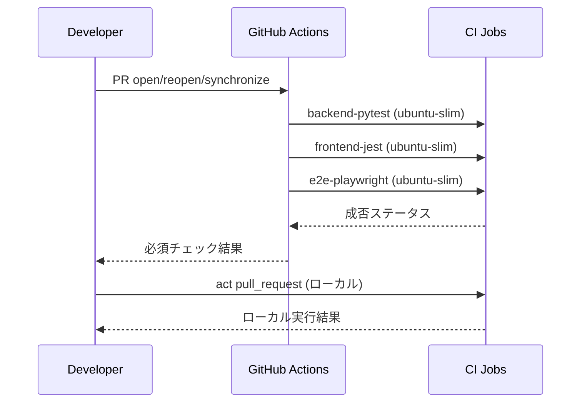
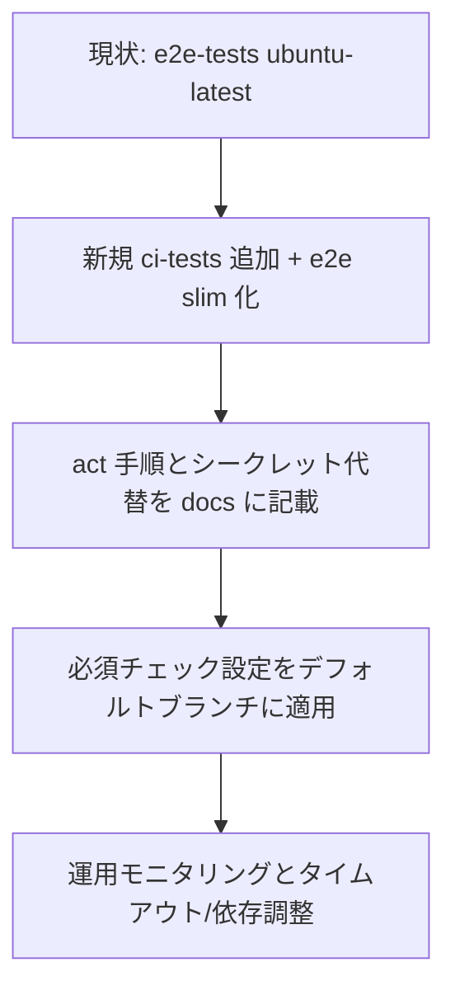

# Design Document

## Overview
本機能は、PR 作成・更新時に既存テスト（バックエンド Pytest、フロントエンド Jest、E2E/Playwright）を GitHub Actions 上で確実に実行し、ubuntu-slim ランナー互換と nektos/act によるローカル再現性を提供する。レビュアーはクラウド実行結果で安全にマージ可否を判断でき、開発者は push 前に act で失敗を検知できる。

### Goals
- PR イベントでバックエンド・フロントエンド・E2E を自動実行し、失敗時にマージをブロックする。
- すべてのジョブを ubuntu-slim ランナー上で安定動作させる。
- act `pull_request` でクラウドと同一構成をローカル再現できるようにする。

### Non-Goals
- 新規テストケースの追加やテストロジック変更。
- CI 以外のデプロイ／リリースフローの改変。
- パフォーマンス最適化（キャッシュ設計は最小限）。

## Architecture

### Existing Architecture Analysis
- 現行 CI: `.github/workflows/e2e-tests.yml` が push/PR で `ubuntu-latest` ランナー上にて E2E のみ実行。Node/Python セットアップ、Playwright 依存インストール、`docker-compose.test.yml` で frontend/backend を起動し `npm run test:e2e` を実行。
- テスト配置: フロントは Jest/Playwright、バックは Pytest。Docker Compose ベースの統合実行が前提。

### High-Level Architecture
```mermaid
graph TB
  A[PR open/reopen/synchronize] --> B[GitHub Actions workflow (ubuntu-slim)]
  B --> C[backend-unit job (Pytest)]
  B --> D[frontend-unit job (Jest)]
  B --> E[e2e job (Playwright + docker-compose.test.yml)]
  E --> F[docker compose up frontend+backend]
  C --> G[status check]
  D --> G
  E --> G
  G --> H[PR required checks / review]
  I[Developer local `act pull_request`] --> J[Same jobs on ubuntu-slim image]
  J --> K[Local status parity]
```

### Technology Alignment
- ランナー: GitHub Actions ubuntu-slim (1 vCPU, 2GB RAM 想定) を採用し、既存 `ubuntu-latest` から移行。
- 言語/ツール: Node 18, Python 3.11, Playwright, docker-compose（既存踏襲）。
- 新規要素: act 用の既定イメージ/シークレット設定（`.actrc` + サンプル env/secrets ファイル）。

### Key Design Decisions
- **Decision**: ランナーを `ubuntu-24.04-slim` 相当へ統一。
  - Context: 1 vCPU slim ランナー指定要件。
  - Alternatives: `ubuntu-latest` 継続 / `ubuntu-22.04` slim。
  - Selected Approach: 24.04 slim。
  - Rationale: 最新 LTS ベースで slim プレビュー要件を満たす。
  - Trade-offs: パッケージ不足時に追加 `apt-get` が必要、リソース上限によりタイムアウトしやすい。
- **Decision**: ワークフローを「ユニット（バック/フロント）＋E2E」の 1 ファイル内 3 ジョブに分割し、依存を明示。
  - Context: 既存 E2E のみで網羅不足。
  - Alternatives: 複数ファイルに分割 / 単一ジョブ統合。
  - Selected Approach: 単一ファイル内の 3 ジョブ（needs で依存制御不要、並列実行可）。
  - Trade-offs: ファイルは肥大化するが閲覧箇所が一箇所で済む。
- **Decision**: act 再現用に `.actrc` で pull_request イメージを slim に固定し、ローカル用 env/secrets サンプルを提供。
  - Context: ローカルとクラウドの差分最小化。
  - Alternatives: ドキュメントのみで手動指定 / Make ターゲットで包む。
  - Selected Approach: `.actrc` で既定化＋サンプルファイル。
  - Trade-offs: ファイルが増えるが開発者の手順が単純化。

## System Flows
### CI フロー（PR）


### ローカル再現フロー（act）


## Components and Interfaces

### Workflow: `.github/workflows/ci-tests.yml`（新規）
- Responsibility: PR/push で 3 ジョブを起動し、キャッシュとアーティファクト収集を行う。
- Dependencies: `actions/checkout@v4`, `actions/setup-node@v4`, `actions/setup-python@v4`, `docker-compose`, `actions/upload-artifact@v4`.
- Interfaces:
  - Triggers: `pull_request` (main/develop 等)、`push` (main/develop)。
  - Env: `CI=true`, `PLAYWRIGHT_BASE_URL`, `PYTHONPATH` など既存に準拠。
  - Artifacts: Playwright レポート、テスト結果（必要に応じ）。

### Job: backend-unit
- Responsibility: backend/ 配下の Pytest を実行。
- Inputs: Python 3.11、pip キャッシュ、`backend/requirements.txt`。
- Behavior: `pip install -r requirements.txt` → `pytest`。
- Outputs: テスト結果（将来的に `pytest --junitxml` でアーティファクト化可）。

### Job: frontend-unit
- Responsibility: frontend の Jest/Testing Library を実行。
- Inputs: Node 18、npm キャッシュ、`frontend/package-lock.json`。
- Behavior: `npm ci` → `npm test -- --runInBand --ci`。
- Outputs: Jest レポート（必要ならアーティファクト化）。

### Job: e2e-playwright
- Responsibility: docker-compose.test.yml でサービスを起動し、Playwright E2E を実行。
- Inputs: Node 18、Python 3.11、docker-compose、Playwright 依存（`npx playwright install --with-deps`）。必要なら slim 向け追加パッケージ（例: `libnss3`, `libatk1.0-0` 等）を apt で補完。
- Behavior: compose 起動→ヘルス待機→`npm run test:e2e`。失敗時ログとアーティファクト収集。
- Outputs: Playwright レポート、テスト結果、compose ログ。

### Local reproducibility: act
- Files: `.actrc`（pull_request の既定イメージを slim に固定）、`act.secrets.example` / `act.env.example`（必要シークレット・環境変数のプレースホルダー）。
- Usage: `act pull_request -j backend-unit|frontend-unit|e2e`。クラウド依存部（例: GitHub Token 必須箇所）はダミー値またはスキップ条件をドキュメント化。

## Error Handling
- ジョブ失敗時: `fail-fast` オフ（並列ジョブ結果をすべて取得）、ステップごとに `if: always()` でログ・アーティファクトを保存。
- タイムアウト: slim 1 vCPU 向けに各ジョブに適切な `timeout-minutes` を設定（E2E は現行 30 分以内に維持）。
- リトライ: テスト自体はリトライしない。パッケージ取得失敗時は `max-attempts` 付きステップで再試行を検討。

## Testing Strategy
- Unit: backend Pytest、frontend Jest を CI で毎回実行。act でも同一コマンドを提供。
- Integration/E2E: Playwright E2E を slim 上で実行し、サービス起動待ちをスクリプト化。
- Smoke (local): act で主要ジョブを個別に実行し、キャッシュ有無での動作を確認。

## Security Considerations
- Secrets: act 用のサンプルファイルを提供し、実値は開発者ローカルでのみ設定。リポジトリには含めない。
- Token/Licenses: GitHub Token 等が不要な場合は無効化、必要な場合はダミー許容かスキップ条件を明記。
- ログ: アーティファクトに秘匿情報を含めないよう、テスト出力でトークンやパスワードを出さないことをガイド。

## Performance & Scalability
- slim 1 vCPU での実行時間を考慮し、`--runInBand`（Jest）や適切な Playwright 並列度を設定。
- npm/pip キャッシュを有効化し、再実行時間を短縮。

## Migration Strategy

- Phase 1: 新ワークフロー追加・act 設定投入（既存 e2e-tests.yml は一時並存可）。
- Phase 2: slim での安定動作を確認後、必須チェックを新ワークフローに切替。
- Phase 3: 旧ワークフローや不要ステップを削除し、README/開発手順を更新。
# Design Document

## Overview
この機能は、PR 作成・更新時に既存テスト（バックエンド Pytest、フロントエンド Jest、E2E Playwright）を ubuntu-slim ランナー上で確実に実行し、レビュー前の品質を担保する。開発者は nektos/act で同一ワークフローをローカル再現し、クラウド実行前に失敗を検知できる。

### Goals
- PR イベントで全テスト種別を自動実行し、必須チェックとして可視化する。
- ubuntu-slim ランナー上で依存を解決し、タイムアウトせず完走させる。
- act により push 前に同一ジョブ構成をローカル再現できるようにする。

### Non-Goals
- 新規テストケースの追加やテスト内容の改修は対象外。
- ビルド/デプロイの自動化は範囲外。
- サードパーティ通知連携（Slack など）の追加は対象外。

## Architecture

### 既存アーキテクチャの考察
- フロント: Next.js 14、Jest/Testing Library、Playwright。
- バック: FastAPI、Pytest。
- 既存ワークフロー: `.github/workflows/e2e-tests.yml` が `ubuntu-latest` で E2E を実行し、Docker Compose に依存。
- 追加方針: 新規 CI ワークフローでユニット・サービス層テストを分離し、既存 E2E ワークフローを ubuntu-slim 化・共通化。

### ハイレベルアーキテクチャ
```mermaid
graph TB
  dev[Developer] -- act pull_request --> actRunner[act (ubuntu-slim)]
  pr[Pull Request] -- webhook --> gha[GitHub Actions (ubuntu-slim)]
  gha --> jobBE[Job: backend-pytest]
  gha --> jobFE[Job: frontend-jest]
  gha --> jobE2E[Job: e2e-playwright]
  jobBE --> compose[Docker/Compose services if needed]
  jobFE --> feDeps[Node 18 deps]
  jobE2E --> compose
  actRunner -- mirrors workflow --> jobBE
  actRunner -- mirrors workflow --> jobFE
  actRunner -- mirrors workflow --> jobE2E
```

### Technology Alignment
- ランナー: `ubuntu-24.04-slim`（パッケージ不足を追加インストールして Compose/Playwright を成立させる）。
- Node: v18（キャッシュ npm）。
- Python: 3.11（キャッシュ pip）。
- Docker/Compose: slim での docker-cli と compose v2 を apt 追加。
- act: `act pull_request -P ubuntu-24.04-slim=ghcr.io/catthehacker/ubuntu:act-24.04` などで slim 相当を利用。

### Key Design Decisions
- **Decision:** ワークフローをジョブ分割（backend-pytest / frontend-jest / e2e-playwright）し、共通セットアップをステップ共有で運用。
  **Context:** ユニットと E2E の依存・タイムアウトが異なる。
  **Alternatives:** 単一ジョブ連鎖、別ファイル分割、再利用アクション化。
  **Selected Approach:** 同一ファイル内でジョブ分割し共通ステップを繰り返し利用。
  **Rationale:** 可読性と設定重複を両立しつつメンテコストを抑える。
  **Trade-offs:** 重複ステップは一部残るがファイル分散より把握しやすい。

- **Decision:** ランナーを ubuntu-slim 固定とし、不足パッケージを明示的に追加。
  **Context:** 要件で ubuntu-slim を要求し、Compose/Playwright 依存がある。
  **Alternatives:** ubuntu-latest フォールバック、self-hosted。
  **Selected Approach:** slim で `docker.io`, `docker-compose-plugin`, Playwright 依存を apt / `npx playwright install --with-deps` で補完。
  **Trade-offs:** 追加インストール時間増。最新イメージ変更リスクを受容。

- **Decision:** act 用の実行手順とシークレット代替をリポジトリ内ドキュメント化。
  **Context:** ローカル再現性要件。
  **Alternatives:** サンプルなしで README 記載のみ、別スクリプト化。
  **Selected Approach:** `docs/ci/act.md`（例）にコマンド・必要シークレット・スキップ方法を明記。
  **Trade-offs:** ドキュメント更新コスト増だが開発者体験を優先。

## System Flows


## Components and Interfaces

### CI ワークフローファイル
- **責務:** PR/push トリガーで全テストジョブを実行し、必須チェックを報告。
- **境界:** `.github/workflows/ci-tests.yml`（新規）、既存 `.github/workflows/e2e-tests.yml` は slim 化と軽微調整。
- **依存:** actions/checkout, setup-node, setup-python, docker/compose, Playwright。
- **契約 (ジョブ共通前提):**
  - 前提: `docker`/`docker-compose` が使用可能、Node/Python をインストール済み。
  - 事後: テスト結果をステータスとアーティファクトで残す。

### Backend Pytest ジョブ
- **責務:** `backend/tests` を全件実行し、依存を pip で解決。
- **依存:** Python 3.11, pip cache, docker (必要ならモックやサービス起動)。
- **インタフェース (擬似):**
  - 入力: ソースコード、`requirements.txt`。
  - 出力: pytest 結果、退出コード。
  - エラー: 依存解決失敗、pytest 失敗時はジョブ失敗。

### Frontend Jest ジョブ
- **責務:** `frontend` のユニット/ライブラリテストを npm で実行。
- **依存:** Node 18, npm ci, キャッシュ lockfile。
- **インタフェース:** 入力: package-lock.json; 出力: npm test 結果。

### E2E Playwright ジョブ
- **責務:** docker-compose.test.yml で frontend/backend を起動し E2E を実行。
- **依存:** docker/compose, `npx playwright install --with-deps`, `PLAYWRIGHT_BASE_URL`。
- **エラー処理:** ヘルスチェックタイムアウト時にログをダンプし失敗。

### act ローカル実行サポート
- **責務:** `act pull_request` で同一ジョブをローカル再現。シークレット代替やスキップ条件を文書化。
- **インタフェース:** ドキュメント (`docs/ci/act.md` など) にコマンド例と必要環境を記載。
- **前提:** Docker デーモンが利用可能、act イメージが slim 相当を指す。

## Error Handling
- テスト失敗: ジョブを即失敗させ、ステータスでマージブロック。E2E はログ/レポートをアーティファクト化。
- 依存インストール失敗: `set -e` で停止し、act 実行時も同様に即時失敗。
- slim 環境不足: apt 追加に失敗した場合はジョブ失敗。追加パッケージ一覧を明記して可視化。
- タイムアウト: ジョブ/ステップごとのタイムアウトを設定し、超過時に失敗。

## Testing Strategy
- Unit: backend Pytest（サービス層・API 単位）、frontend Jest（フック/コンポーネント）。
- Integration: docker-compose 上での Playwright E2E（主要ユーザーフロー）。
- ローカル再現: `act pull_request -P ubuntu-24.04-slim=ghcr.io/catthehacker/ubuntu:act-24.04` をドキュメント化し、必要シークレットの代替値を例示。
- キャッシュ検証: npm/pip キャッシュが有効に働くことを確認。

## Security Considerations
- シークレット最小化: act 実行時は不要なシークレットを空文字または `.secrets` に限定。
- トークン利用: GitHub トークンは必要最小権限で利用し、act ではローカル用に代替値を明示。
- アーティファクト: テストレポートに機密情報を含めない運用を前提とする。

## Migration Strategy

