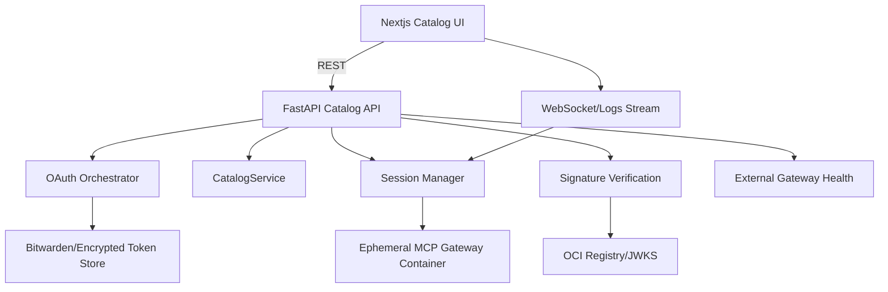
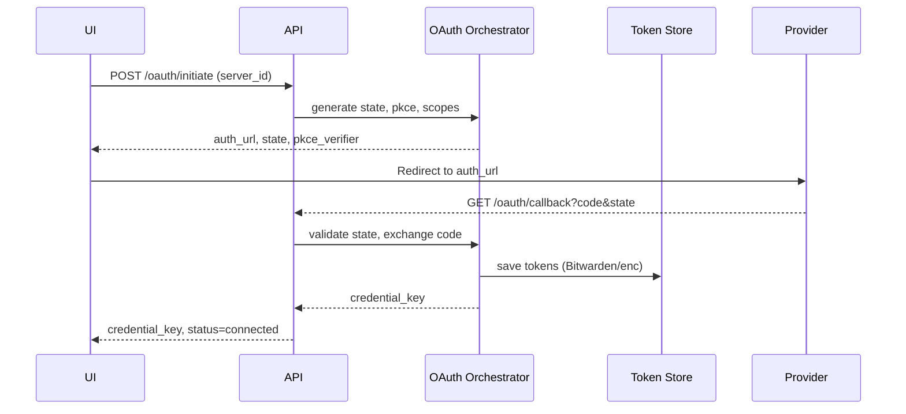
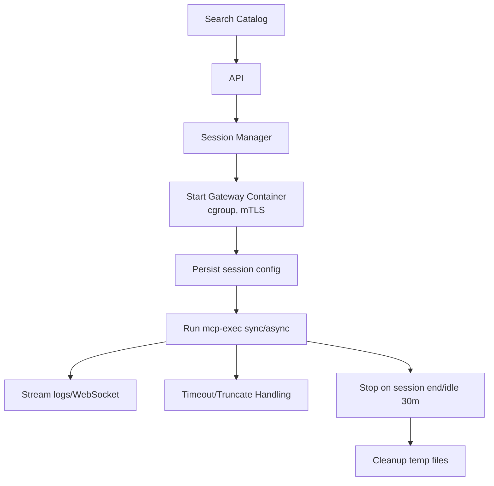

# Design Document: mcp-catalog-enhancements

## Overview
本機能は MCP Catalog の拡張として、OAuth が必要なサーバー接続、動的なサーバー追加・実行、イメージ署名検証、外部/E2B ゲートウェイ接続を安全かつ一貫した UX で提供する。フロントエンドの Next.js UI から認可フロー完結・リソース制御されたゲートウェイ起動・実行状態の可視化を行い、バックエンドの FastAPI がトークン管理、署名検証、許可リスト検証、ヘルスチェックを担う。これにより、運用者は秘密情報を安全に扱いながらカタログ導入と検証を効率化できる。

### Goals
- OAuth 対応サーバーの認可開始/コールバック/トークン保存・ローテーションを安全に完結させる
- カタログから動的にサーバーを探索・追加し、セッション単位の実行・設定変更・停止を制御する
- 署名付きイメージのみをデフォルト許可し、署名検証失敗時の明確なエラーと監査を提供する
- 外部/E2B ゲートウェイの URL/トークン登録と定期ヘルスチェックを安全に行い、UI に状態を提示する

### Non-Goals
- カタログ以外のパッケージ配布チャネルの実装
- 新規ストレージの永続化基盤導入（既存 Bitwarden/暗号化ストレージを利用）
- 汎用的な OAuth プロバイダ管理ポータルの提供

### 現状とギャップ（要件との乖離）
- バックエンド: カタログ取得/検索と素朴な Docker 起動のみ。OAuth、トークン保存・ローテーション、スコープポリシー、セッション管理、署名検証、外部ゲートウェイ許可リスト/ヘルスチェックが未実装。
- フロントエンド: カタログ閲覧/検索/インストールモーダルのみ。OAuth モーダル、セッション/実行パネル、署名検証トグル警告、外部ゲートウェイ設定 UI、ログ/ジョブステータス表示が未実装。
- モデル/データ: `CatalogItem` に追加メタ（required scopes、verify_signatures、permit_unsigned など）が無く、Session/Job/SignaturePolicy/GatewayAllowlist 等のモデルが存在しない。
- 運用: 相関 ID を含む監査ログ、メトリクス、mTLS 証明書管理、アイドル GC といった運用要件が欠落。

### 推奨アプローチ（Approach C: 責務分離 + フラグ段階有効化）
- 新規ドメインサービスを追加（OAuth Orchestrator、TokenStore、ScopePolicy、SessionManager、SignatureVerification、GatewayAllowlist/Healthcheck）し、既存 API は薄いラッパーに留める。
- feature flag で段階的に有効化する: 初期は audit-only/外部ゲートウェイ無効 → OAuth/セッションを導入 → 署名検証 enforcement 切替 → 外部ゲートウェイ常用化。
- 目的: 責務分離で保守性を確保しつつ、安全に段階リリースする。

## Architecture

### 既存アーキテクチャ分析
- フロントエンド: Next.js App Router + SWR で FastAPI と REST 通信（カタログ閲覧のみ）。
- バックエンド: FastAPI ルーター `app/api/catalog.py` は取得/検索のみ、`app/api/containers.py` は単純な Docker 起動/停止。Pydantic モデル `CatalogItem` は基本フィールドのみ。
- 依存: httpx 非同期クライアント、Docker SDK/CLI、Bitwarden CLI（シークレット供給）。
- 制約: サービス層集中（structure.md）、シークレットはディスクに残さず Bitwarden または暗号化ストレージで管理（tech.md）。
- 不足点: OAuth/トークンストア/スコープポリシー、セッション管理、署名検証、外部ゲートウェイ許可・ヘルスチェック、ジョブ/ログ管理が未整備。

### ハイレベルアーキテクチャ


### Technology Alignment
- 既存スタック維持: FastAPI + httpx 非同期、Pydantic v2、Docker SDK/CLI を継続利用。
- 新規依存の想定:
  - 署名検証: cosign CLI または sigstore-python をラッパー経由で呼び出し、RSA-PSS/ECDSA を検証。
  - mTLS: 既存ゲートウェイ起動ロジックに証明書生成/マウントを追加（openssl/python cryptography）。
  - 監査ログ: 構造化ロガーを共通ユーティリティで拡張（既存 logger を流用）。
- フロントは SWR/React Query で状態同期、Playwright/Jest による UI/E2E 互換を維持。

### Key Design Decisions
- **Decision**: トークン保存は Bitwarden 参照 + 暗号化ストレージのハイブリッドにする  
  **Context**: OAuth アクセス/リフレッシュトークンを安全に保持し、管理者のみ閲覧可能とする必要がある。  
  **Alternatives**: (1) DB 平文保存、(2) OS キーチェーン、(3) Bitwarden + 暗号化ストレージ。  
  **Selected Approach**: Bitwarden アイテム ID を主とし、バックアップとしてアプリ内の暗号化ストレージ（鍵は環境変数由来）に暗号化保存。`credential_key` を DB/カタログ行に保存し復号参照にのみ使用。  
  **Rationale**: ディスク残存を最小化しつつ復旧性を確保、既存の Bitwarden 依存と整合。  
  **Trade-offs**: Bitwarden ログイン依存による可用性リスクがあるため、障害時は暗号化ストレージのみにフォールバックする監視が必要。

- **Decision**: ゲートウェイはデフォルトでセッション単位のエフェメラル起動、オプションでプール運用  
  **Context**: Requirement 2 のリソース分離とコスト優先モード両立。  
  **Alternatives**: (1) 常時プール、(2) 完全エフェメラル、(3) エフェメラル＋コスト優先時のみプール。  
  **Selected Approach**: 既定エフェメラル、`cost_priority=true` 設定時のみプールを許可し、資格情報は論理スコープごとに分離。  
  **Rationale**: セキュリティ境界を明確化しつつ、コスト要件に応じた選択を提供。  
  **Trade-offs**: プール有効時は共有リソースの枯渇監視・資格情報隔離チェックが必須。

- **Decision**: 署名検証は enforcement/audit-only モードをサーバー構成で切替  
  **Context**: Requirement 3 でグレース期間と例外運用が必要。  
  **Alternatives**: (1) 常時 enforcement、(2) 常時 audit-only、(3) 切替式。  
  **Selected Approach**: グレース期間設定後は自動で enforcement に遷移し、UI/ログ/メトリクスで告知。例外は permit_unsigned または許可リストのみ。  
  **Rationale**: セキュリティと運用猶予のバランスを確保。  
  **Trade-offs**: モード遷移の状態管理が複雑になるため、メトリクスと監査ログで検証する。

- **Decision**: feature flag で段階的に有効化し、リスクを抑えて展開する  
  **Context**: OAuth/署名検証/外部ゲートウェイは運用リスクが高い。  
  **Selected Approach**: `audit_only_signature`, `external_gateway_enabled`, `session_pool_cost_priority` などのフラグでフェーズごとに開放。  
  **Rationale**: 既存ユーザー影響を限定しながら段階移行を可能にする。  
  **Trade-offs**: フラグ分岐によるコード複雑度増。クリーンアップ計画を別途持つ。

## System Flows

### OAuth 認可/コールバック/保存フロー


### 動的サーバー起動・実行フロー


### 外部/E2B ゲートウェイ接続・ヘルスチェックフロー
```mermaid
graph TB
UI --> API: Save URL/Token
API --> Allow[Allowlist Validator]
Allow -->|pass| StoreGw[Store gateway config]
Allow -->|fail| Error[Reject 400 with reason]
StoreGw --> HC[Run healthcheck 1s→2s→4s retry]
HC --> Metrics[Record p50/p95/p99]
Metrics --> UIStatus[Update UI status]
```

## Requirements Traceability
- **1. OAuth 認可フロー管理**: OAuth Orchestrator, Token Store, Catalog API `/oauth/*`, UI OAuth モーダル、state/PKCE 検証フロー図に対応。
- **2. Dynamic MCP サーバー管理**: Session Manager, Gateway Controller, Execution Controller, UI セッションビュー、動的フローフロー図に対応。
- **3. MCP イメージ署名検証**: Signature Verification Service、Registry/JWKS フェッチ、permit_unsigned ハンドリング、メトリクス/監査。
- **4. 外部/E2B ゲートウェイ接続**: Allowlist Validator、Gateway Config Store、Healthcheck Runner、UI ステータス表示フローに対応。

## Components and Interfaces

### 認証/トークン管理ドメイン
- **OAuth Orchestrator (Backend)**  
  - 役割: state/PKCE 生成、認可 URL 構築、コールバック検証、トークン交換、リフレッシュスケジュール。  
  - 依存: httpx、Bitwarden CLI/暗号化ストレージ、監査ロガー。  
  - サービス契約:
```typescript
interface OAuthService {
  startAuth(serverId: string, scopes: string[]): Promise<AuthStartResult>;
  handleCallback(params: OAuthCallbackParams): Promise<CredentialKey>;
  refreshToken(serverId: string, credentialKey: string): Promise<TokenRefreshResult>;
}
interface AuthStartResult { authUrl: string; state: string; pkceVerifier: string; requiredScopes: string[]; }
interface OAuthCallbackParams { code: string; state: string; serverId: string; }
interface CredentialKey { value: string; expiresAt: string; scope: string[]; }
interface TokenRefreshResult { credentialKey: CredentialKey; refreshed: boolean; }
```
  - 事前条件: 許可スコープに含まれていること、Bitwarden ログイン済み。  
  - 事後条件: `credential_key` が保存され、監査ログに相関 ID が記録される。

- **Token Store (Bitwarden + Encrypted Store)**  
  - 役割: アクセス/リフレッシュトークンと有効期限・scope の保存、`credential_key` 紐付け。  
  - 外部依存: Bitwarden CLI、暗号化キー環境変数。  
  - 取扱: 30 日後自動削除、管理者のみ復号閲覧。

- **Scope Policy Service**  
  - 役割: カタログ定義スコープと許可スコープの突き合わせ、管理者更新時の無効化。

### カタログ/セッション管理ドメイン
- **CatalogService (既存拡張)**  
  - 役割: 既存取得/検索に加え、OAuth 対応サーバーのメタデータ（required scopes, jwks url, verify_signatures フラグ、permit_unsigned、allowlist hints）を反映。  
  - 依存: httpx、Pydantic。

- **Session Manager**  
  - 役割: セッション単位のゲートウェイコンテナ起動/停止、cgroup 制限、mTLS 証明書生成/マウント、アイドル 30 分 GC。  
  - 依存: Docker SDK/CLI、証明書生成ユーティリティ、Prometheus エンドポイント公開。
  - API 契約:
```typescript
interface SessionConfig { cpuQuota: number; memoryMb: number; networkIsolated: boolean; idleMinutes: number; maxRunSeconds: number; outputBytesLimit: number; async: boolean; costPriority: boolean; }
interface SessionStatus { sessionId: string; state: "creating"|"running"|"restarting"|"terminated"; startedAt: string; idleDeadline: string; gatewayEndpoint: string; metricsEndpoint: string; }
```

- **Execution Controller**  
  - 役割: `mcp-exec` 同期/非同期実行、タイムアウト/トランケーション処理、ジョブキュー状態管理。  
  - 出力: `output`, `exit_code`, `started_at`, `finished_at`, `timeout`, `truncated`, `job_id`, `status`.

- **Signature Verification Service**  
  - 役割: docker run 実行前の署名検証。cosign/sigstore で RSA-PSS(SHA-256)/ECDSA(SHA-256) を検証し、JWKS/PEM 取得を 6h キャッシュ。  
  - モード: `enforcement` では失敗時 422/exit 78、`audit-only` では警告ログとレスポンス注記。グレース期間後自動で enforcement へ。

### 外部ゲートウェイドメイン
- **Allowlist Validator**  
  - 役割: URL スキーマ検証、許可リストマージ（グローバル優先→組織別上書き）、未登録時 400 返却。  
  - データモデル: `{ id, type: "domain"|"pattern"|"service", value, createdBy, createdAt, enabled, version }`。

- **Gateway Config Store & Healthcheck Runner**  
  - 役割: URL/トークン保存、`/healthcheck` 実行（1s→2s→4s リトライ、timeout 10〜30 秒）、p50/p95/p99 記録、5 分間隔の定期実行。

### フロントエンド
- **OAuth モーダル/ダイアログ**: 認可開始、state/PKCE 内部保持、コールバック結果表示、再認可ボタン。  
- **Catalog Browser 拡張**: 必要スコープ・署名検証フラグ・必須シークレット表示、検索/カテゴリフィルタ。  
- **Session/Execution パネル**: ゲートウェイ起動状態、リソース使用、mcp-exec 実行 UI、ログ/ステータスストリーム。  
- **Gateway 設定画面**: URL/トークン入力、許可リスト検証結果、ヘルスチェック結果表示、リスク警告（署名検証無効化時）。

### API Contracts (主要)
| Method | Endpoint | Request | Response | Errors |
| --- | --- | --- | --- | --- |
| POST | `/api/catalog/oauth/initiate` | `{server_id, scopes?}` | `{auth_url, state, pkce_verifier, required_scopes}` | 400 invalid scope, 503 provider error |
| GET | `/api/catalog/oauth/callback` | `code, state, server_id` | `{credential_key, expires_at, scope}` | 401 state mismatch, 400 provider 4xx, 502/503 retry exhaustion |
| POST | `/api/catalog/oauth/refresh` | `{server_id, credential_key}` | `{credential_key, refreshed}` | 401 invalid grant, 503 provider 5xx |
| GET | `/api/catalog/search` | `source?, q, category?` | `CatalogResponse` | 503 fetch fail |
| POST | `/api/sessions` | `{server_id, config: SessionConfig}` | `{session_id, gateway_endpoint, metrics_endpoint}` | 422 signature fail, 503 start fail |
| POST | `/api/sessions/{id}/exec` | `{tool, args, async?, max_run_seconds?, output_bytes_limit?}` | 同期: `{output, exit_code, timeout, truncated}` / 非同期: `{job_id, status}` | 408 timeout, 507 output too large |
| DELETE | `/api/sessions/{id}` | - | `{success}` | 404 not found |
| POST | `/api/gateways` | `{url, token, type}` | `{gateway_id, status}` | 400 allowlist reject |
| GET | `/api/gateways/{id}/health` | - | `{status, p50, p95, p99, last_error?}` | 504 timeout |

## Data Models

### ドメインモデル
- **CatalogItem 拡張**: `{ required_scopes?: string[], jwks_url?: string, verify_signatures?: boolean, permit_unsigned?: string[], allowlist_hint?: string }`  
- **Credential**: `{ credential_key: uuid, token_ref: string, scopes: string[], expires_at: datetime, server_id: string, created_by: string }`（token_ref は Bitwarden アイテム ID or 暗号化キー）  
- **Session**: `{ session_id, server_id, config: SessionConfig, state, idle_deadline, gateway_endpoint, metrics_endpoint, mtls_cert_ref, feature_flags }`  
- **Job**: `{ job_id, session_id, status, queued_at, started_at, finished_at, exit_code?, timeout, truncated, output_ref }`  
- **SignaturePolicy**: `{ mode: "enforcement"|"audit-only", grace_until?: datetime, permit_unsigned: string[], allowed_algorithms: ["RSA-PSS-SHA256","ECDSA-SHA256"], jwks_url?, local_trust_store_ref?, cache_ttl_hours?: number }`  
- **GatewayAllowEntry**: `{ id, type, value, createdBy, createdAt, enabled, version }`

### データ契約・シリアライズ
- リクエスト/レスポンスは JSON、日時は ISO8601。  
- トークン値はレスポンスに含めない。`credential_key` のみ返却。  
- 署名検証失敗レスポンス例: `{ "error_code": "key_not_found", "message": "...", "remediation": "..." }`

## Error Handling
- ユーザーエラー (400/401/403/404/422): スコープ未許可、state 不一致、未登録ゲートウェイ、署名未検証、リソース未発見。メッセージは再操作手順を含める。  
- システムエラー (5xx): プロバイダ 5xx、Docker 起動失敗、Bitwarden 不可。指数バックオフ付きリトライ、相関 ID で監査。  
- ビジネスエラー (503/504/507): リフレッシュ不能、ヘルスチェックタイムアウト、出力制限超過。  
- ロギング: INFO で成功/失敗の要約、WARN/ERROR に相関 ID とカテゴリ、秘密情報は記録しない。

## Security Considerations
- トークン: Bitwarden + 暗号化ストレージ、`credential_key` だけを DB/レスポンスに保持。閲覧権限は管理者ロール限定。30 日後自動削除。  
- OAuth: state/PKCE 必須、スコープは許可リスト検証、管理者のみスコープ更新可能。  
- mTLS: ゲートウェイ間通信は自己署名証明書を起動時生成し、セッション終了時破棄。  
- 署名検証: デフォルト enforcement、permit_unsigned/許可リストのみ例外。JWKS/PEM は TLS/OCSP/CRL 検証、7 日デュアルサイン猶予。  
- ログ/監査: 相関 ID、鍵 ID ハッシュ、アルゴリズム名のみ記録。PII/トークン/秘密鍵は出力禁止。  
- フロント: 署名検証無効化時にリスク警告ダイアログを強制表示。

## Performance & Scalability
- キャッシュ: CatalogService のメモリキャッシュ継続、ヘルスチェック結果も短期キャッシュ。  
- コンテナ: cgroup CPU 0.5core/512MB、アイドル 30 分 GC、異常終了 1 回再起動。プール有効時は最大同時数制限と LRU 破棄。  
- 実行: `max_run_seconds` 10〜300、`output_bytes_limit` 32KB〜1MB、ログストリームチャンク 8KB。  
- 署名検証: JWKS 6h キャッシュ、検証並列度は同時 4 件まで。  
- ヘルスチェック: 5 分間隔、バックオフ 1→2→4s、timeout 10〜30s。

## Migration Strategy
```mermaid
graph TB
Phase0[Phase0: Design Signoff] --> Phase1[Phase1: Flags ON in audit-only\n`audit_only_signature=true`\n`external_gateway_enabled=false`]
Phase1 --> Phase2[Phase2: OAuth endpoints + TokenStore\n`oauth_enabled=true`]
Phase2 --> Phase3[Phase3: Session Manager + mTLS\n`session_pool_cost_priority` gated]
Phase3 --> Phase4[Phase4: UI rollout (OAuth/Session/Warning)] 
Phase4 --> Phase5[Phase5: Signature enforcement ON\naudit grace end]
Phase5 --> Phase6[Phase6: External gateways ON\nhealthcheck enforced]
Phase6 --> Phase7[Phase7: Cleanup legacy cache\nrotate keys, purge old tokens]
```
- フラグ制御: `audit_only_signature`, `external_gateway_enabled`, `session_pool_cost_priority`, `verify_signatures_enforced` を段階的に切替。  
- ロールバック: フラグで即時無効化し、署名検証/ゲートウェイを旧動作にフォールバック。  
- 検証チェックポイント: 各 Phase で pytest/Playwright/契約テストを実施し、監査ログへ記録。

## Testing Strategy
- ユニット: OAuth state/PKCE 生成、トークン交換エラーハンドリング、署名検証モード分岐、allowlist 判定、SessionConfig バリデーション。  
- 統合: `/api/catalog/oauth/*` 正常/異常、mcp-exec 同期/非同期タイムアウト、署名検証 enforcement/audit-only、ヘルスチェックのバックオフとメトリクス。  
- E2E/UI: 認可フロー完走、署名検証無効化時の警告ダイアログ、ゲートウェイ起動/停止、ログストリーム表示、接続テスト UI ステータス。  
- パフォーマンス: 同時実行 10 セッションで `max_run_seconds` タイムアウト確認、署名検証キャッシュヒット率、ヘルスチェック 5 分インターバル負荷測定。

