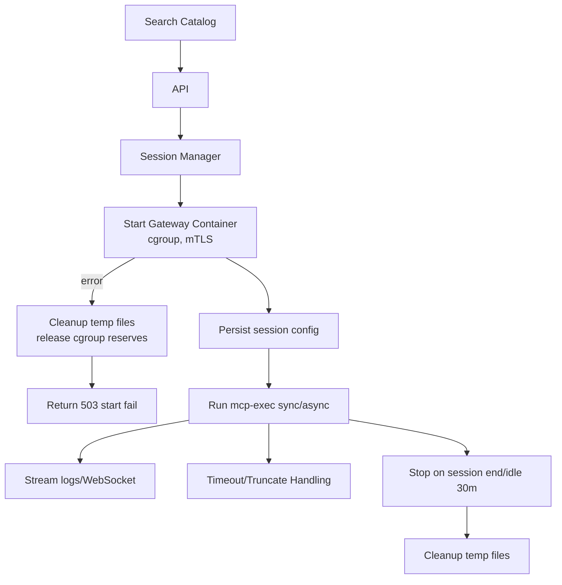
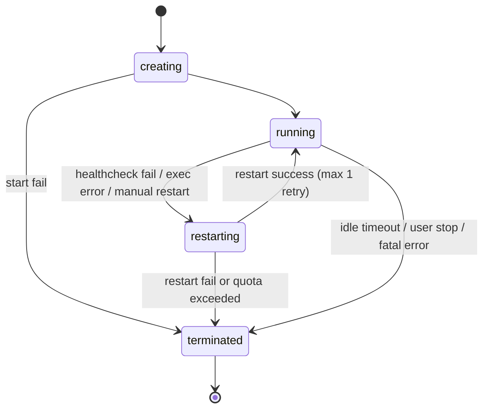

# Design Document: mcp-catalog-enhancements

## Overview
本機能は MCP Catalog の拡張として、OAuth が必要なサーバー接続、動的なサーバー追加・実行、イメージ署名検証、外部/E2B ゲートウェイ接続を安全かつ一貫した UX で提供する。フロントエンドの Next.js UI から認可フロー完結・リソース制御されたゲートウェイ起動・実行状態の可視化を行い、バックエンドの FastAPI がトークン管理、署名検証、許可リスト検証、ヘルスチェックを担う。これにより、運用者は秘密情報を安全に扱いながらカタログ導入と検証を効率化できる。

### Goals
- OAuth 対応サーバーの認可開始/コールバック/トークン保存・ローテーションを安全に完結させる
- カタログから動的にサーバーを探索・追加し、セッション単位の実行・設定変更・停止を制御する
- 署名付きイメージのみをデフォルト許可し、署名検証失敗時の明確なエラーと監査を提供する
- 外部/E2B ゲートウェイの URL/トークン登録と定期ヘルスチェックを安全に行い、UI に状態を提示する

### Non-Goals
- カタログ以外のパッケージ配布チャネルの実装
- 新規ストレージの永続化基盤導入（既存 Bitwarden/暗号化ストレージを利用）
- 汎用的な OAuth プロバイダ管理ポータルの提供

### 現状とギャップ（要件との乖離）
- バックエンド: カタログ取得/検索と素朴な Docker 起動のみ。OAuth、トークン保存・ローテーション、スコープポリシー、セッション管理、署名検証、外部ゲートウェイ許可リスト/ヘルスチェックが未実装。
- フロントエンド: カタログ閲覧/検索/インストールモーダルのみ。OAuth モーダル、セッション/実行パネル、署名検証トグル警告、外部ゲートウェイ設定 UI、ログ/ジョブステータス表示が未実装。
- モデル/データ: `CatalogItem` に追加メタ（required scopes、verify_signatures、permit_unsigned など）が無く、Session/Job/SignaturePolicy/GatewayAllowlist 等のモデルが存在しない。
- 運用: 相関 ID を含む監査ログ、メトリクス、mTLS 証明書管理、アイドル GC といった運用要件が欠落。

### 推奨アプローチ（Approach C: 責務分離 + フラグ段階有効化）
- 新規ドメインサービスを追加（OAuth Orchestrator、TokenStore、ScopePolicy、SessionManager、SignatureVerification、GatewayAllowlist/Healthcheck）し、既存 API は薄いラッパーに留める。
- feature flag で段階的に有効化する: 初期は audit-only/外部ゲートウェイ無効 → OAuth/セッションを導入 → 署名検証 enforcement 切替 → 外部ゲートウェイ常用化。
- 目的: 責務分離で保守性を確保しつつ、安全に段階リリースする。

## Architecture

### 既存アーキテクチャ分析
- フロントエンド: Next.js App Router + SWR で FastAPI と REST 通信（カタログ閲覧のみ）。
- バックエンド: FastAPI ルーター `app/api/catalog.py` は取得/検索のみ、`app/api/containers.py` は単純な Docker 起動/停止。Pydantic モデル `CatalogItem` は基本フィールドのみ。
- 依存: httpx 非同期クライアント、Docker SDK/CLI、Bitwarden CLI（シークレット供給）。
- 制約: サービス層集中（structure.md）、シークレットはディスクに残さず Bitwarden または暗号化ストレージで管理（tech.md）。
- 不足点: OAuth/トークンストア/スコープポリシー、セッション管理、署名検証、外部ゲートウェイ許可・ヘルスチェック、ジョブ/ログ管理が未整備。

### ハイレベルアーキテクチャ


### Technology Alignment
- 既存スタック維持: FastAPI + httpx 非同期、Pydantic v2、Docker SDK/CLI を継続利用。
- 新規依存の想定:
  - 署名検証: cosign CLI または sigstore-python をラッパー経由で呼び出し、RSA-PSS/ECDSA を検証。
  - mTLS: 既存ゲートウェイ起動ロジックに証明書生成/マウントを追加（openssl/python cryptography）。
  - 監査ログ: 構造化ロガーを共通ユーティリティで拡張（既存 logger を流用）。
- フロントは SWR/React Query で状態同期、Playwright/Jest による UI/E2E 互換を維持。

### Key Design Decisions
- **Decision**: トークン保存は Bitwarden 参照 + 暗号化ストレージのハイブリッドにする
  **Context**: OAuth アクセス/リフレッシュトークンを安全に保持し、管理者のみ閲覧可能とする必要がある。
  **Alternatives**: (1) DB 平文保存、(2) OS キーチェーン、(3) Bitwarden + 暗号化ストレージ。
  **Selected Approach**: Bitwarden アイテム ID を主とし、バックアップとしてアプリ内の暗号化ストレージ（鍵は環境変数由来）に暗号化保存。`credential_key` を DB/カタログ行に保存し復号参照にのみ使用。
  **Rationale**: ディスク残存を最小化しつつ復旧性を確保、既存の Bitwarden 依存と整合。
  **Trade-offs**: Bitwarden ログイン依存による可用性リスクがあるため、障害時は暗号化ストレージのみにフォールバックする監視が必要。

- **Decision**: ゲートウェイはデフォルトでセッション単位のエフェメラル起動、オプションでプール運用
  **Context**: Requirement 2 のリソース分離とコスト優先モード両立。
  **Alternatives**: (1) 常時プール、(2) 完全エフェメラル、(3) エフェメラル＋コスト優先時のみプール。
  **Selected Approach**: 既定エフェメラル、`cost_priority=true` 設定時のみプールを許可し、資格情報は論理スコープごとに分離。
  **Rationale**: セキュリティ境界を明確化しつつ、コスト要件に応じた選択を提供。
  **Trade-offs**: プール有効時は共有リソースの枯渇監視・資格情報隔離チェックが必須。Testing/Monitoring に cost_priority プール同時数上限と資格情報隔離検証を組み込み、リソース不足時は 503/507 と一貫したエラーハンドリングを行う。

- **Decision**: 署名検証は enforcement/audit-only モードをサーバー構成で切替
  **Context**: Requirement 3 でグレース期間と例外運用が必要。
  **Alternatives**: (1) 常時 enforcement、(2) 常時 audit-only、(3) 切替式。
  **Selected Approach**: グレース期間設定後は自動で enforcement に遷移し、UI/ログ/メトリクスで告知。例外は permit_unsigned または許可リストのみ。
  **Rationale**: セキュリティと運用猶予のバランスを確保。
  **Trade-offs**: モード遷移の状態管理が複雑になるため、メトリクスと監査ログで検証する。`grace_until` 判定は起動時と 5 分毎の定期チェックで行い、DB ロックまたは分散ロックでアトミックに遷移し、遷移イベントを相関 ID 付きで監査ログに記録する。

- **Decision**: feature flag で段階的に有効化し、リスクを抑えて展開する
  **Context**: OAuth/署名検証/外部ゲートウェイは運用リスクが高い。
  **Selected Approach**: `audit_only_signature`, `external_gateway_enabled`, `session_pool_cost_priority` などのフラグでフェーズごとに開放。
  **Rationale**: 既存ユーザー影響を限定しながら段階移行を可能にする。
  **Trade-offs**: フラグ分岐によるコード複雑度増。クリーンアップ計画を別途持つ。

## System Flows

### OAuth 認可/コールバック/保存フロー


### 動的サーバー起動・実行フロー

※ Start 失敗時は Rollback で一時ファイルと cgroup 予約を解除し、503/507 を返却する。

### 外部/E2B ゲートウェイ接続・ヘルスチェックフロー
```mermaid
graph TB
UI --> API: Save URL/Token
API --> Allow[Allowlist Validator]
Allow -->|pass| StoreGw[Store gateway config]
Allow -->|fail| Error[Reject 400 with reason]
StoreGw --> HC[Run healthcheck 1s→2s→4s retry]
HC --> Metrics[Record p50/p95/p99]
Metrics --> UIStatus[Update UI status]
```

## Requirements Traceability
- **1. OAuth 認可フロー管理**: OAuth Orchestrator, Token Store, Catalog API `/oauth/*`, UI OAuth モーダル、state/PKCE 検証フロー図に対応。
- **2. Dynamic MCP サーバー管理**: Session Manager, Gateway Controller, Execution Controller, UI セッションビュー、動的フローフロー図に対応。
- **3. MCP イメージ署名検証**: Signature Verification Service、Registry/JWKS フェッチ、permit_unsigned ハンドリング、メトリクス/監査。
- **4. 外部/E2B ゲートウェイ接続**: Allowlist Validator、Gateway Config Store、Healthcheck Runner、UI ステータス表示フローに対応。

## Components and Interfaces

### 認証/トークン管理ドメイン
- **OAuth Orchestrator (Backend)**
  - 役割: state/PKCE 生成、認可 URL 構築、コールバック検証、トークン交換、リフレッシュスケジュール。
  - 依存: httpx、Bitwarden CLI/暗号化ストレージ、監査ロガー。
  - サービス契約:
```typescript
interface OAuthService {
  startAuth(serverId: string, scopes: string[]): Promise<AuthStartResult>;
  handleCallback(params: OAuthCallbackParams): Promise<CredentialKey>;
  refreshToken(serverId: string, credentialKey: string): Promise<TokenRefreshResult>;
}
interface AuthStartResult { authUrl: string; state: string; pkceVerifier: string; requiredScopes: string[]; }
interface OAuthCallbackParams { code: string; state: string; serverId: string; }
interface CredentialKey { value: string; expiresAt: string; scope: string[]; }
interface TokenRefreshResult { credentialKey: CredentialKey; refreshed: boolean; }
```
  - 事前条件: 許可スコープに含まれていること、Bitwarden ログイン済み。
  - 事後条件: `credential_key` が保存され、監査ログに相関 ID が記録される。

- **Token Store (Bitwarden + Encrypted Store)**
  - 役割: アクセス/リフレッシュトークンと有効期限・scope の保存、`credential_key` 紐付け。
  - 外部依存: Bitwarden CLI、暗号化キー環境変数。
  - 取扱: 30 日後自動削除、管理者のみ復号閲覧。

- **Scope Policy Service**
  - 役割: カタログ定義スコープと許可スコープの突き合わせ、管理者更新時の無効化。

### カタログ/セッション管理ドメイン
- **CatalogService (既存拡張)**
  - 役割: 既存取得/検索に加え、OAuth 対応サーバーのメタデータ（required scopes, jwks url, verify_signatures フラグ、permit_unsigned、allowlist hints）を反映。
  - 依存: httpx、Pydantic。
  - API 契約（TypeScript 想定、Promise 返却を明示）:
```typescript
// Catalog の1件。署名検証・OAuth メタを含む。
export interface CatalogItem {
  id: string;
  name: string;
  description: string;
  image: string;
  category?: string;
  required_scopes?: string[]; // サーバーが要求するスコープ（必須）
  permitted_scopes?: string[]; // 利用者に許可されているスコープ（validateScopes で突合）
  jwks_url?: string; // verify_signatures=true の場合は必須
  verify_signatures?: boolean; // true なら署名検証を強制
  permit_unsigned?: PermitUnsigned; // 例外許可ポリシー
  allowlist_hint?: string;
}

// 検索フィルタ
export interface SearchFilters {
  q?: string;
  category?: string;
  source?: string;
}

// スコープ検証結果
export interface ValidationResult {
  valid: boolean;
  missing: string[]; // required だが permitted に存在しないもの
  reason?: string;
}

// 署名検証ポリシー
export interface SignaturePolicy {
  mode: "enforcement" | "audit-only";
  permit_unsigned: PermitUnsigned; // 未署名を許可する例外リスト
  allowed_algorithms: ("RSA-PSS-SHA256" | "ECDSA-SHA256")[];
  jwks_url?: string;
  verify_signatures: boolean;
}

// 未署名を許可する条件（例: "sha256:<digest>" や "thumbprint:<cert>" の形）
export type PermitUnsignedEntry =
  | { type: "none" } // 許可しない（デフォルト）
  | { type: "any" } // ワイルドカード許可
  | { type: "sha256"; digest: string } // 例: "sha256:9c1a..."（イメージダイジェストで許可）
  | { type: "thumbprint"; cert: string } // 例: "thumbprint:AB:CD..."（証明書サムプリントで許可）
  | { type: "image"; name: string }; // 例: "image:ghcr.io/org/app:1.2.3"（明示イメージ名で許可）
export type PermitUnsigned = PermitUnsignedEntry[];

// 資格情報参照（格納先を明示）
export type TokenRef =
  | { type: "bitwarden"; item_id: string } // Bitwarden アイテム ID
  | { type: "encrypted"; key: string }; // アプリ内部の暗号化キー識別子

// セッション mTLS 証明書参照
export type MtlsCertRef =
  | { type: "file"; path: string } // ファイルパスで指定
  | { type: "x509"; id: string } // ストア ID で指定
  | { type: "ephemeral"; handle: string }; // 一時生成ハンドルで指定

// フィーチャーフラグ: 名前→有効/無効
export type FeatureFlags = Record<string, boolean>; // 例: { audit_only_signature: true, external_gateway_enabled: false }

// ジョブ出力参照（保存先とキーを明示）
export type OutputRef = {
  storage: "file" | "s3" | "db";
  path: string;
  region?: string; // s3 用
  bucket?: string; // s3 用
};

export interface CatalogService {
  /**
   * カタログ検索。フロント/バック双方で Promise を返却。
   */
  search(filters: SearchFilters): Promise<CatalogItem[]>;

  /**
   * スコープ検証:
   * - required_scopes が空の場合は常に valid=true。
   * - permitted_scopes に同一文字列が含まれていれば一致（完全一致）。
   * - permitted_scopes にプレフィックス（末尾 "*"）がある場合は接頭辞一致を許可する（例: "repo:*" は "repo:read" を許可）。
   * - required_scopes の集合が permitted_scopes（完全一致+プレフィックス一致）の集合に包含されることを確認。
   */
  validateScopes(required_scopes: string[], permitted_scopes: string[]): Promise<ValidationResult>;

  /**
   * 署名検証ポリシー解決:
   * - verify_signatures=true で jwks_url が無い場合は ValidationError を返す。
   * - verify_signatures=false の場合は jwks_url を無視し、permit_unsigned/type をそのまま返却。
   * - SignaturePolicy を構築し、呼び出し元に返却。
   */
  resolveSignaturePolicy(item: CatalogItem): Promise<SignaturePolicy>;
}
```

> **コメント (Migration Phases)**
> 依存関係が不明確で、ロールバック時の state cleanup が不十分。以下を明確化してください。
> - Phase1「audit-only signature」はセッション管理（Phase3）なしで適用される前提か？署名検証対象が存在しない状態の audit-only の運用価値が不明。
> - Phase3 `session_pool_cost_priority` フラグ名: セッション機能全体を有効化するのか、cost_priority だけを有効化するのか曖昧。Session Manager 初出だが base session（ephemeral）有効化タイミングが不明。
> - Phase5「Signature enforcement ON」で、Phase1-4 に保存・実行中のイメージ（audit-only で許可済み）の扱いを明示：新セッションのみ対象か、既存セッション再検証か。
> - Rollback 戦略が「フラグで即時無効化」のみ。例: Phase4 UI rollback 時、生成済み session の `metrics_endpoint` 参照が無効になる順序と cleanup が不明。
> - 推奨: Phase 図の下に dependency/rollback matrix を追加。特に Phase5 rollback では `signature_enforced` OFF、進行中セッションは既存ポリシー継続（audit/enforcement 混在）、新規セッションは audit-only へ戻し、cleanup で `SignaturePolicy.enforcement` を除去し `enforcement_disabled` を監査ログに記録する流れを定義する。

- **Session Manager**
  - 役割: セッション単位のゲートウェイコンテナ起動/停止、cgroup 制限、mTLS 証明書生成/マウント、アイドル 30 分 GC。
  - 依存: Docker SDK/CLI、証明書生成ユーティリティ、Prometheus エンドポイント公開。
  - API 契約:
```typescript
interface SessionConfig { cpuQuota: number; memoryMb: number; networkIsolated: boolean; idleMinutes: number; maxRunSeconds: number; outputBytesLimit: number; async: boolean; costPriority: boolean; }
interface SessionStatus { sessionId: string; state: "creating"|"running"|"restarting"|"terminated"; startedAt: string; idleDeadline: string; gatewayEndpoint: string; metricsEndpoint: string; }
```
  - 状態遷移: `creating` → `running`（起動成功）／`terminated`（起動失敗）。`running` → `restarting` はヘルスチェック失敗・実行エラー・手動再起動要求で遷移、最大 1 回リトライで `running` に復帰、失敗時は `terminated`。`running` → `terminated` はユーザー停止・アイドル期限到達・致命的エラー時。`terminated` 到達時に temp/cgroup/証明書をクリーンアップし、UI へ状態更新を通知。


- **Execution Controller**
  - 役割: `mcp-exec` 同期/非同期実行、タイムアウト/トランケーション処理、ジョブキュー状態管理。非同期時は UI にポーリング/WS どちらでも取得できるステータスを提供。
  - 出力: `output`, `exit_code`, `started_at`, `finished_at`, `timeout`, `truncated`, `job_id`, `status`, `result_url`。結果は 24h TTL で GC。
  - インターフェース:
```typescript
interface ExecutionController {
  executeSync(sessionId: string, tool: string, args: string[]): Promise<ExecResult>;
  executeAsync(sessionId: string, tool: string, args: string[]): Promise<AsyncExecResult>;
  pollJobStatus(jobId: string): Promise<JobStatus>;
}
interface ExecResult { output: string; exit_code: number; timeout: boolean; truncated: boolean; started_at: string; finished_at: string; }
interface AsyncExecResult { job_id: string; status: "queued"; result_url: string; expires_at: string; }
interface JobStatus { job_id: string; status: "queued"|"running"|"completed"|"failed"|"expired"; output_ref?: string; exit_code?: number; timeout?: boolean; truncated?: boolean; error_code?: string; finished_at?: string; expires_at: string; }
```
  - UI フロー: 非同期実行時は `job_id` を返却し、UI は WebSocket ストリームまたは `/api/sessions/{id}/exec/jobs/{job_id}` ポーリングで状態取得する。

- **Signature Verification Service**
  - 役割: docker run 実行前の署名検証。cosign/sigstore で RSA-PSS(SHA-256)/ECDSA(SHA-256) を検証し、JWKS/PEM 取得を 6h キャッシュ。
  - モード: `enforcement` では失敗時 422/exit 78、`audit-only` では警告ログとレスポンス注記。グレース期間後自動で enforcement へ。OCSP/CRL フェッチ失敗時の挙動は `ocsp_fetch_failure_mode` に従い、キャッシュ優先または reject を選択する。

### 外部ゲートウェイドメイン
- **Allowlist Validator**
  - 役割: URL スキーマ検証、許可リストマージ（グローバル優先→組織別上書き）、未登録時 400 返却。
  - データモデル: `{ id, type: "domain"|"pattern"|"service", value, createdBy, createdAt, enabled, version }`。

- **Gateway Config Store & Healthcheck Runner**
  - 役割: URL/トークン保存、`/healthcheck` 実行（1s→2s→4s リトライ、timeout 10〜30 秒）、p50/p95/p99 記録、5 分間隔の定期実行。

### フロントエンド
- **OAuth モーダル/ダイアログ**: 認可開始、state/PKCE 内部保持、コールバック結果表示、再認可ボタン。
- **Catalog Browser 拡張**: 必要スコープ・署名検証フラグ・必須シークレット表示、検索/カテゴリフィルタ。
- **Session/Execution パネル**: ゲートウェイ起動状態、リソース使用、mcp-exec 実行 UI、ログ/ステータスストリーム。
- **Gateway 設定画面**: URL/トークン入力、許可リスト検証結果、ヘルスチェック結果表示、リスク警告（署名検証無効化時）。

### API Contracts (主要)
全エンドポイントのエラー body は `{ error_code: string, message: string, remediation?: string, correlation_id: string }` を返却する。HTTP ステータスは validation=400、authorization=403、state/署名/整合性検証=422、内部/外部依存障害=500/503 を原則とする。

| Method | Endpoint | Request | Response | Errors |
| --- | --- | --- | --- | --- |
| POST | `/api/catalog/oauth/initiate` | `{server_id, scopes?}` | `{auth_url, state, pkce_verifier, required_scopes}` | 400 invalid scope, 503 provider error |
| GET | `/api/catalog/oauth/callback` | `code, state, server_id` | `{credential_key, expires_at, scope}` | 422 state mismatch, 400 provider 4xx, 503 provider 5xx |
| POST | `/api/catalog/oauth/refresh` | `{server_id, credential_key}` | `{credential_key, refreshed}` | 422 invalid grant/state, 503 provider 5xx |
| GET | `/api/catalog/search` | `source?, q, category?` | `CatalogResponse` | 503 fetch fail |
| POST | `/api/sessions` | `{server_id, config: SessionConfig}` | `{session_id, gateway_endpoint, metrics_endpoint}` | 400 invalid config, 422 signature fail, 503 start fail, 507 resource insufficient |
| POST | `/api/sessions/{id}/exec` | `{tool, args, async?, max_run_seconds?, output_bytes_limit?}` | 同期: `{output, exit_code, timeout, truncated}` / 非同期: `{job_id, status, result_url}` | 400 invalid args, 408 timeout, 507 output too large |
| GET | `/api/sessions/{id}/exec/jobs/{job_id}` | - | `{job_id, status, output_ref?, exit_code?, timeout?, truncated?, error_code?, finished_at?, expires_at}` | 404 not found |
| DELETE | `/api/sessions/{id}` | - | `{success}` | 404 not found |
| POST | `/api/gateways` | `{url, token, type}` | `{gateway_id, status}` | 400 allowlist reject, 403 unauthorized |
| GET | `/api/gateways/{id}/health` | - | `{status, p50, p95, p99, last_error?}` | 504 timeout |

## Data Models

### ドメインモデル
- **CatalogItem 拡張**: `{ required_scopes?: string[], jwks_url?: string, verify_signatures?: boolean, permit_unsigned?: PermitUnsignedEntry[], allowlist_hint?: string }`（PermitUnsignedEntry は `type` で判別: `none`/`any`/`sha256`/`thumbprint`/`image`。例: `{type:"sha256", digest:"sha256:9c1a..."}`）
- **Credential**: `{ credential_key: uuid, token_ref: TokenRef, scopes: string[], expires_at: datetime, server_id: string, created_by: string }`（`TokenRef` は `{type:"bitwarden", item_id:string}` または `{type:"encrypted", key:string}` で判別）
- **Session**: `{ session_id, server_id, config: SessionConfig, state, idle_deadline, gateway_endpoint, metrics_endpoint, mtls_cert_ref: MtlsCertRef, feature_flags: Record<string, boolean> }`（`MtlsCertRef` は `{type:"file", path}` / `{type:"x509", id}` / `{type:"ephemeral", handle}`。feature_flags 例: `{ audit_only_signature: true, external_gateway_enabled: false, session_pool_cost_priority: true }`）
- **Job**: `{ job_id, session_id, status, queued_at, started_at, finished_at, exit_code?, timeout, truncated, output_ref?: OutputRef }`（`OutputRef` は `{storage:"file"|"s3"|"db", path:string, region?:string, bucket?:string}` で格納先とキーを明示）
- **SignaturePolicy**: `{ mode: "enforcement"|"audit-only", grace_until?: datetime, permit_unsigned: PermitUnsignedEntry[], allowed_algorithms: ["RSA-PSS-SHA256","ECDSA-SHA256"], jwks_url?, local_trust_store_ref?, cache_ttl_hours?: number, max_cert_age_days?: number, ocsp_check_required?: boolean, ocsp_fetch_failure_mode?: "use_cached"|"reject" }`
- **GatewayAllowEntry**: `{ id, type, value, createdBy, createdAt, enabled, version }`

### データ契約・シリアライズ
- リクエスト/レスポンスは JSON、日時は ISO8601。
- トークン値はレスポンスに含めない。`credential_key` のみ返却。
- 署名検証失敗レスポンス例: `{ "error_code": "key_not_found", "message": "...", "remediation": "..." }`

## Error Handling
- ユーザーエラー (400/403/404/422): スコープ未許可、state/署名不一致、未登録ゲートウェイ、無効 config。メッセージは再操作手順を含める。
- システムエラー (5xx): プロバイダ 5xx、Docker デーモン不可、Bitwarden 不可。
- ビジネスエラー (503/504/507): リフレッシュ不能、ヘルスチェックタイムアウト、リソース枯渇。
- リトライ戦略:
  - OAuth provider 5xx: base_delay=100ms, max_delay=10s, max_attempts=3, jitter 有効。
  - Docker 起動失敗: base_delay=500ms, max_attempts=1（再起動は Session Manager 再試行に委譲）。
  - Bitwarden 接続: base_delay=200ms, max_delay=5s, max_attempts=2。
- リソース不足 (503/507): cost_priority プール上限超過時は LRU 破棄を試み、失敗時に 507 を返却。Start 失敗時は一時ファイル/cgroup/証明書をロールバックして 503/507 を返却する。
- 相関 ID: リクエスト入力時に `X-Correlation-ID` を取得し、無ければ UUID を生成して全ログとエラー body に含める。
- 秘密情報の除外: token、cert、private key、certificate PEM、user email、credential_key、refresh token はログ・レスポンスに出さない。
- ロギング: INFO で成功/失敗の要約、WARN/ERROR に相関 ID とカテゴリを付与。

## Security Considerations
- トークン: Bitwarden + 暗号化ストレージ、`credential_key` だけを DB/レスポンスに保持。閲覧権限は管理者ロール限定。30 日後自動削除。
- OAuth: state/PKCE 必須、スコープは許可リスト検証、管理者のみスコープ更新可能。
- mTLS: ゲートウェイ間通信は自己署名証明書を起動時生成し、セッション終了時破棄。
- 署名検証: デフォルト enforcement、permit_unsigned/許可リストのみ例外。JWKS/PEM は TLS/OCSP/CRL 検証、7 日デュアルサイン猶予。
- ログ/監査: 相関 ID、鍵 ID ハッシュ、アルゴリズム名のみ記録。PII/トークン/秘密鍵/user email/credential_key/token_ref は出力禁止。
- フロント: 署名検証無効化時にリスク警告ダイアログを強制表示。

## Performance & Scalability
- キャッシュ: CatalogService のメモリキャッシュ継続、ヘルスチェック結果も短期キャッシュ。
- コンテナ: cgroup CPU 0.5core/512MB、アイドル 30 分 GC、異常終了 1 回再起動。プール有効時は最大同時数制限と LRU 破棄、上限超過時は 507 を返却しメトリクスに記録。
- 実行: `max_run_seconds` 10〜300、`output_bytes_limit` 32KB〜1MB、ログストリームチャンク 8KB。
- 署名検証: JWKS 6h キャッシュ、検証並列度は同時 4 件まで。revocation チェックは `ocsp_fetch_failure_mode` に従う。
- ヘルスチェック: 5 分間隔、バックオフ 1→2→4s、timeout 10〜30s。

## Migration Strategy
```mermaid
graph TB
Phase0[Phase0: Design Signoff] --> Phase1[Phase1: Flags ON in audit-only\n`audit_only_signature=true`\n`external_gateway_enabled=false`]
Phase1 --> Phase2[Phase2: OAuth endpoints + TokenStore\n`oauth_enabled=true`]
Phase2 --> Phase3[Phase3: Session Manager + mTLS\n`session_pool_cost_priority` gated]
Phase3 --> Phase4[Phase4: UI rollout (OAuth/Session/Warning)]
Phase4 --> Phase5[Phase5: Signature enforcement ON\naudit grace end]
Phase5 --> Phase6[Phase6: External gateways ON\nhealthcheck enforced]
Phase6 --> Phase7[Phase7: Cleanup legacy cache\nrotate keys, purge old tokens]
```
- フラグ制御: `audit_only_signature`, `external_gateway_enabled`, `session_pool_cost_priority`, `verify_signatures_enforced` を段階的に切替。
- ロールバック: フラグで即時無効化し、署名検証/ゲートウェイを旧動作にフォールバック。
- 検証チェックポイント/成功判定: 各 Phase で pytest/Playwright/契約テストを実施し、監査ログへ記録し、以下の成功基準を全て満たした場合のみ次 Phase に進行。不合格は即時ロールバック（該当フラグ OFF と state cleanup）。
  - Phase0 Design Signoff: テスト 5/5 (100%) lint/link check。パフォーマンス: 静的レビュー latency p95<1s。耐障害: failure tolerance=0、同時セッション 0。監査: correlation_id 100%、PII 検出 0。
  - Phase1 audit-only signature: テスト 18/18 (100%)。パフォーマンス: catalog search latency p95<2s、resource cleanup<5m。耐障害: failure tolerance<=1/1000 requests、同時セッション 0。監査: correlation_id 100%、署名検証結果と audit-only フラグを全ログ、PII 検出 0。
  - Phase2 OAuth endpoints + TokenStore: テスト 24/24 (100%)。パフォーマンス: OAuth callback p95<3s、refresh p95<2s、cleanup<5m。耐障害: failure tolerance<=1/200 requests、同時セッション 0。監査: correlation_id 100%、token 値非出力/credential_key のみ、PII 検出 0。
  - Phase3 Session Manager + mTLS: テスト 28/28 (100%)。パフォーマンス: session start p95<5s、idle GC<2m、cleanup<5m。耐障害: failure tolerance<=1/500 sessions、最大同時セッション 10、再起動成功率>=99%。監査: correlation_id 100%、証明書参照のみ記録（PEM 未出力）、PII 検出 0。
  - Phase4 UI rollout: テスト 20/20 (100%)。パフォーマンス: UI 主要操作 p95<1.5s、WS 更新遅延<1s。耐障害: failure tolerance<=1/1000 UI actions、最大同時セッション 10。監査: correlation_id 100%、UI エラー/警告ログ全件、PII 検出 0。
  - Phase5 Signature enforcement ON: テスト 22/22 (100%)。パフォーマンス: enforcement 検証 p95<2s、rollback cleanup<5m。耐障害: failure tolerance<=1/2000 requests、最大同時セッション 10。監査: correlation_id 100%、enforcement 判定・permit_unsigned 変更を全ログ、PII 検出 0。
  - Phase6 External gateways ON: テスト 18/18 (100%)。パフォーマンス: healthcheck p95<2s、backoff 成功率 100%、cleanup<5m。耐障害: failure tolerance<=1/500 healthchecks、最大同時セッション 10、外部接続 timeout rate<1%。監査: correlation_id 100%、外部 URL/allowlist 判定ログ全件、PII 検出 0。
  - Phase7 Cleanup legacy cache: テスト 10/10 (100%)。パフォーマンス: purge ジョブ完了<10m、レイテンシ劣化なし。耐障害: failure tolerance<=1/200 purge ops。監査: correlation_id 100%、削除対象と purge 結果を全ログ、PII 検出 0。

## Testing Strategy
- ユニット: OAuth state/PKCE 生成、トークン交換エラーハンドリング、署名検証モード分岐、allowlist 判定、SessionConfig バリデーション、TokenStore からの token/email/credential_key 非出力検証。
- 統合: `/api/catalog/oauth/*` 正常/異常、mcp-exec 同期/非同期タイムアウト、署名検証 enforcement/audit-only、ヘルスチェックのバックオフとメトリクス。
- 統合（cost_priority プール）: `cost_priority=true` で同時セッション上限超過時に 503/507 を返却し LRU 破棄が走ること、資格情報隔離（セッション間で token/cert が漏れない）を検証。
- 統合（再起動/ロールバック）: Start 失敗時の Rollback で temp/cgroup/証明書が残存しないこと、Phase5 enforcement OFF へのロールバックで API スキーマが後方互換のまま維持されること。
- セキュリティ: audit ログに token/email/private_key/credential_key が 1 文字も出ないこと（regex チェック）、credential_key rotation 時の再認可動作。
- E2E/UI: 認可フロー完走、署名検証無効化時の警告ダイアログ、ゲートウェイ起動/停止、ログストリーム表示、非同期ジョブのポーリング/WS サイクルが UI で見えること、接続テスト UI ステータス。
- フィーチャーフラグ組み合わせ: `audit_only_signature`, `external_gateway_enabled`, `session_pool_cost_priority`, `verify_signatures_enforced` の組み合わせでクリティカルパスを選択し回帰。
- パフォーマンス: 同時実行 10 セッションで `max_run_seconds` タイムアウト確認、署名検証キャッシュヒット率、ヘルスチェック 5 分インターバル負荷測定。
