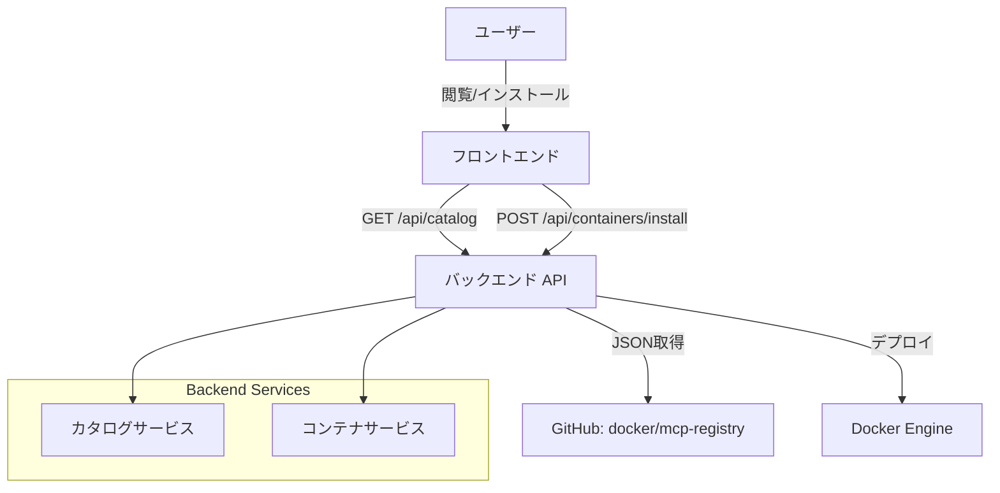
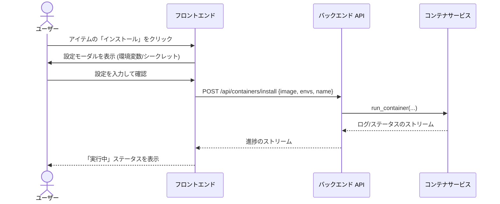

# 技術設計書: MCP Registry Browser

## 1. はじめに
本設計書は、Docker MCP GatewayのためのRegistry Browser機能の実装を定義します。この機能により、ユーザーは [github.com/docker/mcp-registry](https://github.com/docker/mcp-registry) からMCPサーバーの推奨リストを閲覧し、数クリックの簡略化されたワークフローでインストールできるようになります。従来の手動による `docker run` コマンドを、GUIベースの探索・設定プロセスに置き換えます。

## 2. アーキテクチャ

### 2.1 システムコンテキスト
`CatalogService`（バックエンド）は、外部のDocker MCP Registryと内部の `ContainerService` との架け橋となります。フロントエンドはカタログAPIを利用して、閲覧可能なUIを提供します。



## 3. システムフロー

### 3.1 インストールフロー


## 4. コンポーネントとインターフェース

### 4.1 バックエンド (Python/FastAPI)

#### `app/services/catalog.py`
**責務**: レジストリのメタデータを取得しキャッシュする。

| メソッド               | 説明                                                                                      |
| ---------------------- | ----------------------------------------------------------------------------------------- |
| `fetch_catalog()`      | 設定されたURLからレジストリJSONをGETする。結果をキャッシュ（メモリ内または短いTTL）する。 |
| `get_item_details(id)` | 必要に応じて特定のバージョン/タグの詳細を解決する。                                       |

**データソース**:
- プライマリ: `https://raw.githubusercontent.com/docker/mcp-registry/main/registry.json` (URLは検証/設定可能にする)

#### `app/schemas/catalog.py`
外部レジストリフォーマットのためのPydanticモデル。

```python
class RegistryItem(BaseModel):
    name: str # 例: "fetch"
    description: str
    vendor: str
    image: str # Dockerイメージ名
    homepage: Optional[str]
    required_envs: List[str] # 必須環境変数名のリスト
```

#### `app/routers/catalog.py`
`/api/catalog` エンドポイントを公開する。

### 4.2 フロントエンド (Next.js)

#### `app/catalog/page.tsx`
メインのエントリーポイント。 `CatalogCard` コンポーネントのグリッドを表示する。

#### `components/catalog/InstallModal.tsx`
**主要機能**: `required_envs` に基づく動的なフォーム生成。
- 標準的な文字列のための入力フィールド。
- 機密フィールド（"KEY" や "SECRET" を含む場合など、ヒューリスティック検知）のための既存 `BitwardenSelector` との統合。

## 5. データモデル

### 5.1 レジストリスキーマ (外部契約)
リモートJSONのスキーマ構造を前提とする。 *注: リモートレジストリが必須環境変数を厳密に定義していない場合、マッピングレイヤーが必要になるか、またはユーザーが手動で環境変数を追加する「ベストエフォート」なインストールになる可能性がある。*

### 5.2 API データ転送
**GET /api/catalog**
```json
[
  {
    "id": "docker/fetch",
    "name": "Fetch",
    "description": "Web fetch tool",
    "isInstalled": true,
    "image": "docker/mcp-fetch:latest"
  }
]
```

## 6. 実装上の注意点

### 6.1 重複防止
- フロントエンドは、同じイメージまたは期待される名前を持つコンテナが既に実行中かどうかを確認し（`useContainers` フックを使用）、「インストール」ボタンを無効化するか「インストール済み」に変更する必要がある。

### 6.2 エラーハンドリング
- **レジストリ到達不能**: 明確なエラーバナーと共に空のリストへのフォールバックを行う。
- **Docker Pull 失敗**: 標準的なエラートーストを表示する。バックグラウンドタスクがゾンビ化しないようにする。

### 6.3 セキュリティ
- **環境変数インジェクション**: モーダルに入力された値がサニタイズされ、コンテナ実行コマンドへ安全に渡されることを保証する（既存の `ContainerService` がこれを処理するが、 `InstallationRequest` モデルを検証すること）。

## 7. 要件トレーサビリティ

| 要件ID   | 概要                     | コンポーネント                                              |
| -------- | ------------------------ | ----------------------------------------------------------- |
| 1.1, 1.3 | カタログ取得             | `CatalogService`, `app/api/catalog`, `schemas/catalog`      |
| 1.2      | 取得エラーハンドリング   | `CatalogService` (try/except), フロントエンドのエラーバナー |
| 2.1, 2.2 | 閲覧 UI                  | `app/catalog/page.tsx`, `CatalogCard`                       |
| 2.3      | インストール済みチェック | フロントエンド (`useContainers` vs カタログリストの照合)    |
| 3.1      | 設定モーダル             | `InstallModal`, `BitwardenSelector` 統合                    |
| 3.2, 3.3 | インストールと進捗       | `useInstallation` フック, `ContainerService` (非同期)       |
