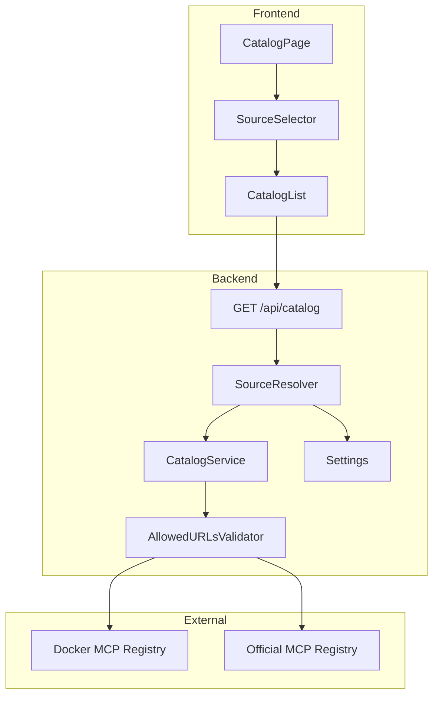
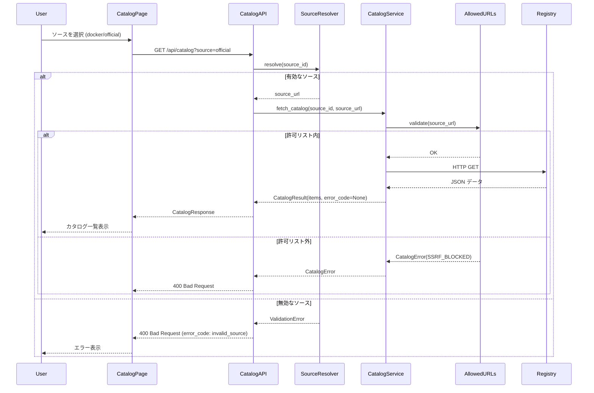
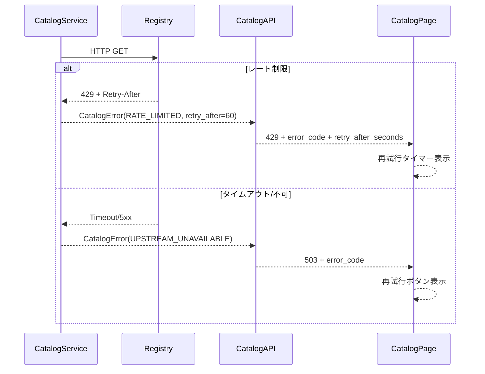

# Technical Design: mcp-registry-source-selector

## Overview

**Purpose**: 本機能は、MCP サーバーカタログの取得元を「プリセット選択」方式に変更し、ユーザーが URL を手入力することなく `DockerMCPCatalog` と `Official MCP Registry` を切り替えられるようにする。

**Users**: MCP サーバーを導入・管理する開発者およびチームメンバーが、セレクタ UI から目的のカタログソースを選択し、一覧表示・検索・インストールを行う。

**Impact**: 現在のフリーフォーム URL 入力を廃止し、バックエンドで許可されたソースのみを取得対象とすることで、セキュリティを強化しつつ操作性を向上させる。

### Goals
- プリセットされた 2 つのカタログソース（Docker / Official）をセレクタから選択可能にする
- バックエンド API で `source` パラメータを ID ベースで受け付け、未知の値は拒否する
- 既存の Docker カタログ機能を維持し、後方互換性を確保する
- エラー時にユーザーへ適切なフィードバックと再試行手段を提供する

### Non-Goals
- カスタム URL の動的追加機能（将来的な拡張として検討）
- OAuth を必要とするソースの自動認証フロー（既存の OAuth 機能を利用）
- カタログソースの優先順位設定やマージ表示

## Architecture

### Existing Architecture Analysis

現在のシステムは以下の構成で動作している：

- **Frontend**: `CatalogPage` がテキスト入力で URL を受け取り、`CatalogList` → `searchCatalog` API 経由でバックエンドに送信
- **Backend**: `GET /api/catalog` が `source` クエリパラメータを URL として解釈し、`CatalogService.fetch_catalog` でデータ取得
- **Data Flow**: URL → httpx fetch → JSON パース → `CatalogItem` 変換 → キャッシュ → レスポンス
- **既存設定**: `catalog_default_url` 環境変数で Docker カタログ URL を上書き可能

**Constraints**:
- 任意 URL をフェッチする現状は SSRF リスクを含む
- Official Registry の URL が設定ファイルに未定義

### Architecture Pattern & Boundary Map



**Architecture Integration**:
- **Selected pattern**: 既存コンポーネントの拡張（Option A）
- **Domain boundaries**: フロントエンドは ID を送信、バックエンドが URL 解決を担う
- **Existing patterns preserved**: SWR によるキャッシュ、`CatalogService` のフェッチ/変換ロジック
- **New components rationale**: `SourceResolver` ロジックは既存 API 層に組み込み、`AllowedURLsValidator` はサービス層で SSRF を多層防御
- **Steering compliance**: サービス層集中、シークレット安全性、テスト容易性を維持

### Technology Stack

| Layer | Choice / Version | Role in Feature | Notes |
|-------|------------------|-----------------|-------|
| Frontend | Next.js 15, React 19, TypeScript | セレクタ UI、状態管理 | 既存スタック |
| UI | Tailwind CSS | セレクタスタイリング | 既存スタック |
| Data Fetch | SWR | キャッシュ付きカタログ取得 | 既存スタック |
| Backend | FastAPI, Python 3.14+ | API エンドポイント、ソース解決 | 既存スタック |
| Validation | Pydantic v2 | Enum バリデーション | 既存スタック |
| HTTP Client | httpx | 上流レジストリ取得 | 既存スタック |

## System Flows

### カタログソース選択フロー



### エラーハンドリングフロー



**Key Decisions**:
- フロントエンドは ID 文字列のみ送信し、URL 詳細を知らない
- バリデーションエラーは上流リクエスト前に即座に返却
- サービス層で許可 URL リストを検証し、SSRF を多層防御
- エラーコードベースでフロントエンドが UI を出し分け

## Requirements Traceability

| Requirement | Summary | Components | Interfaces | Flows |
|-------------|---------|------------|------------|-------|
| 1.1 | セレクタで Docker/Official を提供 | CatalogSourceSelector | - | - |
| 1.2 | ソース変更時にリスト再取得 | CatalogPage, CatalogList | - | ソース選択フロー |
| 1.3 | 初回表示時 Docker をデフォルト | CatalogPage | - | - |
| 1.4 | 取得中にローディング表示 | CatalogList | - | - |
| 1.5 | 失敗時にエラー表示と再試行 | CatalogList | ErrorResponse | エラーハンドリングフロー |
| 2.1 | source パラメータ受付 | CatalogAPI | API Contract | ソース選択フロー |
| 2.2 | 省略時は Docker | CatalogAPI, SourceResolver | - | - |
| 2.3 | docker 指定時の動作 | SourceResolver, CatalogService | - | - |
| 2.4 | official 指定時の動作 | SourceResolver, CatalogService | - | - |
| 2.5 | 未知ソースで 400 | CatalogAPI, SourceResolver | API Contract | ソース選択フロー |
| 3.1 | 統一レスポンススキーマ | CatalogService | Service Interface | - |
| 3.2 | スキーマ変換 | CatalogService | - | - |
| 3.3 | マッピング不可項目の除外 | CatalogService | - | - |
| 3.4 | 未知フィールドの無視 | CatalogService | - | - |
| 3.5 | 安定 ID と表示名の保証 | CatalogService | - | - |
| 4.1 | レート制限エラー応答 | CatalogService, CatalogAPI | ErrorResponse | エラーハンドリングフロー |
| 4.2 | 上流不可エラー応答 | CatalogService, CatalogAPI | ErrorResponse | エラーハンドリングフロー |
| 4.3 | UI でレート制限通知 | CatalogList | ErrorResponse | エラーハンドリングフロー |
| 4.4 | UI で上流不可通知 | CatalogList | ErrorResponse | エラーハンドリングフロー |
| 4.5 | エラー時に選択ソース保持 | CatalogPage | - | - |
| 5.1 | プリセット限定 | SourceResolver, AllowedURLsValidator | - | ソース選択フロー |
| 5.2 | 未知ソースでリクエスト禁止 | SourceResolver, AllowedURLsValidator | - | ソース選択フロー |
| 5.3 | フリーフォーム入力廃止 | CatalogSourceSelector | - | - |
| 5.4 | 認証情報非露出 | CatalogService, CatalogAPI | - | - |
| 5.5 | サーバー側認証利用 | CatalogService | - | - |
| 6.1 | source 省略時の後方互換レスポンス | CatalogAPI | API Contract | - |
| 6.2 | 変更なしで Docker 動作 | CatalogPage | - | - |
| 6.3 | Docker ソース継続サポート | Config, CatalogService | - | - |
| 6.4 | Official 不可時も Docker 利用可 | CatalogService | - | - |
| 6.5 | ページリロードなしで切替 | CatalogPage | - | - |

## Components and Interfaces

| Component | Domain/Layer | Intent | Req Coverage | Key Dependencies | Contracts |
|-----------|--------------|--------|--------------|------------------|-----------|
| CatalogSourceSelector | Frontend/UI | プリセットソース選択 UI を提供 | 1.1, 5.3 | CatalogPage (P0) | State |
| CatalogPage | Frontend/UI | ソース状態管理と切替ハンドリング | 1.2, 1.3, 4.5, 6.2, 6.5 | CatalogSourceSelector (P0), CatalogList (P0) | State |
| CatalogList | Frontend/UI | カタログ一覧表示、ローディング、エラー | 1.4, 1.5, 4.3, 4.4 | searchCatalog API (P0) | - |
| CatalogAPI | Backend/API | source パラメータ受付とレスポンス返却 | 2.1, 2.2, 2.5, 5.4, 6.1 | SourceResolver (P0), CatalogService (P0) | API |
| SourceResolver | Backend/Logic | ソース ID から URL への解決とバリデーション | 2.3, 2.4, 5.1, 5.2 | Settings (P0) | Service |
| AllowedURLsValidator | Backend/Security | サービス層での URL 許可リスト検証 | 5.1, 5.2 | Settings (P0) | Service |
| CatalogService | Backend/Service | データ取得、変換、キャッシュ、エラーハンドリング | 3.1-3.5, 4.1, 4.2, 5.5, 6.3, 6.4 | AllowedURLsValidator (P0), httpx (P0) | Service |
| Settings | Backend/Config | ソース URL とパラメータの定義 | 6.3 | - | - |

### Frontend/UI

#### CatalogSourceSelector

| Field | Detail |
|-------|--------|
| Intent | プリセットされたカタログソースをセレクタから選択できる UI を提供 |
| Requirements | 1.1, 5.3 |

#### Responsibilities & Constraints

- Docker と Official の 2 つのプリセットを `<select>` で表示
- フリーフォームの URL 入力は提供しない
- 選択変更時に親コンポーネントへコールバック

#### Dependencies

- Outbound: CatalogPage — 選択値の通知 (P0)

**Contracts**: State [x]

##### State Management

- **State model**: Props 経由で `selectedSource` と `onSourceChange` を受け取る制御コンポーネント
- **Persistence**: なし（親コンポーネントで管理）

#### Implementation Notes

- Integration: 既存の `<input>` を置き換え、同じスタイルを適用
- Validation: 選択肢は固定であり追加バリデーション不要

#### CatalogPage

| Field | Detail |
|-------|--------|
| Intent | カタログソースの状態管理と切替時のリスト再取得をオーケストレーション |
| Requirements | 1.2, 1.3, 4.5, 6.2, 6.5 |

#### Responsibilities & Constraints

- デフォルトソースを `docker` に設定
- ソース変更時に `catalogSource` ステートを更新し、`CatalogList` へ伝播
- エラー発生時も選択ソースを保持

#### Dependencies

- Inbound: CatalogSourceSelector — ソース選択通知 (P0)
- Outbound: CatalogList — カタログデータ取得指示 (P0)

**Contracts**: State [x]

##### State Management

- **State model**: `useState<CatalogSourceId>('docker')`
- **Persistence**: なし（セッション中のみ）

#### Implementation Notes

- Integration: `inputSource` と `catalogSource` の 2 段階管理を廃止し、セレクタからの即時反映に変更
- Validation: セレクタが固定値のみを返すためフロント側バリデーションは不要

#### CatalogList (エラーハンドリング拡張)

| Field | Detail |
|-------|--------|
| Intent | カタログ一覧表示、ローディング、構造化エラーコードに基づくエラー表示 |
| Requirements | 1.4, 1.5, 4.3, 4.4 |

#### Responsibilities & Constraints

- `error_code` に基づいてエラーメッセージを出し分け
- `retry_after_seconds` がある場合はカウントダウン表示
- 再試行ボタンを提供

**Error Display Logic**:
```typescript
switch (error.error_code) {
  case 'rate_limited':
    // レート制限通知 + retry_after_seconds カウントダウン
    break;
  case 'upstream_unavailable':
    // 上流障害通知 + 再試行ボタン
    break;
  case 'invalid_source':
    // 無効なソースエラー（通常発生しない）
    break;
  default:
    // 一般エラー
}
```

### Backend/API

#### CatalogAPI (GET /api/catalog)

| Field | Detail |
|-------|--------|
| Intent | source パラメータを受け取り、ソース解決後にカタログデータを返却 |
| Requirements | 2.1, 2.2, 2.5, 5.4, 6.1 |

#### Responsibilities & Constraints

- `source` クエリパラメータを `CatalogSourceId` Enum でバリデーション
- 省略時は `docker` として扱う
- 未知の値は 400 Bad Request を返却
- エラーレスポンスに内部 URL や認証情報を含めない
- 構造化エラーレスポンス (`error_code`, `retry_after_seconds`) を返却

#### Dependencies

- Inbound: Frontend — HTTP リクエスト (P0)
- Outbound: SourceResolver — ソース解決 (P0)
- Outbound: CatalogService — データ取得 (P0)

**Contracts**: API [x]

##### API Contract

| Method | Endpoint | Request | Response | Errors |
|--------|----------|---------|----------|--------|
| GET | /api/catalog | `source?: CatalogSourceId` | CatalogResponse | 400, 429, 503, 500 |
| GET | /api/catalog/search | `source?: CatalogSourceId`, `q?`, `category?`, `page?`, `page_size?` | CatalogResponse | 400, 429, 503, 500 |

**Request Parameters**:
```python
class CatalogSourceId(str, Enum):
    DOCKER = "docker"
    OFFICIAL = "official"
```

**Error Response Schema**:
```python
class CatalogErrorResponse(BaseModel):
    """構造化エラーレスポンス"""
    detail: str = Field(..., description="人間可読なエラーメッセージ")
    error_code: CatalogErrorCode = Field(..., description="機械可読なエラーコード")
    retry_after_seconds: int | None = Field(default=None, description="再試行までの秒数")

class CatalogErrorCode(str, Enum):
    INVALID_SOURCE = "invalid_source"
    RATE_LIMITED = "rate_limited"
    UPSTREAM_UNAVAILABLE = "upstream_unavailable"
    INTERNAL_ERROR = "internal_error"
```

**HTTP Status Mapping**:
- `INVALID_SOURCE` → 400 Bad Request
- `RATE_LIMITED` → 429 Too Many Requests (上流の Retry-After を透過)
- `UPSTREAM_UNAVAILABLE` → 503 Service Unavailable
- `INTERNAL_ERROR` → 500 Internal Server Error

#### Implementation Notes

- Integration: 既存の `source: Optional[str]` を `source: CatalogSourceId = CatalogSourceId.DOCKER` に変更
- Validation: Pydantic/FastAPI が自動でバリデーション
- Risks: 既存クライアントが URL を送信している場合は 400 になるが、Web Console は自己完結しているため影響なし

### Backend/Logic

#### SourceResolver

| Field | Detail |
|-------|--------|
| Intent | ソース ID を対応する URL に解決し、未知 ID を拒否する |
| Requirements | 2.3, 2.4, 5.1, 5.2 |

#### Responsibilities & Constraints

- `CatalogSourceId` Enum の各値を `Settings` の URL にマッピング
- Enum で定義されていない値は処理前に拒否済み（Pydantic バリデーション）

#### Dependencies

- Inbound: CatalogAPI — ソース解決リクエスト (P0)
- Outbound: Settings — URL 定義参照 (P0)

**Contracts**: Service [x]

##### Service Interface
```python
def resolve_source_url(source: CatalogSourceId, settings: Settings) -> str:
    """
    ソース ID を対応する URL に解決する。
    
    Args:
        source: カタログソース ID
        settings: アプリケーション設定
        
    Returns:
        解決された URL 文字列
    """
    mapping = {
        CatalogSourceId.DOCKER: settings.catalog_docker_url,
        CatalogSourceId.OFFICIAL: settings.catalog_official_url,
    }
    return mapping[source]
```
- Preconditions: `source` は `CatalogSourceId` Enum のメンバー
- Postconditions: 有効な URL 文字列を返却
- Invariants: `Settings` で定義された URL のみを返却

#### Implementation Notes

- Integration: `catalog.py` の `get_catalog` 関数内にインライン実装可能（独立クラス化は不要）

### Backend/Security

#### AllowedURLsValidator

| Field | Detail |
|-------|--------|
| Intent | サービス層で URL が許可リストに含まれているか検証し、SSRF を多層防御 |
| Requirements | 5.1, 5.2 |

#### Responsibilities & Constraints

- `CatalogService` がフェッチを実行する前に URL を検証
- 許可リストは `Settings` から取得
- 許可リスト外の URL は `CatalogError` をスロー

#### Dependencies

- Inbound: CatalogService — URL 検証リクエスト (P0)
- Outbound: Settings — 許可リスト参照 (P0)

**Contracts**: Service [x]

##### Service Interface
```python
class AllowedURLsValidator:
    """サービス層での URL 許可リスト検証"""
    
    def __init__(self, settings: Settings):
        self._allowed_urls: frozenset[str] = frozenset([
            settings.catalog_docker_url,
            settings.catalog_official_url,
            # 後方互換: catalog_default_url も許可（非推奨）
            settings.catalog_default_url,
        ])
    
    def validate(self, url: str) -> None:
        """
        URL が許可リストに含まれているか検証する。
        
        Args:
            url: 検証対象の URL
            
        Raises:
            CatalogError: 許可リスト外の URL
        """
        if url not in self._allowed_urls:
            raise CatalogError(
                error_code=CatalogErrorCode.INVALID_SOURCE,
                message="URL is not in the allowed list"
            )
```

#### Implementation Notes

- Integration: `CatalogService._fetch_from_url` の先頭で呼び出し
- Validation: 完全一致で検証（プレフィックス攻撃を防止）
- Risks: 許可リストが大きくなる場合はパフォーマンス影響を検討

### Backend/Service

#### CatalogService (既存拡張)

| Field | Detail |
|-------|--------|
| Intent | 上流レジストリからデータを取得し、統一スキーマに変換してキャッシュ |
| Requirements | 3.1-3.5, 4.1, 4.2, 5.5, 6.3, 6.4 |

#### Responsibilities & Constraints

- 複数のスキーマ形式（Docker GitHub Contents API、Official Registry JSON）を `CatalogItem` に正規化
- マッピング不可の項目は除外
- **フェッチ前に `AllowedURLsValidator` で URL を検証（SSRF 多層防御）**
- レート制限（429）やタイムアウトを構造化エラーとして返却
- 認証情報はバックエンドで管理し、レスポンスに露出させない

#### Dependencies

- Inbound: CatalogAPI — データ取得リクエスト (P0)
- Outbound: AllowedURLsValidator — URL 検証 (P0)
- External: Docker MCP Registry — HTTP fetch (P1)
- External: Official MCP Registry — HTTP fetch (P1)

**Contracts**: Service [x]

##### Service Interface
```python
class CatalogResult(NamedTuple):
    """カタログ取得結果"""
    items: List[CatalogItem]
    cached: bool
    warning: str | None = None

class CatalogError(Exception):
    """カタログ取得エラー"""
    def __init__(
        self,
        error_code: CatalogErrorCode,
        message: str,
        retry_after_seconds: int | None = None
    ):
        self.error_code = error_code
        self.message = message
        self.retry_after_seconds = retry_after_seconds
        super().__init__(message)

async def fetch_catalog(
    self, 
    source_url: str, 
    force_refresh: bool = False
) -> CatalogResult:
    """
    カタログデータを取得する。
    
    Args:
        source_url: 取得先 URL（許可リスト内であること）
        force_refresh: キャッシュを無視するか
        
    Returns:
        CatalogResult(items, cached, warning)
        
    Raises:
        CatalogError: 取得失敗時（レート制限、タイムアウト、許可リスト外含む）
    """
    # Step 1: URL を許可リストで検証（SSRF 防止）
    self._url_validator.validate(source_url)
    
    # Step 2: キャッシュ確認
    # Step 3: HTTP フェッチ
    # Step 4: スキーマ変換
    ...
```
- Preconditions: `source_url` は有効な HTTP/HTTPS URL
- Postconditions: `CatalogResult` を返却、または `CatalogError` をスロー
- Invariants: 許可リスト外の URL はフェッチしない

#### Implementation Notes

- Integration: `_convert_explore_server` で Official Registry 形式を処理済み、追加調整は軽微
- Validation: 上流レスポンスのスキーマ検証は Pydantic モデルで実施
- Risks: Official Registry のスキーマ変更時はパース失敗の可能性あり（ログ記録で早期検知）

### Backend/Config

#### Settings (既存拡張)

| Field | Detail |
|-------|--------|
| Intent | カタログソースの URL 定義と関連パラメータを管理 |
| Requirements | 6.3 |

#### Responsibilities & Constraints

- `catalog_docker_url` および `catalog_official_url` を定義
- 環境変数で上書き可能
- **後方互換**: 既存の `catalog_default_url` を `catalog_docker_url` のエイリアスとして維持

**Contracts**: なし（データホルダー）

**Configuration (後方互換対応)**:
```python
# backend/app/config.py に追加
class Settings(BaseSettings):
    # 既存設定（後方互換のため維持、非推奨）
    catalog_default_url: str = "https://api.github.com/repos/docker/mcp-registry/contents/servers"
    
    # 新設定（推奨）
    catalog_official_url: str = "https://registry.modelcontextprotocol.io/v0/servers"
    
    @property
    def catalog_docker_url(self) -> str:
        """Docker カタログ URL。catalog_default_url のエイリアス（後方互換）。"""
        return self.catalog_default_url
```

**Migration Notes**:
- `catalog_default_url` は非推奨だが、既存ユーザーの環境変数上書きを尊重するため維持
- 新規デプロイでは `CATALOG_DOCKER_URL` の使用を推奨（ドキュメント更新）
- 将来バージョンで `catalog_default_url` を完全に削除する際は deprecation warning をログ出力

**Environment Variables**:

| Variable | Default | Description |
|----------|---------|-------------|
| `CATALOG_DEFAULT_URL` | GitHub API URL | Docker カタログ URL（既存/非推奨） |
| `CATALOG_OFFICIAL_URL` | Official Registry URL | Official MCP Registry URL |

## Data Models

### Domain Model

本機能で追加されるドメインエンティティはなし。既存の `CatalogItem` を継続使用。

### Logical Data Model

**CatalogSourceId Enum**:
```python
class CatalogSourceId(str, Enum):
    DOCKER = "docker"
    OFFICIAL = "official"
```

**CatalogErrorCode Enum**:
```python
class CatalogErrorCode(str, Enum):
    INVALID_SOURCE = "invalid_source"
    RATE_LIMITED = "rate_limited"
    UPSTREAM_UNAVAILABLE = "upstream_unavailable"
    INTERNAL_ERROR = "internal_error"
```

**Mapping**:
- `DOCKER` → `settings.catalog_docker_url` (= `settings.catalog_default_url`)
- `OFFICIAL` → `settings.catalog_official_url`

### Data Contracts & Integration

**Frontend 定数**:
```typescript
// frontend/lib/constants/catalogSources.ts
export const CATALOG_SOURCES = [
  { id: 'docker', label: 'Docker MCP Catalog' },
  { id: 'official', label: 'Official MCP Registry' },
] as const;

export type CatalogSourceId = typeof CATALOG_SOURCES[number]['id'];

// frontend/lib/types/catalog.ts に追加
export type CatalogErrorCode = 
  | 'invalid_source'
  | 'rate_limited'
  | 'upstream_unavailable'
  | 'internal_error';

export interface CatalogErrorResponse {
  detail: string;
  error_code: CatalogErrorCode;
  retry_after_seconds?: number;
}
```

**API リクエスト**:
- `GET /api/catalog?source=docker`
- `GET /api/catalog?source=official`
- `GET /api/catalog` (source 省略時は docker)

## Error Handling

### Error Strategy
- **入力検証エラー**: Pydantic/FastAPI の自動バリデーションで 400 を返却（`error_code: invalid_source`）
- **上流レート制限**: 429 を返却（`error_code: rate_limited`, `retry_after_seconds` を含む）
- **上流障害**: 503 を返却（`error_code: upstream_unavailable`）
- **UI エラー表示**: `error_code` に基づいて適切なメッセージと再試行 UI を表示

### Error Categories and Responses

**User Errors (4xx)**:
```json
{
  "detail": "Invalid source value. Allowed: docker, official",
  "error_code": "invalid_source"
}
```

**Rate Limit (429)**:
```json
{
  "detail": "Upstream rate limit exceeded. Please retry later.",
  "error_code": "rate_limited",
  "retry_after_seconds": 60
}
```

**Upstream Unavailable (503)**:
```json
{
  "detail": "Upstream registry is temporarily unavailable.",
  "error_code": "upstream_unavailable"
}
```

**Internal Error (500)**:
```json
{
  "detail": "An internal error occurred.",
  "error_code": "internal_error"
}
```

### Monitoring
- 既存のログ機構 (`logger.error`) でエラーを記録
- `warning` フィールドでユーザーへの警告情報を伝達
- `error_code` をメトリクスで集計可能

## Testing Strategy

### Unit Tests
- `CatalogSourceId` Enum のバリデーション動作
- `resolve_source_url` のマッピング正確性
- `AllowedURLsValidator` の許可リスト検証
- `CatalogError` の構造化エラー生成
- `CatalogService` の各スキーマ変換ロジック

### Integration Tests
- `GET /api/catalog?source=docker` のエンドツーエンド動作
- `GET /api/catalog?source=official` のエンドツーエンド動作
- 不正な source 値での 400 レスポンス（`error_code` 検証）
- source 省略時のデフォルト動作
- 上流 429 → 429 透過（`retry_after_seconds` 検証）
- 上流タイムアウト → 503 返却

### E2E/UI Tests
- セレクタで Docker を選択 → カタログ表示
- セレクタで Official を選択 → カタログ表示
- ソース切替時にページリロードなしでリスト更新
- レート制限エラー → カウントダウン表示と再試行
- 上流障害エラー → 再試行ボタン表示

## Security Considerations

- **SSRF 多層防御**:
  1. API 層: `CatalogSourceId` Enum でバリデーション（第一防御）
  2. サービス層: `AllowedURLsValidator` で許可リスト検証（第二防御）
- **情報漏洩防止**: エラーメッセージに内部 URL や認証情報を含めない
- **認証情報管理**: GitHub Token は環境変数または Bitwarden から取得し、レスポンスに露出させない

## Migration Strategy

### 後方互換性

1. **既存環境変数の尊重**: `CATALOG_DEFAULT_URL` を設定しているユーザーは、`docker` ソース選択時にその URL が使用される
2. **フロントエンド互換**: `NEXT_PUBLIC_CATALOG_URL` は無視される（URL 直接送信を禁止するため）
3. **API 互換**: `source` パラメータ省略時は従来通り Docker カタログを返却

### 非推奨化スケジュール

| Phase | Timing | Action |
|-------|--------|--------|
| Phase 1 | 本リリース | `catalog_default_url` を非推奨としてマーク、ログに警告出力 |
| Phase 2 | 次メジャーリリース | ドキュメントから `catalog_default_url` の記載を削除 |
| Phase 3 | 2メジャーリリース後 | `catalog_default_url` を完全削除、`catalog_docker_url` のみサポート |

## Supporting References

詳細な調査ログと設計判断の根拠は `research.md` を参照。
