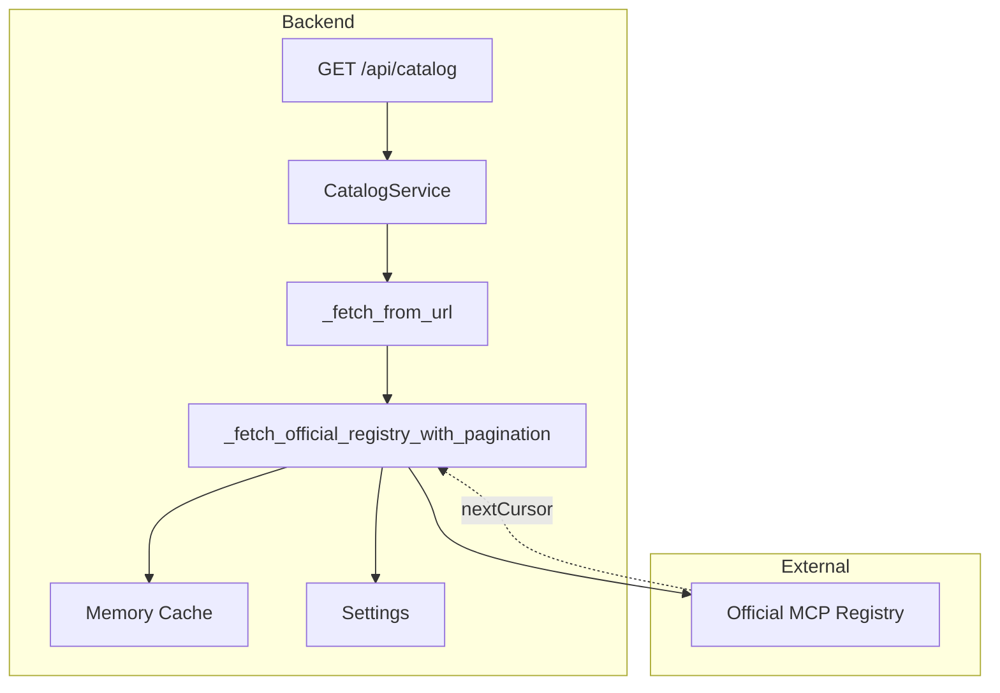
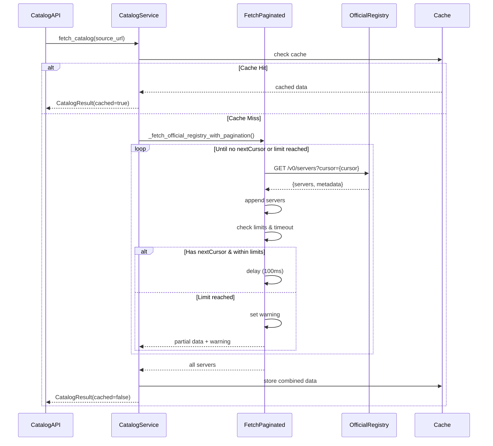
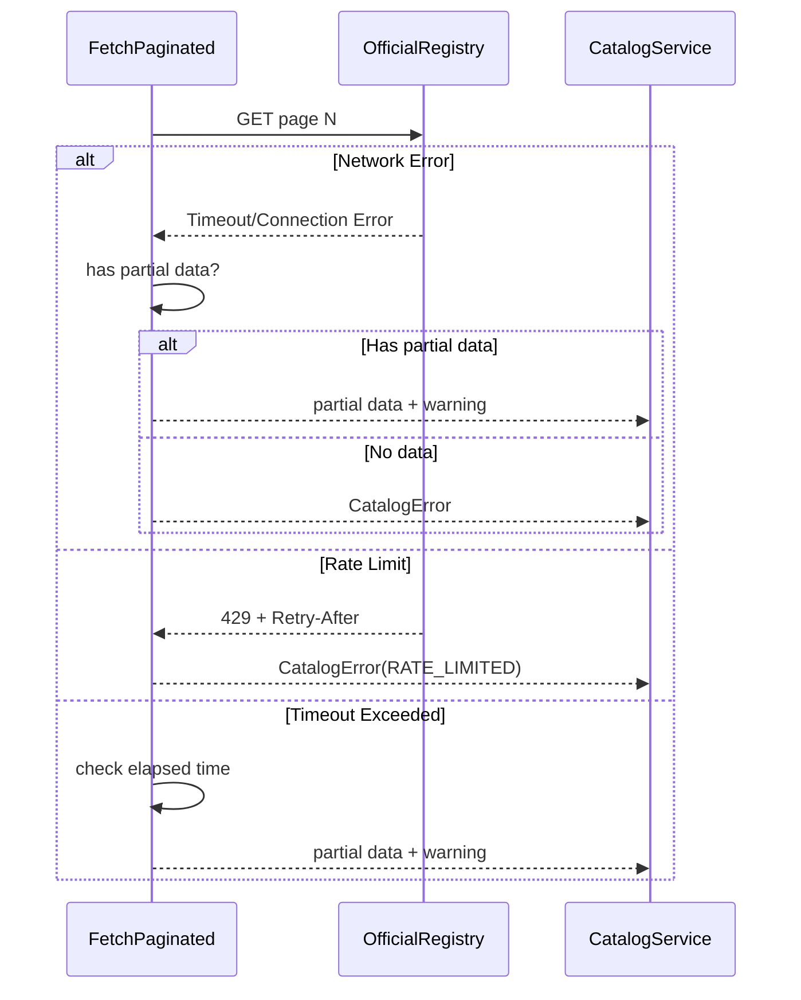

# Technical Design: official-registry-pagination

## Overview

**Purpose**: Official MCP Registry API のカーソルベースページネーションに対応し、30件を超える全サーバーエントリを取得・表示可能にする。

**Users**: MCP サーバーを導入・管理する開発者が、Official ソース選択時にレジストリの全エントリを閲覧できる。

**Impact**: 現在の単一リクエスト実装を拡張し、`metadata.nextCursor` を使用した複数ページ取得を実装することで、ユーザーは Official Registry の全カタログを利用可能になる。

### Goals
- `metadata.nextCursor` を使用したカーソルベースページネーション取得を実装
- 最大ページ数・タイムアウトの制限を設定可能にし、無限ループを防止
- 部分成功時に取得済みデータを返却し、警告メッセージで通知
- 既存のキャッシュ機構と統合し、全ページ取得完了後の結合データをキャッシュ

### Non-Goals
- フロントエンドでの段階的ページ取得（バックエンドで一括取得）
- Docker カタログソースへのページネーション適用（GitHub API は別形式）
- リアルタイム進捗表示（WebSocket/SSE による取得進捗のストリーミング）

## Architecture

### Existing Architecture Analysis

現在のシステムは以下の構成で動作している：

- **Backend**: `CatalogService._fetch_from_url` が単一リクエストを発行し、レスポンスをパース
- **Official Registry**: `https://registry.modelcontextprotocol.io/v0/servers` からJSON形式でデータ取得
- **Response Format**: `{"servers": [...], "metadata": {"nextCursor": "...", "count": 30}}`
- **Current Limitation**: `metadata.nextCursor` を無視し、最初の30件のみ返却

**Constraints**:
- Official Registry は1リクエストあたり最大30件を返却
- カーソルが存在する限り、追加ページが利用可能
- 上流サービスへの負荷を考慮した遅延が必要

### Architecture Pattern & Boundary Map



**Architecture Integration**:
- **Selected pattern**: 既存 `CatalogService` の拡張（Option A）
- **Domain boundaries**: Official Registry URL 判定時のみページネーション取得を使用
- **Existing patterns preserved**: キャッシュ機構、エラーハンドリング、スキーマ変換
- **New components rationale**: `_fetch_official_registry_with_pagination` メソッドを追加し、カーソルベース取得を実装
- **Steering compliance**: サービス層集中、テスト容易性、型安全性を維持

### Technology Stack & Alignment

| Layer | Choice / Version | Role in Feature | Notes |
|-------|------------------|-----------------|-------|
| Backend | FastAPI, Python 3.14+ | ページネーション取得ロジック | 既存スタック |
| HTTP Client | httpx | 上流レジストリへの複数リクエスト | 既存スタック |
| Async | asyncio | ページ間遅延の実装 | 既存スタック |
| Validation | Pydantic v2 | レスポンススキーマ検証 | 既存スタック |
| Config | Settings (BaseSettings) | ページネーション設定管理 | 既存スタック |

## System Flows

### カーソルベースページネーション取得フロー



### エラーハンドリングフロー



**Key Decisions**:
- Official Registry URL の場合のみページネーション取得を使用
- カーソルが存在する限りループ継続、上限到達時は警告付きで返却
- 途中エラー時は取得済みデータを部分成功として返却
- 各ページ取得間に遅延を挿入し、上流サービスへの負荷を軽減

## Requirements Traceability

| Requirement | Summary | Components | Interfaces | Flows |
|-------------|---------|------------|------------|-------|
| 1.1 | nextCursor を使用した次ページ取得 | _fetch_official_registry_with_pagination | Service Interface | ページネーションフロー |
| 1.2 | カーソル存在時のループ継続 | _fetch_official_registry_with_pagination | Service Interface | ページネーションフロー |
| 1.3 | 全ページのサーバー結合 | _fetch_official_registry_with_pagination | Service Interface | ページネーションフロー |
| 1.4 | ページ間遅延の挿入 | _fetch_official_registry_with_pagination | Service Interface | ページネーションフロー |
| 2.1 | 最大ページ数上限の設定 | Settings, _fetch_official_registry_with_pagination | Config | ページネーションフロー |
| 2.2 | 全体タイムアウトの設定 | Settings, _fetch_official_registry_with_pagination | Config | ページネーションフロー |
| 2.3 | 上限到達時の警告付き返却 | _fetch_official_registry_with_pagination | Service Interface | ページネーションフロー |
| 2.4 | 環境変数による設定 | Settings | Config | - |
| 3.1 | 途中エラー時の部分成功 | _fetch_official_registry_with_pagination | Service Interface | エラーハンドリングフロー |
| 3.2 | 部分成功時の警告通知 | _fetch_official_registry_with_pagination | Service Interface | エラーハンドリングフロー |
| 3.3 | レート制限時の既存処理適用 | _fetch_from_url | Service Interface | エラーハンドリングフロー |
| 3.4 | リトライロジックの適用 | _fetch_from_url | Service Interface | エラーハンドリングフロー |
| 4.1 | 全ページ結合データのキャッシュ | CatalogService.fetch_catalog | Service Interface | ページネーションフロー |
| 4.2 | キャッシュヒット時のスキップ | CatalogService.fetch_catalog | Service Interface | ページネーションフロー |
| 4.3 | 既存 TTL 設定の適用 | Settings | Config | - |
| 5.1 | ローディング表示の維持 | - | - | - |
| 5.2 | 取得進捗のログ出力 | _fetch_official_registry_with_pagination | - | ページネーションフロー |
| 5.3 | 既存無限スクロール UI の利用 | - | - | - |
| 6.1 | CATALOG_OFFICIAL_MAX_PAGES 設定 | Settings | Config | - |
| 6.2 | CATALOG_OFFICIAL_FETCH_TIMEOUT 設定 | Settings | Config | - |
| 6.3 | CATALOG_OFFICIAL_PAGE_DELAY 設定 | Settings | Config | - |

## Components & Interface Contracts

| Component | Domain/Layer | Intent | Req Coverage | Key Dependencies | Contracts |
|-----------|--------------|--------|--------------|------------------|-----------| 
| Settings | Backend/Config | ページネーション設定の管理 | 2.1, 2.2, 2.4, 6.1, 6.2, 6.3 | - | Config |
| CatalogService | Backend/Service | カタログ取得のオーケストレーション | 4.1, 4.2, 4.3 | _fetch_official_registry_with_pagination (P0) | Service |
| _fetch_official_registry_with_pagination | Backend/Service | Official Registry からのページネーション取得 | 1.1, 1.2, 1.3, 1.4, 2.1, 2.2, 2.3, 3.1, 3.2, 5.2 | httpx (P0), Settings (P0) | Service |
| _fetch_from_url | Backend/Service | URL 判定とフェッチ処理の分岐 | 3.3, 3.4 | _fetch_official_registry_with_pagination (P0) | Service |

### Backend/Config

#### Settings (既存拡張)

| Field | Detail |
|-------|--------|
| Intent | ページネーション関連の設定を管理 |
| Requirements | 2.1, 2.2, 2.4, 6.1, 6.2, 6.3 |

##### Responsibilities & Constraints

- 最大ページ数、タイムアウト、ページ間遅延の設定を提供
- 環境変数による上書きをサポート
- デフォルト値を定義

**Contracts**: Config [x]

##### Configuration

```python
# backend/app/config.py に追加
class Settings(BaseSettings):
    # 既存設定
    catalog_official_url: str = "https://registry.modelcontextprotocol.io/v0/servers"
    catalog_cache_ttl_seconds: int = 3600
    
    # 新設定
    catalog_official_max_pages: int = Field(
        default=20,
        description="Official Registry からの最大取得ページ数（1ページ=30件）"
    )
    catalog_official_fetch_timeout: int = Field(
        default=60,
        description="全ページ取得の合計タイムアウト秒数"
    )
    catalog_official_page_delay: int = Field(
        default=100,
        description="ページ間遅延ミリ秒"
    )
```

**Environment Variables**:

| Variable | Default | Description |
|----------|---------|-------------|
| `CATALOG_OFFICIAL_MAX_PAGES` | 20 | 最大取得ページ数（1ページ=30件、最大600件） |
| `CATALOG_OFFICIAL_FETCH_TIMEOUT` | 60 | 全ページ取得タイムアウト秒数 |
| `CATALOG_OFFICIAL_PAGE_DELAY` | 100 | ページ間遅延ミリ秒 |

##### Implementation Notes

- Integration: 既存の `Settings` クラスに新フィールドを追加
- Validation: Pydantic の Field で型とデフォルト値を定義
- Risks: なし（既存設定との競合なし）

### Backend/Service

#### CatalogService (既存拡張)

| Field | Detail |
|-------|--------|
| Intent | カタログ取得のオーケストレーションとキャッシュ管理 |
| Requirements | 4.1, 4.2, 4.3 |

##### Responsibilities & Constraints

- キャッシュヒット時はページネーション取得をスキップ
- 全ページ取得完了後の結合データをキャッシュ
- 既存の TTL 設定を適用

**Contracts**: Service [x]

##### Service Interface

```python
async def fetch_catalog(
    self, 
    source_url: str, 
    force_refresh: bool = False
) -> CatalogResult:
    """
    カタログデータを取得する。メモリキャッシュが有効な場合はAPI呼び出しをスキップする。
    
    Args:
        source_url: 取得先のURL
        force_refresh: キャッシュを無視して強制的に再取得するか
        
    Returns:
        CatalogResult(items, cached, warning)
        
    Raises:
        CatalogError: 取得およびフォールバックが失敗し、キャッシュも無い場合
    """
    # Step 1: キャッシュ確認
    if not force_refresh:
        cached = self.get_cached_catalog(source_url)
        if cached is not None:
            return CatalogResult(items=cached, cached=True, warning=self._warning)
    
    # Step 2: データ取得（ページネーション対応）
    items = await self._fetch_from_url(source_url)
    
    # Step 3: キャッシュ保存
    self._cache_catalog(source_url, items)
    
    return CatalogResult(items=items, cached=False, warning=self._warning)
```

- Preconditions: `source_url` は有効な HTTP/HTTPS URL
- Postconditions: `CatalogResult` を返却、または `CatalogError` をスロー
- Invariants: キャッシュヒット時はネットワークリクエストを発行しない

##### Implementation Notes

- Integration: 既存の `fetch_catalog` メソッドは変更不要（`_fetch_from_url` が内部でページネーション判定）
- Validation: キャッシュキーは `source_url` を使用
- Risks: なし（既存動作を維持）

#### _fetch_from_url (既存拡張)

| Field | Detail |
|-------|--------|
| Intent | URL 判定とフェッチ処理の分岐 |
| Requirements | 3.3, 3.4 |

##### Responsibilities & Constraints

- Official Registry URL の場合はページネーション取得を使用
- それ以外は既存の単一リクエスト処理を維持
- レート制限とリトライロジックを適用

**Contracts**: Service [x]

##### Service Interface

```python
async def _fetch_from_url(self, source_url: str) -> List[CatalogItem]:
    """
    Fetch and parse catalog data from a URL.
    
    Args:
        source_url: URL of the catalog JSON file
        
    Returns:
        List of CatalogItem objects
        
    Raises:
        CatalogError: If fetch or parsing fails
    """
    # Step 1: URL を許可リストで検証
    self._url_validator.validate(source_url)
    
    # Step 2: Official Registry URL の場合はページネーション取得
    if source_url == settings.catalog_official_url:
        return await self._fetch_official_registry_with_pagination(source_url)
    
    # Step 3: それ以外は既存の単一リクエスト処理
    # ... 既存コード ...
```

- Preconditions: `source_url` は許可リスト内の URL
- Postconditions: `List[CatalogItem]` を返却、または `CatalogError` をスロー
- Invariants: Official Registry URL のみページネーション取得を使用

##### Implementation Notes

- Integration: 既存の `_fetch_from_url` メソッドに URL 判定を追加
- Validation: 完全一致で Official Registry URL を判定
- Risks: URL 比較は正規化済みの値を使用（`AllowedURLsValidator` で正規化）

#### _fetch_official_registry_with_pagination (新規)

| Field | Detail |
|-------|--------|
| Intent | Official Registry からカーソルベースでページネーション取得 |
| Requirements | 1.1, 1.2, 1.3, 1.4, 2.1, 2.2, 2.3, 3.1, 3.2, 5.2 |

##### Responsibilities & Constraints

- `metadata.nextCursor` を使用して次ページを取得
- カーソルが存在しなくなるまで、または上限に達するまでループ
- 取得した全ページのサーバーを結合
- 各ページ取得間に遅延を挿入
- 最大ページ数とタイムアウトを監視
- 上限到達時は警告メッセージを設定
- 途中エラー時は取得済みデータを返却

**Contracts**: Service [x]

##### Service Interface

**注意**: 以下のコードはデザイン/サンプルとして提供されており、そのまま本番環境で使用できるものではありません。実装時には以下を確認してください：
- 例外の種類と処理順序が実際の HTTP クライアント（httpx）の動作に合致しているか
- 部分成功時の動作が要件を満たしているか
- 依存するヘルパーメソッドと設定値が実装環境に存在するか

#### Design Example (実装パターン)

```python
async def _fetch_official_registry_with_pagination(
    self, 
    source_url: str
) -> List[CatalogItem]:
    """
    Official Registry からカーソルベースでページネーション取得する。
    
    Args:
        source_url: Official Registry の URL
        
    Returns:
        全ページから取得した CatalogItem のリスト
        
    Raises:
        CatalogError: 初回ページ取得失敗時（部分成功時は警告付きで返却）
    """
    all_servers: List[dict] = []
    cursor: str | None = None
    page_count: int = 0
    start_time: float = time.time()
    
    max_pages: int = settings.catalog_official_max_pages
    timeout_seconds: int = settings.catalog_official_fetch_timeout
    page_delay_ms: int = settings.catalog_official_page_delay
    
    try:
        async with httpx.AsyncClient(timeout=30.0) as client:
            while page_count < max_pages:
                # タイムアウトチェック
                elapsed = time.time() - start_time
                if elapsed > timeout_seconds:
                    self._append_warning(
                        f"Timeout reached after {page_count} pages. "
                        f"Returning {len(all_servers)} items."
                    )
                    break
                
                # リクエスト URL 構築
                url = f"{source_url}?cursor={cursor}" if cursor else source_url
                
                # ページ取得
                try:
                    response = await client.get(url, headers=self._get_headers())
                    response.raise_for_status()
                    data = response.json()
                except httpx.HTTPStatusError as e:
                    if e.response.status_code == 429:
                        # レート制限エラー
                        retry_after = self._parse_retry_after_seconds(
                            e.response.headers.get("Retry-After")
                        )
                        raise CatalogError(
                            message="Rate limit exceeded",
                            error_code=CatalogErrorCode.RATE_LIMITED,
                            retry_after_seconds=retry_after
                        )
                    # その他のエラー
                    if all_servers:
                        # 部分成功
                        self._append_warning(
                            f"Error fetching page {page_count + 1}: {e}. "
                            f"Returning {len(all_servers)} items."
                        )
                        break
                    else:
                        # 初回ページ失敗
                        raise CatalogError(
                            message=f"Failed to fetch catalog: {e}",
                            error_code=CatalogErrorCode.UPSTREAM_UNAVAILABLE
                        )
                except Exception as e:
                    # ネットワークエラー等
                    if all_servers:
                        self._append_warning(
                            f"Error fetching page {page_count + 1}: {e}. "
                            f"Returning {len(all_servers)} items."
                        )
                        break
                    else:
                        raise CatalogError(
                            message=f"Failed to fetch catalog: {e}",
                            error_code=CatalogErrorCode.UPSTREAM_UNAVAILABLE
                        )
                
                # サーバーリストを結合
                servers = data.get("servers", [])
                all_servers.extend(servers)
                page_count += 1
                
                logger.info(
                    f"Fetched page {page_count} from Official Registry: "
                    f"{len(servers)} items (total: {len(all_servers)})"
                )
                
                # 次のカーソルを取得
                metadata = data.get("metadata", {})
                cursor = metadata.get("nextCursor")
                
                if not cursor:
                    # 最終ページ
                    logger.info(
                        f"Completed pagination: {page_count} pages, "
                        f"{len(all_servers)} total items"
                    )
                    break
                
                # ページ間遅延
                if cursor:
                    await asyncio.sleep(page_delay_ms / 1000.0)
            
            # 最大ページ数到達チェック
            if cursor and page_count >= max_pages:
                self._append_warning(
                    f"Max pages ({max_pages}) reached. "
                    f"Returning {len(all_servers)} items. "
                    f"More items may be available."
                )
        
        # スキーマ変換
        items = [
            self._convert_explore_server(server)
            for server in all_servers
        ]
        
        # 重複除外（ID ベース）
        seen_ids: set[str] = set()
        unique_items: List[CatalogItem] = []
        for item in items:
            if item.id not in seen_ids:
                seen_ids.add(item.id)
                unique_items.append(item)
        
        return unique_items
        
    except CatalogError:
        # CatalogError はそのまま再スロー
        raise
    except Exception as e:
        logger.error(f"Unexpected error in pagination: {e}", exc_info=True)
        if all_servers:
            # 部分成功
            self._append_warning(f"Unexpected error: {e}. Returning partial data.")
            items = [
                self._convert_explore_server(server)
                for server in all_servers
            ]
            return items
        else:
            raise CatalogError(
                message=f"Failed to fetch catalog: {e}",
                error_code=CatalogErrorCode.INTERNAL_ERROR
            )
```

#### Dependencies (依存関係)

このサンプルコードは以下のヘルパーメソッドと設定値に依存しています。実装前に存在を確認してください：

**ヘルパーメソッド**:
- `_convert_explore_server(server: dict) -> CatalogItem`: サーバー辞書を `CatalogItem` に変換
- `_get_headers() -> dict`: HTTP リクエストヘッダーを生成
- `_parse_retry_after_seconds(header_value: str | None) -> int | None`: `Retry-After` ヘッダーをパース
- `_append_warning(message: str) -> None`: 警告メッセージをインスタンス変数に追記

**設定値** (Settings):
- `settings.catalog_official_max_pages`: 最大取得ページ数（デフォルト: 20）
- `settings.catalog_official_fetch_timeout`: 全体タイムアウト秒数（デフォルト: 60）
- `settings.catalog_official_page_delay`: ページ間遅延ミリ秒（デフォルト: 100）

**その他**:
- `logger`: ロギングインスタンス（進捗とエラーの記録用）
- `CatalogError`, `CatalogErrorCode`: エラー型とエラーコード定義

#### Implementation Checklist (実装チェックリスト)

実装者は以下を確認してから本番環境にコードを適用してください：

- [ ] **ヘルパーメソッドの存在確認**: `_convert_explore_server`, `_get_headers`, `_parse_retry_after_seconds`, `_append_warning` が実装されているか
- [ ] **設定値の定義確認**: `catalog_official_max_pages`, `catalog_official_fetch_timeout`, `catalog_official_page_delay` が `Settings` に定義されているか
- [ ] **例外型の検証**: `httpx.HTTPStatusError` と `httpx.AsyncClient` の例外型が実際の httpx バージョンと一致するか
- [ ] **エラー処理の適応**: 429 以外の HTTP ステータスコード（503, 504 等）に対するエラーハンドリングが適切か
- [ ] **部分成功動作の確認**: 途中エラー時に取得済みデータを返却する動作が要件を満たしているか
- [ ] **タイムアウト動作の確認**: `time.time()` による経過時間計測が期待通りに動作するか
- [ ] **重複除外ロジックの検証**: ID ベースの重複除外が必要か、またロジックが正しいか
- [ ] **ログ出力の確認**: `logger.info` と `logger.error` の出力レベルとメッセージが適切か

##### Contract Specification

- Preconditions: `source_url` は Official Registry の URL
- Postconditions: `List[CatalogItem]` を返却、または `CatalogError` をスロー
- Invariants:
  - ページ数は `max_pages` を超えない
  - 全体実行時間は `timeout_seconds` を超えない
  - 各ページ取得間に `page_delay_ms` の遅延を挿入

##### Implementation Notes

- Integration: `_fetch_from_url` から呼び出される新規メソッド
- Validation: レスポンススキーマは既存の `_convert_explore_server` で検証
- Risks: 
  - Official Registry のスキーマ変更時はパース失敗の可能性（ログ記録で早期検知）
  - 大量ページ取得時のメモリ使用量（最大600件程度なので問題なし）

## Data Models

### Domain Model

本機能で追加されるドメインエンティティはなし。既存の `CatalogItem` を継続使用。

### Logical Data Model

**Official Registry Response Schema**:
```python
class OfficialRegistryMetadata(BaseModel):
    """Official Registry のメタデータ"""
    nextCursor: str | None = Field(
        default=None,
        description="次ページ取得用のカーソル文字列"
    )
    count: int = Field(
        description="現在のレスポンスに含まれるサーバー数"
    )

class OfficialRegistryResponse(BaseModel):
    """Official Registry のレスポンス"""
    servers: List[dict] = Field(
        description="サーバーエントリのリスト"
    )
    metadata: OfficialRegistryMetadata = Field(
        description="ページネーションメタデータ"
    )
```

**Example Response**:
```json
{
  "servers": [
    {
      "server": {
        "name": "ai.mcpcap/mcpcap",
        "version": "0.6.0",
        ...
      },
      "_meta": {...}
    },
    ...
  ],
  "metadata": {
    "nextCursor": "ai.mcpcap/mcpcap:0.6.0",
    "count": 30
  }
}
```

### Data Contracts & Integration

**Cursor Parameter**:
- 初回リクエスト: `GET /v0/servers`
- 次ページリクエスト: `GET /v0/servers?cursor={nextCursor}`

**Pagination Logic**:
1. 初回リクエストでカーソルなしで取得
2. レスポンスから `metadata.nextCursor` を抽出
3. カーソルが存在する場合、クエリパラメータに付与して次ページ取得
4. カーソルが存在しなくなるまで繰り返し

## Error Handling

### Error Strategy
- **初回ページ失敗**: `CatalogError` をスロー（既存のエラーハンドリングを適用）
- **途中ページ失敗**: 取得済みデータを返却し、警告メッセージを設定
- **レート制限**: 429 エラーをスロー（既存のレート制限処理を適用）
- **タイムアウト**: 取得済みデータを返却し、警告メッセージを設定
- **最大ページ数到達**: 取得済みデータを返却し、警告メッセージを設定

### Error Categories and Responses

**Rate Limit (429)**:
```python
CatalogError(
    message="Rate limit exceeded",
    error_code=CatalogErrorCode.RATE_LIMITED,
    retry_after_seconds=60
)
```

**Upstream Unavailable (503)**:
```python
CatalogError(
    message="Failed to fetch catalog: ...",
    error_code=CatalogErrorCode.UPSTREAM_UNAVAILABLE
)
```

**Partial Success (Warning)**:
```python
CatalogResult(
    items=[...],
    cached=False,
    warning="Timeout reached after 15 pages. Returning 450 items."
)
```

### Monitoring
- 各ページ取得時にページ番号と取得件数をログ出力
- 全ページ取得完了時に合計件数をログ出力
- 警告メッセージをログに記録
- エラー発生時は詳細をログに記録

## Testing Strategy

### Unit Tests
- `_fetch_official_registry_with_pagination` のページネーション取得ロジック
  - 複数ページのモックレスポンスを使用
  - カーソルが正しく処理されることを確認
  - ページ結合が正しく行われることを確認
- 最大ページ数制限の動作確認
- タイムアウトの動作確認
- 部分成功時の警告メッセージ設定を確認
- 重複除外ロジックの確認

### Integration Tests
- Official ソースでのエンドツーエンド動作
  - モックサーバーを使用した複数ページ取得
  - 30件を超えるサーバーが返却されることを確認
- キャッシュ動作の確認
  - 2回目のリクエストでキャッシュが使用されることを確認
  - キャッシュ有効期限後に再取得が行われることを確認

### E2E/UI Tests
- Official ソース選択時に30件を超えるサーバーが表示される
- ローディング状態が全ページ取得完了まで維持される
- 部分成功時に警告メッセージが表示される

## Security Considerations

- **SSRF 防止**: 既存の `AllowedURLsValidator` で URL を検証
- **レート制限遵守**: ページ間遅延を挿入し、上流サービスへの負荷を軽減
- **タイムアウト設定**: 無限ループを防止し、リソース枯渇を回避
- **エラー情報漏洩防止**: エラーメッセージに内部 URL や認証情報を含めない

## Migration Strategy

### 後方互換性

1. **既存動作の維持**: Docker カタログソースは既存の単一リクエスト処理を継続
2. **キャッシュ互換**: キャッシュキーは `source_url` を使用し、既存キャッシュと互換
3. **API 互換**: フロントエンドからの変更は不要（バックエンドで透過的に処理）

### デプロイ手順

1. バックエンドに新設定を追加（デフォルト値で動作）
2. ページネーション取得ロジックを実装
3. 単体テスト・統合テストを実行
4. デプロイ後、Official ソースで30件を超えるサーバーが表示されることを確認

### ロールバック計画

- 問題発生時は `_fetch_from_url` の URL 判定を無効化し、既存の単一リクエスト処理に戻す
- 環境変数 `CATALOG_OFFICIAL_MAX_PAGES=1` で実質的にページネーションを無効化可能

## Supporting References

詳細な調査ログと設計判断の根拠は `research.md` を参照。
