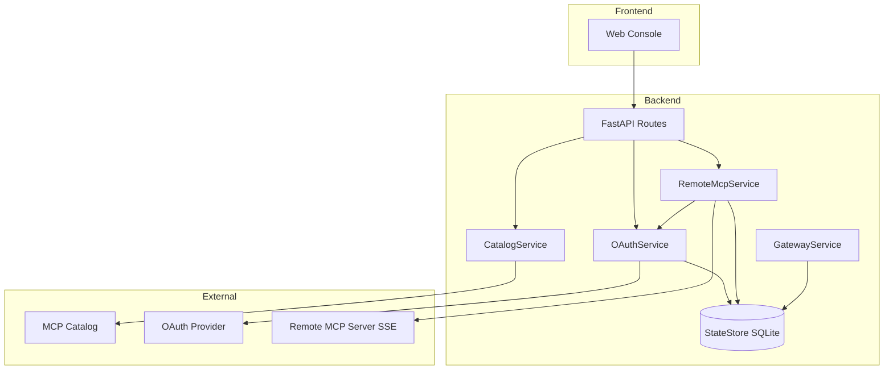
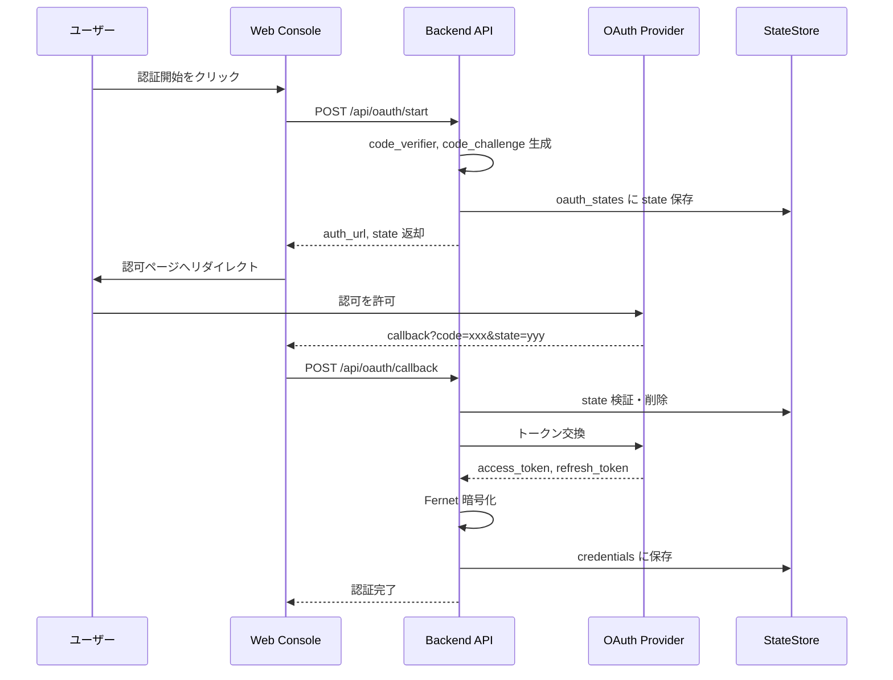
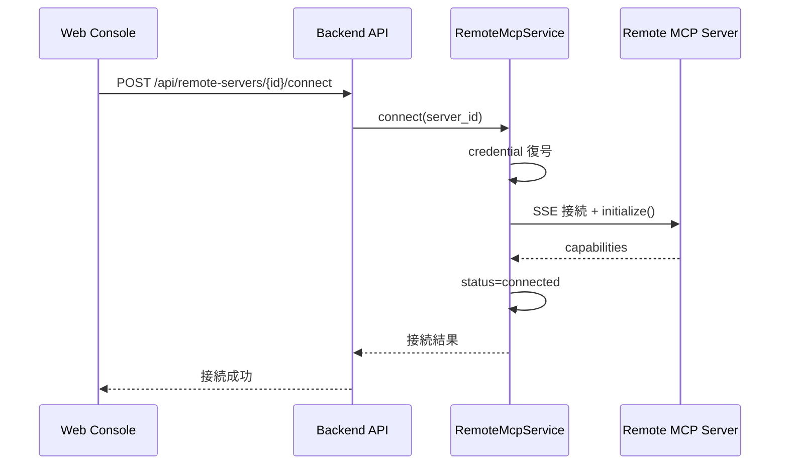

# Technical Design: リモートMCPサーバー登録 (remote-mcp-registration)

## Overview

**Purpose**: 本機能は、Docker MCP Gateway Web Console からリモート MCP サーバー（SaaS API エンドポイント）を発見・登録し、OAuth 2.0（PKCE）認証を経てランタイム統合を実現する。

**Users**: MCP サーバーを利用する開発者およびチームが、ローカル Docker コンテナと同様の操作感でリモート SaaS を統合・管理できる。

**Impact**: 既存のカタログ・OAuth 基盤を拡張し、Docker 非依存のサーバー管理機能を追加。`CatalogService`、`OAuthService`、`StateStore` に変更が入り、新規 `RemoteMcpService` を導入する。

### Goals
- リモート MCP サーバーをカタログから発見・登録・管理できる
- OAuth 2.0 + PKCE による安全な認証フローを提供する
- Gateway Runtime 経由でリモートサーバーへの透過的な MCP 通信を実現する
- 認証状態・接続状態の可視化と監査ログ記録を行う

### Non-Goals
- Stdio プロキシサーバーの実装（本設計では SSE 直接接続）
- Kubernetes / WASM などへの抽象化（将来検討）
- 複数同時リモート接続のロードバランシング

## Architecture

### Existing Architecture Analysis
- **CatalogService**: Docker イメージ必須フィルタにより、リモートサーバーが除外される
- **OAuthService**: PKCE/Fernet 実装済みだが、state がメモリ管理
- **ContainerService**: Docker 専用のライフサイクル管理
- **GatewayService**: URL 許可リストとヘルスチェックのみ、MCP プロトコル統合なし
- **StateStore**: SQLite ベースで拡張容易

### Architecture Pattern & Boundary Map



**Architecture Integration**:
- **Selected pattern**: サービス層分離（Option B）— `RemoteMcpService` を新設し、Docker 管理とリモート管理を分離
- **Domain boundaries**: カタログ取得 (CatalogService) / 認証 (OAuthService) / リモート管理 (RemoteMcpService) / 永続化 (StateStore)
- **Existing patterns preserved**: サービス層集中、Fernet 暗号化、SQLite 永続化、監査ログ
- **New components rationale**: `RemoteMcpService` は Docker 非依存のサーバー管理責務を担い、既存 ContainerService を汚染しない
- **Steering compliance**: シークレット安全性（トークン暗号化）、許可リスト検証、テスト容易性を維持

### Technology Stack

| Layer | Choice / Version | Role in Feature | Notes |
|-------|------------------|-----------------|-------|
| Backend / Services | FastAPI, Python 3.11+ | API エンドポイント、サービス層 | 既存維持 |
| SSE Client | mcp (Python SDK) | リモート MCP サーバーへの SSE 接続 | **新規依存** |
| HTTP Client | httpx | OAuth トークン交換、カタログ取得 | 既存維持 |
| Encryption | cryptography/Fernet | トークン暗号化 | 既存維持 |
| Data / Storage | SQLite (state.db) | remote_servers, oauth_states テーブル追加 | スキーマ拡張 |
| Frontend / CLI | Next.js 14, React 18, Tailwind | リモートサーバー管理 UI | UIコンポーネント追加 |

## System Flows

### OAuth 認証フロー



**Key Decisions**:
- state は SQLite に永続化し、TTL (10分) と単一使用を保証
- PKCE code_verifier はクライアント側で生成し、バックエンドは code_challenge のみ保存

### リモートサーバー接続フロー



## Requirements Traceability

| Requirement | Summary | Components | Interfaces | Flows |
|-------------|---------|------------|------------|-------|
| 1.1–1.5 | カタログからリモートサーバー発見 | CatalogService, RemoteServerList UI | GET /api/catalog | — |
| 2.1–2.6 | サーバー登録・有効化・削除 | RemoteMcpService, StateStore | POST/DELETE /api/remote-servers | — |
| 3.1–3.9 | OAuth 認可フロー開始 | OAuthService, StateStore | POST /api/oauth/start | OAuth 認証フロー |
| 4.1–4.7 | OAuth コールバック・トークン管理 | OAuthService, StateStore | POST /api/oauth/callback | OAuth 認証フロー |
| 5.1–5.6 | クレデンシャル安全保管 | OAuthService (TokenCipher) | — | — |
| 6.1–6.5 | ランタイム統合・プロトコル変換 | RemoteMcpService, MCP SDK | POST /api/remote-servers/{id}/connect | リモートサーバー接続フロー |
| 7.1–7.5 | 状態管理 UI | RemoteServerStatusPanel | GET /api/remote-servers | — |
| 8.1–8.6 | セキュリティ制約 | OAuthService, RemoteMcpService | — | — |
| 9.1–9.5 | 監査・メトリクス | StateStore (audit_logs) | — | — |
| 10.1–10.5 | 失敗時振る舞い | RemoteMcpService | — | — |

## Components and Interfaces

| Component | Domain/Layer | Intent | Req Coverage | Key Dependencies | Contracts |
|-----------|--------------|--------|--------------|------------------|-----------|
| RemoteMcpService | Backend/Services | リモートサーバーのライフサイクル管理 | 2, 6, 10 | OAuthService (P0), StateStore (P0), mcp SDK (P0) | Service, State |
| CatalogService (拡張) | Backend/Services | リモートサーバー対応カタログ | 1 | — | Service |
| OAuthService (拡張) | Backend/Services | state 永続化対応 | 3, 4, 5 | StateStore (P0) | Service, State |
| StateStore (拡張) | Backend/Services | 新テーブル追加 | 2, 3, 9 | — | State |
| RemoteServerList | Frontend/Components | リモートサーバー一覧 UI | 1, 7 | API Client (P0) | — |
| RemoteServerDetail | Frontend/Components | 詳細・認証・接続操作 UI | 2, 3, 7 | API Client (P0) | — |

### Backend / Services

#### RemoteMcpService

| Field | Detail |
|-------|--------|
| Intent | リモート MCP サーバーの登録・接続・状態管理を担当 |
| Requirements | 2.1–2.6, 6.1–6.5, 10.1–10.5 |

##### Responsibilities & Constraints
- リモートサーバー定義の CRUD 操作
- MCP Python SDK を用いた SSE 接続の確立と管理
- 認証状態に基づく接続制御（未認証サーバーへの接続拒否）
- ヘルスチェック (MCP ping) の実行

##### Dependencies
- Inbound: API routes — リモートサーバー操作リクエスト (P0)
- Outbound: StateStore — `remote_servers` テーブルへの永続化 (P0)
- Outbound: OAuthService — credential 取得・検証 (P0)
- External: mcp SDK — SSE クライアント (P0)

**Contracts**: Service [x] / State [x]

##### Service Interface
```python
from typing import List, Optional
from datetime import datetime
from pydantic import BaseModel

class RemoteServerStatus(str, Enum):
    UNREGISTERED = "unregistered"
    REGISTERED = "registered"
    AUTH_REQUIRED = "auth_required"
    AUTHENTICATED = "authenticated"
    DISABLED = "disabled"
    ERROR = "error"

class RemoteServerRecord(BaseModel):
    server_id: str
    catalog_item_id: str
    name: str
    endpoint: str
    status: RemoteServerStatus
    credential_key: Optional[str]
    last_connected_at: Optional[datetime]
    error_message: Optional[str]
    created_at: datetime

class RemoteMcpServiceInterface:
    async def register_server(
        self, 
        catalog_item_id: str, 
        correlation_id: Optional[str] = None
    ) -> RemoteServerRecord:
        """カタログからサーバーを登録する。重複時は RemoteMcpError を送出。"""
        ...

    async def list_servers(self) -> List[RemoteServerRecord]:
        """登録済みサーバー一覧を返す。"""
        ...

    async def get_server(self, server_id: str) -> Optional[RemoteServerRecord]:
        """サーバー詳細を返す。"""
        ...

    async def enable_server(self, server_id: str) -> RemoteServerRecord:
        """サーバーを有効化する。認証が必要な場合は status=auth_required。"""
        ...

    async def disable_server(self, server_id: str) -> RemoteServerRecord:
        """サーバーを無効化する。"""
        ...

    async def delete_server(
        self, 
        server_id: str, 
        delete_credentials: bool = False
    ) -> None:
        """サーバーを削除する。delete_credentials=True で紐づく認証情報も削除。"""
        ...

    async def connect(self, server_id: str) -> dict:
        """サーバーへ SSE 接続し、capabilities を返す。"""
        ...

    async def test_connection(self, server_id: str) -> dict:
        """接続テストを実行し、到達性と認証状態を返す (6.5)。"""
        ...
```

- **Preconditions**: `register_server` は catalog_item_id が有効なリモートサーバー定義であること
- **Postconditions**: `connect` 成功時は `status=AUTHENTICATED` に更新される
- **Invariants**: `status=DISABLED` のサーバーへの connect は即座にエラー

##### State Management
- **State model**: `RemoteServerRecord` を `remote_servers` テーブルに永続化
- **Persistence**: SQLite via StateStore
- **Concurrency strategy**: SQLite row-level locking; 楽観的ロックは不要（低頻度操作）

##### Implementation Notes
- **Integration**: MCP SDK の `sse_client()` をラップし、接続タイムアウト (30s) を設定
- **Validation**: endpoint は HTTPS 必須 (`_normalize_oauth_url` パターンを流用)
- **Risks**: 長時間 SSE 接続によるリソース枯渇 → アイドル検出で自動切断

---

#### OAuthService 拡張

| Field | Detail |
|-------|--------|
| Intent | state の SQLite 永続化対応 |
| Requirements | 3.2–3.7, 4.1–4.3 |

##### Responsibilities & Constraints
- `oauth_states` テーブルへの state 保存・検証・削除
- TTL (10分) 超過 state の自動無効化

##### Dependencies
- Outbound: StateStore — `oauth_states` テーブル (P0)

**Contracts**: State [x]

##### State Management
- **State model**: `OAuthStateRecord` (state, server_id, code_challenge, expires_at, created_at)
- **Persistence**: SQLite via StateStore
- **Concurrency strategy**: state 検証後の即時削除で再利用防止

##### Implementation Notes
- **Migration**: 既存メモリ管理 (`_state_store_mem`) を維持しつつ、永続化を並行稼働させ、段階的に移行

---

#### CatalogService 拡張

| Field | Detail |
|-------|--------|
| Intent | リモートサーバー (server_type=remote) 対応 |
| Requirements | 1.1–1.5 |

##### Responsibilities & Constraints
- `_filter_items_missing_image` を「docker_image OR remote_endpoint が存在」に変更
- `CatalogItem` に `server_type`, `remote_endpoint` フィールド追加

##### Implementation Notes
- **Validation**: `remote_endpoint` は URL 形式かつ HTTPS 必須

---

#### StateStore 拡張

| Field | Detail |
|-------|--------|
| Intent | 新テーブル追加 (remote_servers, oauth_states) |
| Requirements | 2.1, 3.3, 9.1–9.4 |

**Contracts**: State [x]

##### State Management
- **New tables**:
  ```sql
  CREATE TABLE IF NOT EXISTS remote_servers (
      server_id TEXT PRIMARY KEY,
      catalog_item_id TEXT NOT NULL,
      name TEXT NOT NULL,
      endpoint TEXT NOT NULL,
      status TEXT NOT NULL,
      credential_key TEXT,
      last_connected_at TEXT,
      error_message TEXT,
      created_at TEXT NOT NULL
  );

  CREATE TABLE IF NOT EXISTS oauth_states (
      state TEXT PRIMARY KEY,
      server_id TEXT NOT NULL,
      code_challenge TEXT,
      code_challenge_method TEXT,
      scopes TEXT NOT NULL,
      authorize_url TEXT NOT NULL,
      token_url TEXT NOT NULL,
      client_id TEXT NOT NULL,
      redirect_uri TEXT NOT NULL,
      expires_at TEXT NOT NULL,
      created_at TEXT NOT NULL
  );
  ```

---

### Backend / API

#### Remote Servers API

| Method | Endpoint | Request | Response | Errors |
|--------|----------|---------|----------|--------|
| GET | /api/remote-servers | — | List[RemoteServerRecord] | 500 |
| POST | /api/remote-servers | { catalog_item_id } | RemoteServerRecord | 400, 409, 500 |
| GET | /api/remote-servers/{id} | — | RemoteServerRecord | 404, 500 |
| POST | /api/remote-servers/{id}/enable | — | RemoteServerRecord | 404, 500 |
| POST | /api/remote-servers/{id}/disable | — | RemoteServerRecord | 404, 500 |
| DELETE | /api/remote-servers/{id} | { delete_credentials? } | — | 404, 500 |
| POST | /api/remote-servers/{id}/connect | — | { capabilities } | 401, 404, 502, 500 |
| POST | /api/remote-servers/{id}/test | — | { reachable, authenticated } | 404, 500 |

---

### Frontend / Components

#### RemoteServerList

| Field | Detail |
|-------|--------|
| Intent | リモートサーバー一覧表示とフィルタ |
| Requirements | 1.1–1.2, 7.1 |

##### Implementation Notes
- SWR でサーバー一覧を取得 (`/api/remote-servers`)
- status によるバッジ表示（未登録/要認証/認証済み/エラー）

#### RemoteServerDetail

| Field | Detail |
|-------|--------|
| Intent | サーバー詳細・認証・接続操作 UI |
| Requirements | 1.3, 2.1–2.6, 3.1, 3.8, 7.2–7.5 |

##### Implementation Notes
- 「認証開始」ボタンで OAuth フロー開始
- 「接続テスト」ボタンで接続テスト API 呼び出し
- 進行中状態のスピナー表示

## Data Models

### Domain Model
- **Aggregates**: `RemoteServer` (server_id をルートとし、credential との関連を管理)
- **Entities**: `RemoteServerRecord`, `OAuthStateRecord`
- **Value Objects**: `RemoteServerStatus` (Enum)
- **Domain Events**: `ServerRegistered`, `ServerAuthenticated`, `ServerDisabled`, `ConnectionFailed`

### Logical Data Model

**Structure Definition**:
- `remote_servers` 1:0..1 `credentials` (credential_key による参照)
- `oauth_states` は一時的データ (TTL 後削除)

**Consistency & Integrity**:
- サーバー削除時に紐づく credential の削除可否をユーザーに確認 (Requirement 2.6)
- `oauth_states` の expires_at 超過行は GC で定期削除

### Physical Data Model

**For SQLite**:
- `remote_servers`: server_id (PK), catalog_item_id (NOT NULL), status (NOT NULL)
- `oauth_states`: state (PK), expires_at (INDEX for GC)
- GC: `DELETE FROM oauth_states WHERE expires_at < datetime('now')`

## Error Handling

### Error Strategy
- ネットワークエラー: ユーザーが識別可能なエラーメッセージを返却 (10.1)
- プロバイダ障害: リトライ可能な状態を維持し、UI で再試行ボタン表示 (10.2)
- 認証失効: 自動リフレッシュ試行、失敗時は再認証誘導 (10.3)

### Error Categories and Responses
- **User Errors (4xx)**: 400 (不正リクエスト)、401 (未認証)、404 (サーバー未登録)、409 (重複登録)
- **System Errors (5xx)**: 500 (内部エラー)、502 (リモートサーバー応答不能)
- **Business Logic Errors (422)**: 無効な endpoint URL、TLS 非対応

### Monitoring
- 監査ログ: `server_registered`, `server_authenticated`, `connection_failed` イベントを `audit_logs` に記録 (9.1–9.4)
- メトリクス: `remote_server_connections_total`, `oauth_flow_success_total`, `oauth_flow_failure_total`

## Testing Strategy

### Unit Tests
- `RemoteMcpService.register_server` — 正常登録・重複拒否
- `RemoteMcpService.connect` — credential 復号・SSE 接続モック
- `OAuthService._persist_state` / `_validate_state` — TTL 検証
- `CatalogService._filter_items` — remote_endpoint 対応

### Integration Tests
- OAuth フロー全体 (start → callback → token 保存)
- リモートサーバー登録 → 認証 → 接続テスト
- カタログ取得 → リモートサーバーフィルタリング

### E2E/UI Tests
- リモートサーバー一覧表示
- 認証開始 → OAuth リダイレクト → コールバック処理
- 接続テスト実行と結果表示

### Performance/Load
- 同時 OAuth フロー 10 並列
- SSE 接続 5 並列 (バックエンドリソース監視)

## Security Considerations

### Authentication and Authorization
- OAuth 2.0 + PKCE (S256) 必須
- state による CSRF 防止 (単一使用、TTL 10分)
- TLS 必須 (endpoint, authorize_url, token_url)

### Data Protection
- トークンは Fernet 暗号化して永続化 (AES-256-GCM 相当)
- ログ・エラー応答に認証情報を含めない (5.6, 8.6)

### Domain Allowlist
- `OAUTH_ALLOWED_DOMAINS` による OAuth エンドポイント制限
- `REMOTE_MCP_ALLOWED_DOMAINS` (新規環境変数) によるリモートサーバーエンドポイント制限

## Performance & Scalability

### Target Metrics
- OAuth フロー完了: < 5秒 (プロバイダ応答時間除く)
- SSE 接続確立: < 3秒
- カタログ取得: < 2秒 (キャッシュヒット時)

### Connection Management
- SSE 接続タイムアウト: 30秒
- アイドル接続自動切断: 5分

## Migration Strategy

1. **Phase 1**: StateStore スキーマ追加 (`remote_servers`, `oauth_states`) — 既存テーブルへの影響なし
2. **Phase 2**: CatalogItem モデル拡張 (オプショナルフィールド追加) — 後方互換
3. **Phase 3**: OAuthService state 永続化 — メモリ管理と並行稼働
4. **Phase 4**: RemoteMcpService 導入 — 新規 API 追加
5. **Phase 5**: Frontend UI 追加 — 段階的リリース

**Rollback triggers**: マイグレーション失敗時は前バージョンへロールバック可能（スキーマ変更は IF NOT EXISTS パターン）
