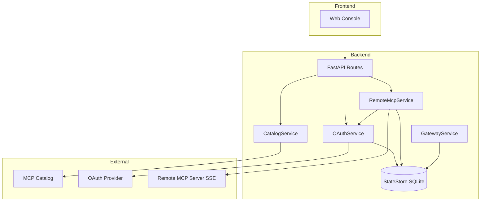
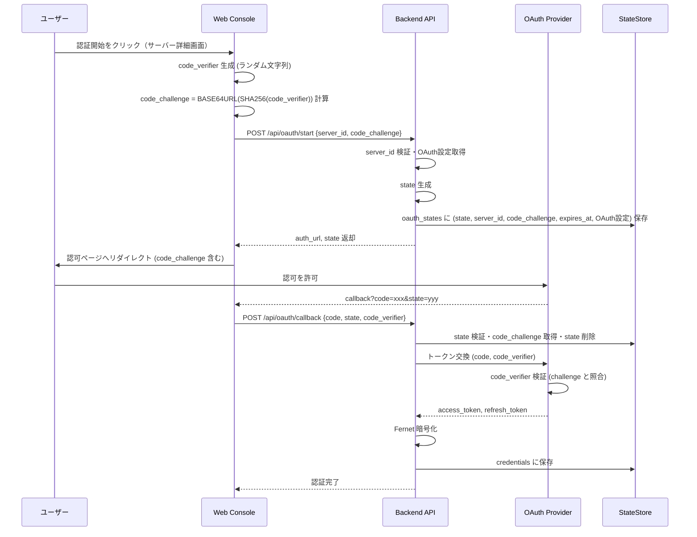
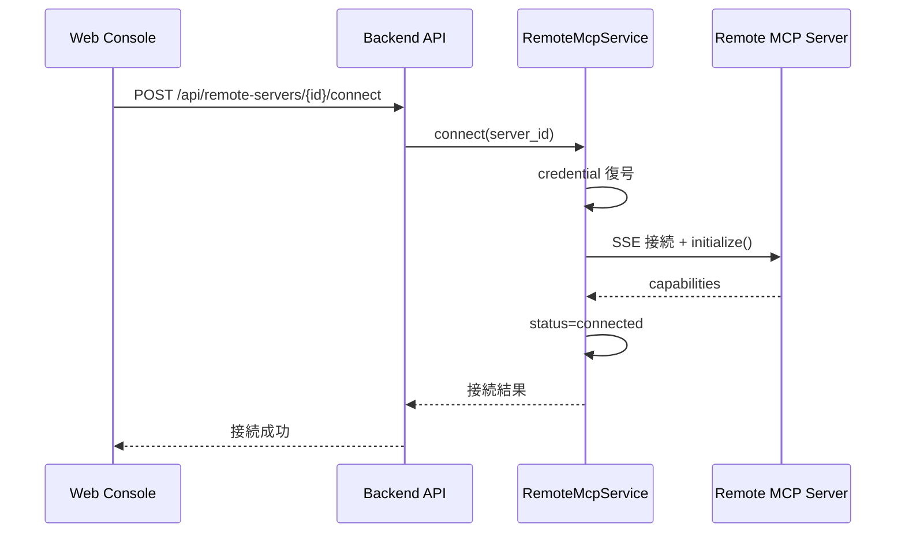

# Technical Design: リモートMCPサーバー登録 (remote-mcp-registration)

## Overview

**Purpose**: 本機能は、Docker MCP Gateway Web Console からリモート MCP サーバー（SaaS API エンドポイント）を発見・登録し、OAuth 2.0（PKCE）認証を経てランタイム統合を実現する。

**Users**: MCP サーバーを利用する開発者およびチームが、ローカル Docker コンテナと同様の操作感でリモート SaaS を統合・管理できる。

**Impact**: 既存のカタログ・OAuth 基盤を拡張し、Docker 非依存のサーバー管理機能を追加。`CatalogService`、`OAuthService`、`StateStore` に変更が入り、新規 `RemoteMcpService` を導入する。

### Goals
- リモート MCP サーバーをカタログから発見・登録・管理できる
- OAuth 2.0 + PKCE による安全な認証フローを提供する
- Gateway Runtime 経由でリモートサーバーへの透過的な MCP 通信を実現する
- 認証状態・接続状態の可視化と監査ログ記録を行う

### Non-Goals
- Stdio プロキシサーバーの実装（本設計では SSE 直接接続）
- Kubernetes / WASM などへの抽象化（将来検討）
- 複数同時リモート接続のロードバランシング

## Architecture

### Existing Architecture Analysis
- **CatalogService**: Docker イメージ必須フィルタにより、リモートサーバーが除外される
- **OAuthService**: PKCE/Fernet 実装済みだが、state がメモリ管理
- **ContainerService**: Docker 専用のライフサイクル管理
- **GatewayService**: URL 許可リストとヘルスチェックのみ、MCP プロトコル統合なし
- **StateStore**: SQLite ベースで拡張容易

### Architecture Pattern & Boundary Map



**Architecture Integration**:
- **Selected pattern**: サービス層分離（Option B）— `RemoteMcpService` を新設し、Docker 管理とリモート管理を分離
- **Domain boundaries**: カタログ取得 (CatalogService) / 認証 (OAuthService) / リモート管理 (RemoteMcpService) / 永続化 (StateStore)
- **Existing patterns preserved**: サービス層集中、Fernet 暗号化、SQLite 永続化、監査ログ
- **New components rationale**: `RemoteMcpService` は Docker 非依存のサーバー管理責務を担い、既存 ContainerService を汚染しない
- **Steering compliance**: シークレット安全性（トークン暗号化）、許可リスト検証、テスト容易性を維持

### Technology Stack

| Layer | Choice / Version | Role in Feature | Notes |
|-------|------------------|-----------------|-------|
| Backend / Services | FastAPI, Python 3.11+ | API エンドポイント、サービス層 | 既存維持 |
| SSE Client | mcp (Python SDK) | リモート MCP サーバーへの SSE 接続 | **新規依存** |
| HTTP Client | httpx | OAuth トークン交換、カタログ取得 | 既存維持 |
| Encryption | cryptography/Fernet | トークン暗号化 | 既存維持 |
| Data / Storage | SQLite (state.db) | remote_servers, oauth_states テーブル追加 | スキーマ拡張 |
| Frontend / CLI | Next.js 14, React 18, Tailwind | リモートサーバー管理 UI | UIコンポーネント追加 |

### Environment Variables

| Variable | Type | Default | Description |
|----------|------|---------|-------------|
| `OAUTH_ALLOWED_DOMAINS` | string | (既存) | OAuth エンドポイント許可ドメインリスト（既存） |
| `REMOTE_MCP_ALLOWED_DOMAINS` | string | "" (空文字列 = deny-all) | リモート MCP サーバーエンドポイント許可ドメインリスト（カンマ区切り、ワイルドカード対応）。詳細は Security Considerations > Domain Allowlist 参照 |
| `REMOTE_MCP_MAX_CONNECTIONS` | int | 20 | 同時 SSE 接続数上限（開発環境では 5 を推奨） |
| `ALLOW_INSECURE_ENDPOINT` | bool | false | 開発環境専用: localhost/http スキーム許可（本番では必ず false） |

## System Flows

### OAuth 認証フロー



**Key Decisions**:
- **サーバー識別**: OAuth フロー開始時に `server_id` を指定し、どのリモートサーバーに対する認証かを明確化
  - **前提**: リモートサーバーは事前に `RemoteMcpService.register_server()` で登録済み（`server_id` が存在）
  - **UX フロー**: ユーザーはサーバー詳細画面で「認証開始」ボタンをクリック → UI が該当サーバーの `server_id` を `/api/oauth/start` に送信
  - **Backend 処理**: `server_id` から OAuth 設定（authorize_url, token_url, client_id, scopes）を取得し、`oauth_states` に紐付けて保存
- **PKCE フロー**: クライアント (Web Console) が `code_verifier` を生成し、`code_challenge` を計算して API に渡す
- **Backend 保存**: API は `state`, `server_id`, `code_challenge`, OAuth設定を SQLite に TTL (10分) 付きで永続化し、単一使用を保証
- **Verifier 保持**: `code_verifier` はクライアント側でセッションストレージに短命保持し、callback 後に削除（永続化しない）
- **検証フロー**: OAuth Provider が `code_verifier` を受け取り、保存された `code_challenge` と照合してトークンを発行

### リモートサーバー接続フロー



## Requirements Traceability

| Requirement | Summary | Components | Interfaces | Flows |
|-------------|---------|------------|------------|-------|
| 1.1–1.5 | カタログからリモートサーバー発見 | CatalogService, RemoteServerList UI | GET /api/catalog | — |
| 2.1–2.6 | サーバー登録・有効化・削除 | RemoteMcpService, StateStore | POST/DELETE /api/remote-servers | — |
| 3.1–3.9 | OAuth 認可フロー開始 | OAuthService, StateStore | POST /api/oauth/start | OAuth 認証フロー |
| 4.1–4.7 | OAuth コールバック・トークン管理 | OAuthService, StateStore | POST /api/oauth/callback | OAuth 認証フロー |
| 5.1–5.6 | クレデンシャル安全保管 | OAuthService (TokenCipher) | — | — |
| 6.1–6.5 | ランタイム統合・プロトコル変換 | RemoteMcpService, MCP SDK | POST /api/remote-servers/{id}/connect | リモートサーバー接続フロー |
| 7.1–7.5 | 状態管理 UI | RemoteServerStatusPanel | GET /api/remote-servers | — |
| 8.1–8.6 | セキュリティ制約 | OAuthService, RemoteMcpService | — | — |
| 9.1–9.5 | 監査・メトリクス | StateStore (audit_logs) | — | — |
| 10.1–10.5 | 失敗時振る舞い | RemoteMcpService | — | — |

## Components and Interfaces

| Component | Domain/Layer | Intent | Req Coverage | Key Dependencies | Contracts |
|-----------|--------------|--------|--------------|------------------|-----------|
| RemoteMcpService | Backend/Services | リモートサーバーのライフサイクル管理 | 2, 6, 10 | OAuthService (P0), StateStore (P0), mcp SDK (P0) | Service, State |
| CatalogService (拡張) | Backend/Services | リモートサーバー対応カタログ | 1 | — | Service |
| OAuthService (拡張) | Backend/Services | state 永続化対応 | 3, 4, 5 | StateStore (P0) | Service, State |
| StateStore (拡張) | Backend/Services | 新テーブル追加 | 2, 3, 9 | — | State |
| RemoteServerList | Frontend/Components | リモートサーバー一覧 UI | 1, 7 | API Client (P0) | — |
| RemoteServerDetail | Frontend/Components | 詳細・認証・接続操作 UI | 2, 3, 7 | API Client (P0) | — |

### Backend / Services

#### RemoteMcpService

| Field | Detail |
|-------|--------|
| Intent | リモート MCP サーバーの登録・接続・状態管理を担当 |
| Requirements | 2.1–2.6, 6.1–6.5, 10.1–10.5 |

##### Responsibilities & Constraints
- リモートサーバー定義の CRUD 操作
- MCP Python SDK を用いた SSE 接続の確立と管理
- 認証状態に基づく接続制御（未認証サーバーへの接続拒否）
- ヘルスチェック (MCP ping) の実行

##### Dependencies
- Inbound: API routes — リモートサーバー操作リクエスト (P0)
- Outbound: StateStore — `remote_servers` テーブルへの永続化 (P0)
- Outbound: OAuthService — credential 取得・検証 (P0)
- External: mcp SDK — SSE クライアント (P0)

**Contracts**: Service [x] / State [x]

##### Service Interface
```python
from typing import List, Optional
from datetime import datetime
from enum import Enum
from pydantic import BaseModel

class RemoteServerStatus(str, Enum):
    UNREGISTERED = "unregistered"
    REGISTERED = "registered"
    AUTH_REQUIRED = "auth_required"
    AUTHENTICATED = "authenticated"
    DISABLED = "disabled"
    ERROR = "error"

class RemoteServerRecord(BaseModel):
    server_id: str
    catalog_item_id: str
    name: str
    endpoint: str
    status: RemoteServerStatus
    credential_key: Optional[str]
    last_connected_at: Optional[datetime]
    error_message: Optional[str]
    created_at: datetime

class RemoteMcpServiceInterface:
    async def register_server(
        self, 
        catalog_item_id: str, 
        correlation_id: Optional[str] = None
    ) -> RemoteServerRecord:
        """カタログからサーバーを登録する。重複時は RemoteMcpError を送出。"""
        ...

    async def list_servers(self) -> List[RemoteServerRecord]:
        """登録済みサーバー一覧を返す。"""
        ...

    async def get_server(self, server_id: str) -> Optional[RemoteServerRecord]:
        """サーバー詳細を返す。"""
        ...

    async def enable_server(self, server_id: str) -> RemoteServerRecord:
        """サーバーを有効化する。認証が必要な場合は status=auth_required。"""
        ...

    async def disable_server(self, server_id: str) -> RemoteServerRecord:
        """サーバーを無効化する。"""
        ...

    async def delete_server(
        self, 
        server_id: str, 
        delete_credentials: bool = False
    ) -> None:
        """サーバーを削除する。delete_credentials=True で紐づく認証情報も削除。"""
        ...

    async def connect(self, server_id: str) -> dict:
        """サーバーへ SSE 接続し、capabilities を返す。"""
        ...

    async def test_connection(self, server_id: str) -> dict:
        """接続テストを実行し、到達性と認証状態を返す (6.5)。"""
        ...
```

- **Preconditions**: `register_server` は catalog_item_id が有効なリモートサーバー定義であること
- **Postconditions**: `connect` 成功時は `status=AUTHENTICATED` に更新される
- **Invariants**: `status=DISABLED` のサーバーへの connect は即座にエラー

##### State Management
- **State model**: `RemoteServerRecord` を `remote_servers` テーブルに永続化
- **Persistence**: SQLite via StateStore
- **Concurrency strategy**: SQLite row-level locking; 楽観的ロックは不要（低頻度操作）

##### Implementation Notes
- **Endpoint Allowlist Validation** (P0):
  - `register_server()` 実行時:
    1. カタログから endpoint URL を取得
    2. `StateStore.is_endpoint_allowed(endpoint)` を呼び出し
    3. False の場合、`RemoteMcpError` を raise し、HTTP 400 Bad Request を返却
    4. エラーメッセージ: `"Endpoint not allowed: {host}:{port} is not in REMOTE_MCP_ALLOWED_DOMAINS"`
    5. 監査ログに記録: `{"event": "endpoint_rejected", "server_id": server_id, "endpoint": endpoint, "reason": "not_in_allowlist"}`
  - `connect()` 実行時:
    1. サーバーレコードから endpoint URL を取得
    2. `StateStore.is_endpoint_allowed(endpoint)` を呼び出し（二重チェック）
    3. False の場合、同様に HTTP 400 と監査ログを記録
- **Integration**: MCP SDK の `sse_client()` をラップし、以下の接続管理を実装
  - **接続確立タイムアウト**: `asyncio.wait_for(sse_client.connect(), timeout=30)` で初期接続を制御
  - **HTTPクライアント設定**: `httpx.AsyncClient(timeout=httpx.Timeout(30.0, connect=10.0))` でSSE接続のHTTPレイヤータイムアウトを設定
- **Validation**: endpoint は HTTPS 必須 (`_normalize_oauth_url` パターンを流用)
- **アイドル検出と自動切断**:
  - **実装機構**: RemoteMcpService 側で実装（MCP SDK の標準機能ではない）
  - **Heartbeat**: 120秒ごとに MCP ping リクエストを送信し、応答を待機
  - **アイドルタイムアウト**: 連続300秒（5分）応答がない場合、接続を切断して `status=ERROR` に更新
  - **実装パターン**: バックグラウンド `asyncio.Task` で各接続の最終アクティビティ時刻を監視
- **リソース枯渇対策**:
  - **同時接続数上限**: 開発環境 5並列、本番環境 20並列（環境変数 `REMOTE_MCP_MAX_CONNECTIONS` で設定可能）
  - **上限超過時**: 新規接続試行は HTTP 429 (Too Many Requests) を返却
  - **接続プール管理**: `asyncio.Semaphore` で並行数を制御

---

#### OAuthService 拡張

| Field | Detail |
|-------|--------|
| Intent | state の SQLite 永続化対応、PKCE code_challenge 管理 |
| Requirements | 3.2–3.7, 4.1–4.3 |

##### Responsibilities & Constraints
- `oauth_states` テーブルへの state、code_challenge 保存・検証・削除
- TTL (10分) 超過 state の自動無効化
- PKCE フロー: クライアントから受け取った code_challenge を保存し、callback 時に code_verifier と照合

##### Dependencies
- Outbound: StateStore — `oauth_states` テーブル (P0)

**Contracts**: State [x]

##### State Management
- **State model**: `OAuthStateRecord` (state, server_id, code_challenge, code_challenge_method, scopes, authorize_url, token_url, client_id, redirect_uri, expires_at, created_at)
- **Persistence**: SQLite via StateStore
- **Concurrency strategy**: state 検証後の即時削除で再利用防止
- **PKCE データフロー**:
  - `/api/oauth/start` 受信時:
    1. クライアントから `server_id` と `code_challenge` を受け取る
    2. `server_id` から OAuth 設定（authorize_url, token_url, client_id, scopes）を RemoteMcpService 経由で取得
    3. `state` を生成し、`server_id`, `code_challenge`, OAuth設定を `oauth_states` テーブルに保存
  - `/api/oauth/callback` 受信時:
    1. クライアントから `code`, `state`, `code_verifier` を受け取る
    2. `state` で `oauth_states` レコードを検索し、`server_id` と `code_challenge` を取得
    3. `code_verifier` と保存された `code_challenge` の整合性を確認
    4. OAuth Provider へトークン交換リクエスト（`code`, `code_verifier` を送信）
    5. 取得したトークンを `server_id` に紐付けて `credentials` テーブルに保存
  - **重要**: code_verifier は Backend で永続化せず、クライアント側でセッションストレージに短命保持

##### Implementation Notes
- **Migration**: 既存メモリ管理 (`_state_store_mem`) を維持しつつ、永続化を並行稼働させ、段階的に移行
- **PKCE 検証**: code_challenge_method は "S256" 固定（SHA-256）

---

#### CatalogService 拡張

| Field | Detail |
|-------|--------|
| Intent | リモートサーバー (server_type=remote) 対応とフィルタ時の検証 |
| Requirements | 1.1–1.5 |

##### Responsibilities & Constraints
- `_filter_items_missing_image` を「docker_image OR remote_endpoint が存在」に変更
  - **優先順位**: docker_image が存在すれば優先して使用、なければ remote_endpoint を使用
  - **両方存在する場合**: docker_image を優先（リモートサーバーとしては扱わない）
- `CatalogItem` モデル拡張:
  - `server_type`: Optional[str] — 'docker' または 'remote' を格納
  - `remote_endpoint`: Optional[str] — リモート MCP サーバーの SSE エンドポイント URL
  - `is_remote`: bool — フィルタ処理後に設定される派生フィールド（`remote_endpoint` が有効な場合 True）
- **URL 検証責務**: CatalogService のフィルタ段階で `remote_endpoint` の URL 形式・スキーム検証を実施
  - 不正な形式の endpoint を持つアイテムはカタログ取得時に除外
  - 検証エラーは警告ログに記録し、ユーザーには表示しない
  - **注意**: `REMOTE_MCP_ALLOWED_DOMAINS` による許可リスト検証は CatalogService では実施せず、RemoteMcpService.register_server() で実施（責任分離）

##### Implementation Notes
- **Validation Logic**:
  - 既存の `_normalize_oauth_url` パターンを流用し、URL 検証ロジックを一元化
  - **標準スキーム**: HTTPS 必須
  - **開発環境対応**: 環境変数 `ALLOW_INSECURE_ENDPOINT=true` を設定時、`localhost` および `http://` スキームを一時的に許可
  - **検証内容**:
    - URL 形式の正当性（`urllib.parse.urlparse` による検証）
    - スキームが `https` であること（開発環境除く）
    - ホスト名が空でないこと
- **バリデーション設計参照**: 詳細な検証ロジックと例外処理については、Requirements 8.1–8.6（セキュリティ制約）および `.kiro/steering/tech.md`（URL 検証パターン）を参照

---

#### StateStore 拡張

| Field | Detail |
|-------|--------|
| Intent | 新テーブル追加 (remote_servers, oauth_states) |
| Requirements | 2.1, 3.3, 9.1–9.4 |

**Contracts**: State [x]

##### State Management
- **New tables**:
  ```sql
  CREATE TABLE IF NOT EXISTS remote_servers (
      server_id TEXT PRIMARY KEY,
      catalog_item_id TEXT NOT NULL,
      name TEXT NOT NULL,
      endpoint TEXT NOT NULL,
      status TEXT NOT NULL,
      credential_key TEXT REFERENCES credentials(credential_key) ON DELETE SET NULL,
      last_connected_at TEXT,
      error_message TEXT,
      created_at TEXT NOT NULL
  );
  CREATE INDEX IF NOT EXISTS idx_remote_servers_catalog_item_id
      ON remote_servers(catalog_item_id);
  -- NOTE: credential_key は credentials テーブルへの外部キー
  -- NOTE: 外部キー制約の前提: credentials.credential_key は PRIMARY KEY または UNIQUE 制約が必要
  -- NOTE: credential 削除時は SET NULL（サーバーレコードは保持、再認証が必要）

  CREATE TABLE IF NOT EXISTS oauth_states (
      state TEXT PRIMARY KEY,                    -- CSRF 防止用の state パラメータ
      server_id TEXT NOT NULL,                   -- 対象リモートサーバー ID
      code_challenge TEXT,                       -- PKCE: クライアントから受け取った challenge (SHA-256)
      code_challenge_method TEXT,                -- PKCE: 固定 "S256"
      scopes TEXT NOT NULL,                      -- OAuth スコープ（JSON 配列文字列）
      authorize_url TEXT NOT NULL,               -- OAuth Provider の認可エンドポイント
      token_url TEXT NOT NULL,                   -- OAuth Provider のトークンエンドポイント
      client_id TEXT NOT NULL,                   -- OAuth Client ID
      redirect_uri TEXT NOT NULL,                -- コールバック URI
      expires_at TEXT NOT NULL,                  -- TTL (10分) - GC 対象
      created_at TEXT NOT NULL
  );
  CREATE INDEX IF NOT EXISTS idx_oauth_states_expires_at
      ON oauth_states(expires_at);
  -- NOTE: code_verifier は Backend で保存せず、クライアント側でセッションストレージに短命保持
  -- NOTE: expires_at インデックスにより、定期 GC で効率的に期限切れ state を削除可能
  ```

##### Implementation Notes
- **SQLite 外部キー制約の有効化**:
  - 接続確立時に `PRAGMA foreign_keys = ON` を実行（SQLite はデフォルトで外部キー制約が無効）
  - `_connect()` メソッドで以下を実行:
    ```python
    def _connect(self) -> sqlite3.Connection:
        conn = sqlite3.connect(self.db_path)
        conn.row_factory = sqlite3.Row
        conn.execute("PRAGMA foreign_keys = ON")  # 外部キー制約を有効化
        return conn
    ```
  - これにより、`credential_key` が参照する `credentials` レコードが削除された場合、`remote_servers.credential_key` が自動的に NULL になる（ON DELETE SET NULL）
- **Endpoint Allowlist Validation**:
  - `is_endpoint_allowed(url: str) -> bool` メソッドを追加（詳細は Security Considerations > Domain Allowlist > REMOTE_MCP_ALLOWED_DOMAINS を参照）
  - `REMOTE_MCP_ALLOWED_DOMAINS` 環境変数を読み取り、ホスト名・ポート・ワイルドカードマッチングを実行
  - RemoteMcpService.register_server() および connect() から呼び出される
  - 不許可エンドポイントの場合、False を返し、呼び出し元で HTTP 400 Bad Request と監査ログを記録

---

### Backend / API

#### Remote Servers API

| Method | Endpoint | Request | Response | Errors |
|--------|----------|---------|----------|--------|
| GET | /api/remote-servers | — | List[RemoteServerRecord] | 500 |
| POST | /api/remote-servers | { catalog_item_id } | RemoteServerRecord | 400, 409, 500 |
| GET | /api/remote-servers/{id} | — | RemoteServerRecord | 404, 500 |
| POST | /api/remote-servers/{id}/enable | — | RemoteServerRecord | 404, 500 |
| POST | /api/remote-servers/{id}/disable | — | RemoteServerRecord | 404, 500 |
| DELETE | /api/remote-servers/{id} | { delete_credentials? } | — | 404, 500 |
| POST | /api/remote-servers/{id}/connect | — | { capabilities } | 400 (allowlist), 401 (auth token), 404, 502, 500 |
| POST | /api/remote-servers/{id}/test | — | { reachable, authenticated } | 404, 500 |

#### OAuth API

| Method | Endpoint | Request | Response | Errors |
|--------|----------|---------|----------|--------|
| POST | /api/oauth/start | { server_id, code_challenge } | { auth_url, state } | 400, 404, 500 |
| POST | /api/oauth/callback | { code, state, code_verifier } | { success: true } | 400, 401, 500 |

**POST /api/oauth/start**:
- **Request Body**:
  ```json
  {
    "server_id": "remote-server-123",
    "code_challenge": "E9Melhoa2OwvFrEMTJguCHaoeK1t8URWbuGJSstw-cM",
    "code_challenge_method": "S256"  // Optional, defaults to "S256"
  }
  ```
- **Response**:
  ```json
  {
    "auth_url": "https://oauth.example.com/authorize?client_id=...&state=...&code_challenge=...",
    "state": "random-state-string"
  }
  ```
- **Errors**:
  - 400: server_id が無効、code_challenge が不正
  - 404: server_id が存在しない
  - 500: 内部エラー

**POST /api/oauth/callback**:
- **Request Body**:
  ```json
  {
    "code": "authorization-code-from-provider",
    "state": "random-state-string",
    "code_verifier": "original-code-verifier"
  }
  ```
- **Response**:
  ```json
  {
    "success": true,
    "server_id": "remote-server-123"
  }
  ```
- **Errors**:
  - 400: state が無効、code_verifier が不正
  - 401: OAuth Provider がトークン交換を拒否
  - 500: 内部エラー

---

### Frontend / Components

#### RemoteServerList

| Field | Detail |
|-------|--------|
| Intent | リモートサーバー一覧表示とフィルタ |
| Requirements | 1.1–1.2, 7.1 |

##### Implementation Notes
- SWR でサーバー一覧を取得 (`/api/remote-servers`)
- status によるバッジ表示（未登録/要認証/認証済み/エラー）

#### RemoteServerDetail

| Field | Detail |
|-------|--------|
| Intent | サーバー詳細・認証・接続操作 UI |
| Requirements | 1.3, 2.1–2.6, 3.1, 3.8, 7.2–7.5 |

##### Implementation Notes
- **「認証開始」ボタン**:
  1. クライアント側で `code_verifier` を生成し、`code_challenge` を計算
  2. 現在表示中のサーバーの `server_id` と `code_challenge` を `/api/oauth/start` に送信
  3. 取得した `auth_url` へリダイレクト、`state` をセッションストレージに保存
  4. `code_verifier` もセッションストレージに短命保持（callback 時に使用）
- **OAuth コールバック処理**:
  1. URL クエリパラメータから `code` と `state` を取得
  2. セッションストレージから `code_verifier` を取得
  3. `/api/oauth/callback` に送信し、認証完了
- 「接続テスト」ボタンで接続テスト API 呼び出し
- 進行中状態のスピナー表示

## Data Models

### Domain Model
- **Aggregates**: `RemoteServer` (server_id をルートとし、credential との関連を管理)
- **Entities**: `RemoteServerRecord`, `OAuthStateRecord`, `CatalogItem` (拡張)
- **Value Objects**: `RemoteServerStatus` (Enum)
- **Domain Events**: `ServerRegistered`, `ServerAuthenticated`, `ServerDisabled`, `ConnectionFailed`

#### CatalogItem 拡張モデル
```python
from typing import Optional
from pydantic import BaseModel, HttpUrl

class CatalogItem(BaseModel):
    """カタログアイテム（Docker/リモートサーバー両対応）"""
    id: str
    name: str
    description: str

    # 既存フィールド
    docker_image: Optional[str] = None

    # 新規フィールド
    server_type: Optional[str] = None  # 'docker' | 'remote'
    remote_endpoint: Optional[HttpUrl] = None  # リモート MCP SSE エンドポイント
    is_remote: bool = False  # 派生フィールド（フィルタ後に設定）

    # OAuth 設定（リモートサーバー用）
    oauth_config: Optional[dict] = None
```

**フィールド優先順位と派生ルール**:
- `docker_image` が存在 → `is_remote=False`, `server_type='docker'`
- `docker_image` が None かつ `remote_endpoint` が有効 → `is_remote=True`, `server_type='remote'`
- 両方存在 → `docker_image` を優先、`is_remote=False`

### Logical Data Model

**Structure Definition**:
- `remote_servers` 1:0..1 `credentials` (credential_key による参照)
- `oauth_states` は一時的データ (TTL 後削除)

**Consistency & Integrity**:
- **外部キー制約**: `remote_servers.credential_key` → `credentials.credential_key` (ON DELETE SET NULL)
  - credential 削除時、remote_servers レコードは保持され、credential_key のみ NULL になる
  - これにより孤児 credential_key を防ぎ、参照整合性を DB レベルで担保
  - `PRAGMA foreign_keys = ON` を接続時に実行必須（SQLite デフォルトでは無効）
- サーバー削除時に紐づく credential の削除可否をユーザーに確認 (Requirement 2.6)
- `oauth_states` の expires_at 超過行は GC で定期削除

### Physical Data Model

**For SQLite**:
- `remote_servers`:
  - server_id (PK)
  - catalog_item_id (NOT NULL, INDEX)
  - credential_key (FK → credentials.credential_key ON DELETE SET NULL)
  - status (NOT NULL)
- `oauth_states`:
  - state (PK)
  - expires_at (INDEX for GC)
- **Foreign Key Constraints**:
  - `PRAGMA foreign_keys = ON` を接続時に実行（SQLite デフォルトでは無効）
  - `remote_servers.credential_key` → `credentials.credential_key` (ON DELETE SET NULL)
  - credential 削除時、remote_servers レコードは保持され、credential_key のみ NULL になる（再認証が必要な状態）
- **Indexes**:
  - `idx_remote_servers_catalog_item_id` on `remote_servers(catalog_item_id)` — カタログからの逆引き検索を高速化
  - `expires_at` index on `oauth_states` — GC 処理の高速化
- **GC**: `DELETE FROM oauth_states WHERE expires_at < datetime('now')`

## Error Handling

### Error Strategy
- ネットワークエラー: ユーザーが識別可能なエラーメッセージを返却 (10.1)
- プロバイダ障害: リトライ可能な状態を維持し、UI で再試行ボタン表示 (10.2)
- 認証失効: 自動リフレッシュ試行、失敗時は再認証誘導 (10.3)

### Error Categories and Responses
- **User Errors (4xx)**:
  - 400 (不正リクエスト): 不許可エンドポイント (allowlist violation)、無効なパラメータ
  - 401 (未認証): 認証トークンが欠落・期限切れ・未保存、または OAuth Provider がトークン発行を拒否
  - 404 (サーバー未登録): 指定された server_id が存在しない
  - 409 (重複登録): 同じカタログアイテムが既に登録済み
  - 429 (Too Many Requests): 同時接続数上限超過
- **System Errors (5xx)**:
  - 500 (内部エラー): データベースエラー、予期しない例外
  - 502 (リモートサーバー応答不能): SSE 接続失敗、タイムアウト
- **Business Logic Errors (422)**:
  - 無効な endpoint URL: URL 形式不正、TLS 非対応

**Endpoint Not Allowed Error (400)**:
```json
{
  "error": "endpoint_not_allowed",
  "message": "Endpoint not allowed: api.malicious.com:8080 is not in REMOTE_MCP_ALLOWED_DOMAINS",
  "details": {
    "endpoint": "https://api.malicious.com:8080/sse",
    "allowed_domains": "localhost,127.0.0.1,*.trusted.com"
  }
}
```

### Monitoring
- **監査ログ**: 以下のイベントを `audit_logs` に記録 (9.1–9.4):
  - `server_registered`: サーバー登録成功
  - `server_authenticated`: OAuth 認証完了
  - `connection_failed`: SSE 接続失敗
  - `endpoint_rejected`: 不許可エンドポイントへの接続試行（詳細は Security Considerations > Domain Allowlist > Implementation Notes 参照）
- **メトリクス**:
  - `remote_server_connections_total`: 接続試行数
  - `remote_server_connections_rejected_total`: 不許可エンドポイントによる拒否数（新規）
  - `oauth_flow_success_total`: OAuth フロー成功数
  - `oauth_flow_failure_total`: OAuth フロー失敗数

## Testing Strategy

### Unit Tests
- `StateStore.is_endpoint_allowed` — 許可リスト検証ロジック
  - **完全一致マッチング**:
    - `api.example.com` → `https://api.example.com/sse` (port 443) ✓ 許可
    - `api.example.com` → `https://api.example.com:8443/sse` (port 8443) ✗ 拒否（デフォルトポート443のみ許可）
  - **ポート番号明示マッチング**:
    - `api.example.com:8443` → `https://api.example.com:8443/sse` ✓ 許可
    - `api.example.com:8443` → `https://api.example.com:8080/sse` ✗ 拒否（ポート不一致）
  - **ワイルドカードマッチング**:
    - `*.example.com` → `https://api.example.com/sse` (port 443) ✓ 許可
    - `*.example.com` → `https://v2.api.example.com/sse` (port 443) ✓ 許可
    - `*.example.com` → `https://example.com/sse` ✗ 拒否（ワイルドカード非マッチ）
  - **IPv6 拒否**: `https://[2001:db8::1]/sse` ✗ 拒否（IPv6 非サポート）
  - **空リストは deny-all**: `REMOTE_MCP_ALLOWED_DOMAINS=""` → すべて False
- `StateStore` — 外部キー制約とインデックス
  - **外部キー制約の動作確認**:
    - `PRAGMA foreign_keys` が ON であることを確認
    - remote_server を credential_key 付きで作成 → credential を削除 → remote_server.credential_key が NULL になることを確認
    - 存在しない credential_key で remote_server を作成しようとすると FOREIGN KEY constraint failed エラー
  - **インデックスの存在確認**:
    - `idx_remote_servers_catalog_item_id` が作成されていることを確認
- `RemoteMcpService.register_server` — 正常登録・重複拒否・allowlist 検証
  - 許可エンドポイントの登録成功
  - 不許可エンドポイントの登録失敗（HTTP 400 + 監査ログ）
- `RemoteMcpService.connect` — credential 復号・SSE 接続モック・allowlist 検証
  - 許可エンドポイントへの接続成功
  - 不許可エンドポイントへの接続失敗（HTTP 400 + 監査ログ）
- `OAuthService._persist_state` / `_validate_state` — TTL 検証と server_id 紐付け
  - `_persist_state` に server_id を渡し、oauth_states に正しく保存されることを確認
  - `_validate_state` で state から server_id を取得できることを確認
  - 存在しない server_id での OAuth 開始は HTTP 404 を返却
- `CatalogService._filter_items` — remote_endpoint 対応と URL 検証
  - `docker_image` 優先ロジック（両方存在時）
  - `remote_endpoint` 単独時の `is_remote=True` 設定
  - HTTPS スキーム検証（`ALLOW_INSECURE_ENDPOINT=false` 時）
  - 開発環境での `localhost`/`http` 許可（`ALLOW_INSECURE_ENDPOINT=true` 時）
  - 不正な URL 形式のアイテム除外

### Integration Tests
- **OAuth フロー全体**:
  1. リモートサーバーを登録（POST /api/remote-servers）→ server_id 取得
  2. OAuth 開始（POST /api/oauth/start {server_id, code_challenge}）→ auth_url, state 取得
  3. OAuth Provider からコールバック（モック）
  4. OAuth コールバック処理（POST /api/oauth/callback {code, state, code_verifier}）→ トークン取得・保存確認
  5. server_id に紐付いた credential が正しく保存されていることを検証
- リモートサーバー登録 → 認証 → 接続テスト
- カタログ取得 → リモートサーバーフィルタリング
- **Allowlist 統合テスト**:
  - `REMOTE_MCP_ALLOWED_DOMAINS` 設定変更 → 新規登録・接続の可否確認
  - ワイルドカードエントリでの登録・接続フロー
  - 不許可ドメインへの登録試行 → HTTP 400 + 監査ログ検証

### E2E/UI Tests
- リモートサーバー一覧表示
- 認証開始 → OAuth リダイレクト → コールバック処理
- 接続テスト実行と結果表示

### Performance/Load
- **同時 OAuth フロー**: 10 並列（認証フロー処理能力の検証）
- **SSE 接続負荷テスト**:
  - 開発環境: 5 並列（上限検証）
  - 本番環境: 20 並列（上限検証 + リソース監視）
- **接続上限超過テスト**: 上限+1 接続時に HTTP 429 返却を確認

## Security Considerations

### Authentication and Authorization
- OAuth 2.0 + PKCE (S256) 必須
- state による CSRF 防止 (単一使用、TTL 10分)
- TLS 必須 (endpoint, authorize_url, token_url)

### Data Protection
- トークンは Fernet 暗号化して永続化 (AES-128-CBC + HMAC-SHA256 による認証付き暗号化)
- ログ・エラー応答に認証情報を含めない (5.6, 8.6)

### Domain Allowlist

#### OAUTH_ALLOWED_DOMAINS
OAuth エンドポイント制限（既存機能、詳細は既存ドキュメント参照）

#### REMOTE_MCP_ALLOWED_DOMAINS

**目的**: リモート MCP サーバーエンドポイントへの接続を許可ドメインリストで制限し、不正なサーバーへの接続を防止

##### Format and Syntax
- **形式**: カンマ区切りリスト（空白は trimmed）
- **エントリ**: ホスト名 + オプションのポート番号
  - IPv4/ホスト名: `api.example.com`, `api.example.com:8443`, `127.0.0.1:9000`
  - **IPv6**: **サポートしない**（将来のバージョンで検討）
    - 理由: IPv6 リテラル（`[2001:db8::1]:8080`）のパースが複雑で、実装ミスによるセキュリティホールのリスクが高い
    - 回避策: IPv6 が必要な場合は DNS 名を使用（例: `ipv6.api.example.com`）
- **ワイルドカード**: サブドメインマッチング用のプレフィックスワイルドカード（`*.example.com`）のみサポート
  - `*.example.com` は `api.example.com`, `v2.api.example.com` にマッチ
  - `example.com` 自体にはマッチしない（明示的に `example.com,*.example.com` と指定）
  - **制限事項**: フルパスワイルドカード（`api.example.com/*`）やプロトコルワイルドカード（`http*://`）は不可
- **ポート番号セマンティクス**:
  - **ポート指定あり** (`api.example.com:8443`): 指定ポートに厳密マッチ（8443 のみ許可、8080 は拒否）
  - **ポート指定なし** (`api.example.com`): **デフォルトポートのみ許可**（HTTPS=443, HTTP=80）
    - セキュリティ理由: "ポートなし = 全ポート許可" は過剰に寛容で危険
    - **重要**: 非標準ポート（8443, 8080 等）を許可する場合は明示的に指定必須（例: `api.example.com:8443`）

##### Default Value
- **デフォルト**: 空文字列（deny-all）— すべてのリモートサーバー接続を拒否
- **開発環境推奨**: `localhost,127.0.0.1,*.local` — ローカル開発用
- **本番環境例**: `api.production.com,*.trusted-partner.com:8443`

##### Configuration Examples
```bash
# 開発環境（デフォルトポート 80/443 のみ）
REMOTE_MCP_ALLOWED_DOMAINS="localhost,127.0.0.1,*.local"
ALLOW_INSECURE_ENDPOINT=true

# 開発環境（非標準ポート 8080 も許可）
REMOTE_MCP_ALLOWED_DOMAINS="localhost:8080,127.0.0.1:8080,*.local"
ALLOW_INSECURE_ENDPOINT=true

# ステージング環境（デフォルトポート 443 のみ）
REMOTE_MCP_ALLOWED_DOMAINS="api.staging.example.com,*.staging-partners.com"
ALLOW_INSECURE_ENDPOINT=false

# 本番環境（デフォルトポート 443 と非標準ポート 8443 を明示的に許可）
REMOTE_MCP_ALLOWED_DOMAINS="api.production.com,api-v2.production.com:8443,*.trusted-partner.com"
ALLOW_INSECURE_ENDPOINT=false

# 重要: api.production.com は port 443 のみ許可、8443 は拒否
# 重要: api-v2.production.com:8443 は port 8443 のみ許可、443 は拒否
```

##### Reload Behavior
- **優先実装**: ランタイムリロード
  - **方式 1**: 環境変数に基づく設定ファイル（`config/allowlist.json`）を監視し、変更検出時に自動リロード
  - **方式 2**: SIGHUP シグナル受信時に環境変数を再読み込み
- **フォールバック**: アプリケーション再起動（上記ランタイムリロードが実装されていない場合）
- **動作保証**: リロード中は既存接続を維持、新規接続のみ新ルールを適用

##### Validation Rules and Algorithm

**統一検証ルール** (CatalogService line 318 の HTTPS-only check と統合):
1. URL をパースし、スキーム・ホスト・ポートを抽出（`urllib.parse.urlparse`）
2. スキーム検証:
   - `ALLOW_INSECURE_ENDPOINT=false` (デフォルト): `https` 必須
   - `ALLOW_INSECURE_ENDPOINT=true`: `http` または `https` 許可（`localhost` と `127.0.0.1` のみ）
3. ホスト名が空でないことを確認
4. 許可リスト検証（`StateStore.is_endpoint_allowed()` を呼び出し）

**Validation Algorithm** (`StateStore.is_endpoint_allowed(url: str) -> bool`):
```python
def is_endpoint_allowed(url: str) -> bool:
    """
    リモート MCP エンドポイント URL が許可リストに含まれるか検証

    Args:
        url: 検証対象の URL (例: "https://api.example.com:8443/sse")

    Returns:
        True if allowed, False otherwise

    Note:
        - IPv6 リテラルは現在サポートしない（parsed.hostname が IPv6 の場合は拒否）
        - ポート指定なしのエントリはデフォルトポート（HTTPS=443, HTTP=80）のみ許可
    """
    # 1. URL パース
    parsed = urllib.parse.urlparse(url)
    host = parsed.hostname  # "api.example.com"
    port = parsed.port or (443 if parsed.scheme == "https" else 80)

    # 1a. IPv6 アドレスは拒否（セキュリティ理由：パース複雑性）
    if host and ':' in host:
        # IPv6 の可能性（urllib.parse.urlparse は IPv6 を hostname として返す）
        # 厳密には ipaddress.IPv6Address でチェックすべきだが、簡易的に ':' を検出
        return False

    # 2. 許可リストを取得（環境変数からカンマ区切りでパース）
    allowlist = os.getenv("REMOTE_MCP_ALLOWED_DOMAINS", "").split(",")
    allowlist = [entry.strip() for entry in allowlist if entry.strip()]

    # 3. 空リストはdeny-all
    if not allowlist:
        return False

    # 4. 各エントリとマッチング
    for entry in allowlist:
        # ポート番号を分離
        # IMPORTANT: rsplit(":", 1) は単純だが IPv6 には非対応
        # 本実装では IPv6 を明示的に拒否しているため問題なし
        if ":" in entry:
            entry_host, entry_port_str = entry.rsplit(":", 1)
            try:
                entry_port = int(entry_port_str)
            except ValueError:
                continue  # 不正なポート番号は無視
        else:
            entry_host = entry
            # ポート指定なし = デフォルトポート（443 or 80）のみ許可
            entry_port = 443 if parsed.scheme == "https" else 80

        # ワイルドカードマッチング
        if entry_host.startswith("*."):
            # サブドメインマッチング
            suffix = entry_host[2:]  # "*.example.com" -> "example.com"
            if host.endswith("." + suffix):
                if entry_port == port:
                    return True
        else:
            # 完全一致
            if host == entry_host:
                if entry_port == port:
                    return True

    return False
```

##### Implementation Notes

**StateStore 拡張**:
```python
class StateStore:
    def is_endpoint_allowed(self, url: str) -> bool:
        """上記アルゴリズムを実装"""
        ...
```

**RemoteMcpService 統合**:
- `register_server()` と `connect()` の両方で呼び出し
- 不許可エンドポイントの場合:
  - HTTP 400 Bad Request を返却
  - エラーメッセージ: `"Endpoint not allowed: {host}:{port} is not in REMOTE_MCP_ALLOWED_DOMAINS"`
  - 監査ログに記録: `{"event": "endpoint_rejected", "endpoint": endpoint, "reason": "not_in_allowlist"}`

**監査ログ例**:
```json
{
  "timestamp": "2024-01-15T10:30:00Z",
  "event": "endpoint_rejected",
  "server_id": "remote-server-123",
  "endpoint": "https://malicious.example.com/sse",
  "reason": "not_in_allowlist",
  "correlation_id": "req-abc-123"
}
```

#### ALLOW_INSECURE_ENDPOINT
開発環境専用の設定（上記 Validation Rules と統合）:
- `true` 設定時、`localhost` および `127.0.0.1` に限り `http://` スキームを一時的に許可
- **本番環境では必ず `false`**（デフォルト）: HTTPS 必須ポリシーを維持

## Performance & Scalability

### Target Metrics
- OAuth フロー完了: < 5秒 (プロバイダ応答時間除く)
- SSE 接続確立: < 3秒
- カタログ取得: < 2秒 (キャッシュヒット時)

### Connection Management
- **SSE 接続確立タイムアウト**: 30秒（`asyncio.wait_for` + `httpx.Timeout` による制御）
- **Heartbeat 間隔**: 120秒（MCP ping による生存確認）
- **アイドル接続自動切断**: 連続300秒（5分）無応答で切断
- **同時接続数上限**: 開発環境 5、本番環境 20（環境変数 `REMOTE_MCP_MAX_CONNECTIONS` で設定）
- **接続プール管理**: `asyncio.Semaphore` による並行制御

## Migration Strategy

1. **Phase 1**: StateStore スキーマ追加 (`remote_servers`, `oauth_states`) — 既存テーブルへの影響なし
   - **重要**: `PRAGMA foreign_keys = ON` を `_connect()` メソッドで実行必須
   - 外部キー制約 (`credential_key` → `credentials.credential_key`) を定義
   - インデックス (`idx_remote_servers_catalog_item_id`) を作成
2. **Phase 2**: CatalogItem モデル拡張 (オプショナルフィールド追加) — 後方互換
3. **Phase 3**: OAuthService state 永続化 — メモリ管理と並行稼働
4. **Phase 4**: RemoteMcpService 導入 — 新規 API 追加
5. **Phase 5**: Frontend UI 追加 — 段階的リリース

**Rollback triggers**: マイグレーション失敗時は前バージョンへロールバック可能（スキーマ変更は IF NOT EXISTS パターン）

**Foreign Key Constraint Migration Notes**:
- 既存の `credentials` テーブルに影響なし（新規テーブル `remote_servers` のみが参照）
- SQLite は外部キー制約の事後追加が困難なため、初期スキーマ定義時に含める必要がある
- 既存 DB がある場合、`remote_servers` テーブルを DROP して再作成（データ損失許容な初期フェーズのみ）
