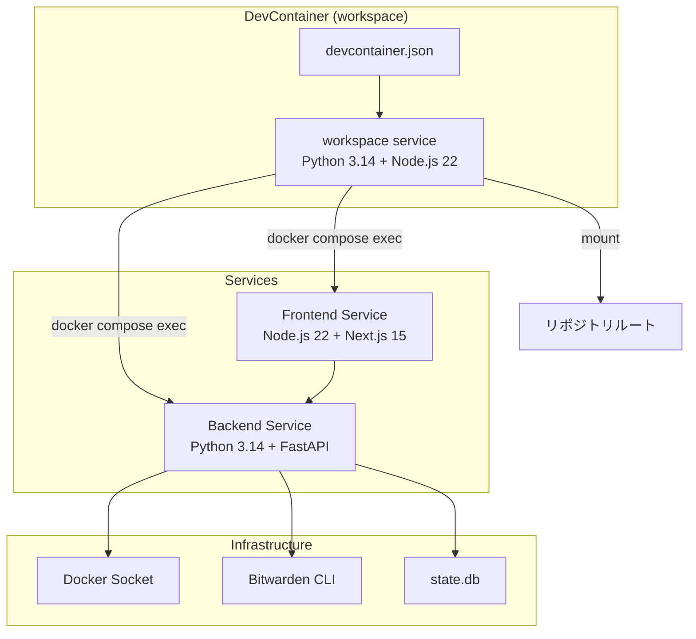
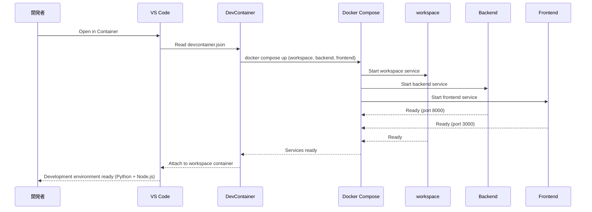
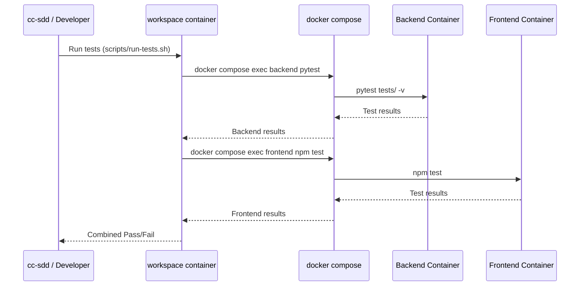

# Technical Design: Tech Stack Update & DevContainer

## Overview

**Purpose**: 本機能は、docker-mcp-gateway-web-console の技術スタックを最新化（Python 3.14.2、Node.js 22.21.1、Next.js 15.1.11、React 19.0.0）し、DevContainer による統一開発環境を提供することで、開発効率の向上と環境差異の排除を実現する。

**Users**: 開発者およびプロジェクトオーナーが、一貫した開発環境でコンテナ化されたテスト実行と最新ランタイムでの開発を行う。

**Impact**: 既存の Dockerfile、docker-compose.yml、package.json、requirements.txt を更新し、新規に `.devcontainer` ディレクトリを追加する。

### Goals
- DevContainer による再現可能な開発環境の提供（Backend/Frontend 両方を単一環境で開発可能）
- Python 3.14.2 および Node.js 22.21.1 / Next.js 15.1.11 / React 19.0.0 への更新
- **パッチレベルまでのバージョン固定**とロックファイルのコミット
- コンテナ内テスト実行ポリシーの確立（`docker compose exec` による統一実行）
- 既存テストスイートの維持（回帰防止）

### Non-Goals
- 本番環境のデプロイメント変更
- 新機能の追加（技術スタック更新のみ）
- データベーススキーマの変更
- CI/CD パイプラインの大幅な変更（テスト実行方法の調整のみ）

## Architecture

### Existing Architecture Analysis

現在のアーキテクチャ:
- **Backend**: Python 3.11 + FastAPI、Dockerfile.dev で開発、Dockerfile で本番
- **Frontend**: Node.js 18 + Next.js 14 + React 18、同様に Dockerfile.dev/Dockerfile 構成
- **Orchestration**: docker-compose.yml で frontend/backend サービスを定義
- **Data**: SQLite (`data/state.db`) で状態永続化
- **Integration**: Docker ソケットマウント、Bitwarden CLI

技術的負債:
- DevContainer 未導入（ホスト環境依存の開発）
- テスト実行がホスト環境で可能な状態
- バージョン固定が不十分（`^` や `>=` による曖昧な指定）

### Architecture Pattern & Boundary Map



**Architecture Integration**:
- **Selected pattern**: **workspace サービス型 DevContainer**（Python 3.14 + Node.js 22 同梱の開発専用コンテナ）
- **Domain boundaries**: Backend と Frontend は独立したサービスとして維持、workspace コンテナは開発者向けオーケストレーション層
- **Existing patterns preserved**: サービス分離、Docker Compose による構成管理
- **New components rationale**: 
  - `.devcontainer` ディレクトリは開発環境の再現性を確保するために必要
  - workspace サービスはリポジトリルートをマウントし、Backend/Frontend 両方の開発を単一 VS Code ウィンドウで可能にする
- **Steering compliance**: 既存のサービス層集中原則を維持

### Technology Stack & Version Pinning Policy

**バージョン固定ポリシー**: すべてのランタイムおよび主要依存関係は**パッチレベル（x.y.z）まで固定**し、ロックファイルをコミットする。

| Layer | Pinned Version | Role in Feature | Lock File |
|-------|----------------|-----------------|-----------|
| Backend Runtime | `python:3.14.2-slim` | FastAPI アプリケーション実行 | Dockerfile |
| Backend Framework | `fastapi==0.115.6` | REST API 提供 | requirements.txt |
| Backend Validation | `pydantic==2.10.4` | リクエスト/レスポンス検証 | requirements.txt |
| Frontend Runtime | `node:22.21.1-alpine` | Next.js アプリケーション実行 | Dockerfile |
| Frontend Framework | `next@15.1.11` | App Router ベース UI（CVE-2025-55183/55184/67779 修正版） | package-lock.json |
| Frontend Library | `react@19.0.0`, `react-dom@19.0.0` | UI コンポーネント | package-lock.json |
| DevContainer | VS Code DevContainer spec | 開発環境定義 | devcontainer.json |
| Container Runtime | Docker + Compose | サービスオーケストレーション | docker-compose.yml |

**ロックファイル管理**:
- **Python**: `requirements.txt` でバージョン固定（`==` 指定）、将来的に `uv.lock` 導入を検討
- **Node.js**: `package-lock.json` を必須コミット、`package.json` の `^` は可能な限り除去

## System Flows

### DevContainer 起動フロー



### テスト実行フロー



## Requirements Traceability

| Requirement | Summary | Components | Interfaces | Flows |
|-------------|---------|------------|------------|-------|
| 1.1 | DevContainer が Python 3.14 / Node.js 22 環境を提供 | DevContainerConfig, BackendDockerfile, FrontendDockerfile | - | DevContainer 起動フロー |
| 1.2 | `.devcontainer` による再現可能な定義 | DevContainerConfig | - | - |
| 1.3 | VS Code 拡張機能の推奨設定 | DevContainerConfig | - | - |
| 1.4 | コンテナ内での依存解決・テスト実行 | DevContainerConfig, TestScripts | TestExecutionContract | テスト実行フロー |
| 2.1 | 単体/E2E テストをコンテナ内で実行 | TestScripts | TestExecutionContract | テスト実行フロー |
| 2.2 | ホスト環境での直接実行を前提としない | TestScripts | - | - |
| 2.3 | docker exec / devcontainer exec 経由でテスト起動 | TestScripts | TestExecutionContract | テスト実行フロー |
| 3.1 | Backend が Python 3.14 で起動 | BackendDockerfile | - | - |
| 3.2 | Python 3.14 互換の依存関係 | BackendDependencies | - | - |
| 3.3 | 未対応依存関係の代替 | BackendDependencies | - | - |
| 3.4 | Python 3.14 コンテナでビルド可能 | BackendDockerfile | - | - |
| 4.1 | Frontend が Node.js 22 で起動 | FrontendDockerfile | - | - |
| 4.2 | Next.js 15 / React 19 互換性 | FrontendDependencies, FrontendCodeMigration | - | - |
| 4.3 | 破壊的変更への対応 | FrontendCodeMigration | - | - |
| 4.4 | Node.js 22 コンテナでビルド可能 | FrontendDockerfile | - | - |
| 5.1 | Backend テストスイートがパス | BackendDependencies | - | テスト実行フロー |
| 5.2 | Frontend テストスイートがパス | FrontendDependencies, FrontendCodeMigration | - | テスト実行フロー |
| 5.3 | E2E テストで主要フローが動作 | FrontendCodeMigration | - | テスト実行フロー |
| 6.1 | ビルド失敗時のログ出力 | BackendDockerfile, FrontendDockerfile | - | - |
| 6.2 | C 拡張ビルド可否の確認 | BackendDockerfile | - | - |
| 6.3 | 再現可能なビルド/テスト結果 | DevContainerConfig, TestScripts | - | テスト実行フロー |

## Components and Interfaces

| Component | Domain/Layer | Intent | Req Coverage | Key Dependencies | Contracts |
|-----------|--------------|--------|--------------|------------------|-----------|
| DevContainerConfig | Infrastructure | DevContainer 環境定義（workspace サービス） | 1.1, 1.2, 1.3, 1.4, 6.3 | docker-compose (P0) | - |
| WorkspaceDockerfile | Infrastructure | Python 3.14 + Node.js 22 統合開発イメージ | 1.1, 1.4 | python:3.14.2-slim, node:22.21.1 (P0) | - |
| BackendDockerfile | Infrastructure | Python 3.14 ベースイメージ定義 | 3.1, 3.4, 6.1, 6.2 | python:3.14.2-slim (P0) | - |
| BackendDependencies | Infrastructure | Python 依存関係定義（`==` 固定） | 3.2, 3.3, 5.1 | FastAPI, Pydantic (P0) | - |
| FrontendDockerfile | Infrastructure | Node.js 22 ベースイメージ定義 | 4.1, 4.4, 6.1 | node:22.21.1-alpine (P0) | - |
| FrontendDependencies | Infrastructure | npm 依存関係定義（package-lock.json 必須） | 4.2, 5.2 | Next.js 15, React 19 (P0) | - |
| FrontendCodeMigration | Application | Next.js 15 破壊的変更対応 | 4.2, 4.3, 5.2, 5.3 | - | - |
| TestScripts | Infrastructure | テスト実行スクリプト（docker compose exec） | 2.1, 2.2, 2.3, 1.4 | docker compose (P0) | Service |

### Infrastructure Layer

#### DevContainerConfig

| Field | Detail |
|-------|--------|
| Intent | VS Code DevContainer の設定を定義し、workspace サービスで Backend/Frontend 両方の開発環境を提供 |
| Requirements | 1.1, 1.2, 1.3, 1.4, 6.3 |

**Responsibilities & Constraints**
- `.devcontainer/devcontainer.json` の作成と管理
- **workspace サービス**への接続設定（Python 3.14 + Node.js 22 同梱）
- **リポジトリルート**をマウントし、Backend/Frontend 両方のコードにアクセス可能
- VS Code 拡張機能の推奨設定（Python + TypeScript/JavaScript）
- ポートフォワーディング設定

**Dependencies**
- Outbound: docker-compose.yml — サービス定義参照 (P0)
- Outbound: docker-compose.devcontainer.yml — workspace サービス定義 (P0)
- External: VS Code Dev Containers 拡張 — DevContainer ランタイム (P0)

**Contracts**: Service [ ] / API [ ] / Event [ ] / Batch [ ] / State [ ]

**Implementation Notes**
- `dockerComposeFile` で既存 compose と devcontainer 用オーバーライドを参照
- `service` で **workspace** を指定（Python + Node.js 統合環境）
- `workspaceFolder` を `/workspace` に設定（リポジトリルートをマウント）
- `customizations.vscode.extensions` で Python, Pylance, ESLint, Prettier, Tailwind 拡張を推奨
- `forwardPorts` で 3000, 8000 を転送
- `postCreateCommand` で Backend/Frontend 両方の依存関係をインストール

##### DevContainer Configuration Schema

```json
{
  "name": "docker-mcp-gateway-console",
  "dockerComposeFile": ["../docker-compose.yml", "docker-compose.devcontainer.yml"],
  "service": "workspace",
  "workspaceFolder": "/workspace",
  "customizations": {
    "vscode": {
      "extensions": [
        "ms-python.python",
        "ms-python.vscode-pylance",
        "charliermarsh.ruff",
        "dbaeumer.vscode-eslint",
        "esbenp.prettier-vscode",
        "bradlc.vscode-tailwindcss"
      ],
      "settings": {
        "python.defaultInterpreterPath": "/usr/local/bin/python",
        "python.formatting.provider": "none",
        "[python]": {
          "editor.defaultFormatter": "charliermarsh.ruff",
          "editor.formatOnSave": true
        },
        "[typescript][typescriptreact]": {
          "editor.defaultFormatter": "esbenp.prettier-vscode",
          "editor.formatOnSave": true
        },
        "editor.formatOnSave": true
      }
    }
  },
  "forwardPorts": [3000, 8000],
  "postCreateCommand": "cd /workspace/backend && pip install -r requirements.txt && cd /workspace/frontend && npm ci"
}
```

##### docker-compose.devcontainer.yml（workspace サービス定義）

```yaml
version: '3.8'

services:
  workspace:
    build:
      context: .
      dockerfile: .devcontainer/Dockerfile.workspace
    volumes:
      - ..:/workspace:cached
      - /var/run/docker.sock:/var/run/docker.sock
    command: sleep infinity
    depends_on:
      - backend
      - frontend

  backend:
    # 既存の backend サービスを継承（docker-compose.yml から）
    volumes:
      - ../backend:/app:cached

  frontend:
    # 既存の frontend サービスを継承（docker-compose.yml から）
    volumes:
      - ../frontend:/app:cached
```

#### WorkspaceDockerfile

| Field | Detail |
|-------|--------|
| Intent | Python 3.14 + Node.js 22 を含む統合開発環境イメージを定義 |
| Requirements | 1.1, 1.4 |

**Responsibilities & Constraints**
- Python 3.14.2 と Node.js 22.21.1 の両方をインストール
- 開発ツール（git, curl, docker CLI）をプリインストール
- リポジトリルートをマウントするための作業ディレクトリ設定

**Dependencies**
- External: python:3.14.2-slim — ベースイメージ (P0)
- External: Node.js 22.21.1 — npm/npx 実行用 (P0)
- External: Docker CLI — docker compose exec 実行用 (P0)

**Contracts**: Service [ ] / API [ ] / Event [ ] / Batch [ ] / State [ ]

##### Dockerfile.workspace

```dockerfile
# .devcontainer/Dockerfile.workspace
FROM python:3.14.2-slim

# Install system dependencies
RUN apt-get update && apt-get install -y \
    curl \
    git \
    build-essential \
    libffi-dev \
    libssl-dev \
    && rm -rf /var/lib/apt/lists/*

# Install Node.js 22.21.1
RUN curl -fsSL https://deb.nodesource.com/setup_22.x | bash - \
    && apt-get install -y nodejs=22.21.1-1nodesource1 \
    && npm install -g npm@latest

# Install Docker CLI (for docker compose exec)
RUN curl -fsSL https://get.docker.com | sh

# Set working directory
WORKDIR /workspace

# Default command (keep container running for VS Code)
CMD ["sleep", "infinity"]
```

#### BackendDockerfile

| Field | Detail |
|-------|--------|
| Intent | Python 3.14.2 ベースの Backend コンテナイメージを定義（パッチレベル固定） |
| Requirements | 3.1, 3.4, 6.1, 6.2 |

**Responsibilities & Constraints**
- `python:3.14.2-slim` ベースイメージの使用（**パッチレベル固定**）
- C 拡張ビルド用の依存関係インストール
- Bitwarden CLI のインストール
- 非 root ユーザーでの実行（本番用）

**Dependencies**
- External: `python:3.14.2-slim` — Docker Hub 公式イメージ（パッチ固定） (P0)
- External: Bitwarden CLI — 秘密情報管理 (P0)

**Contracts**: Service [ ] / API [ ] / Event [ ] / Batch [ ] / State [ ]

**Implementation Notes**
- `build-essential`, `libffi-dev`, `libssl-dev` を追加（C 拡張ビルド対応）
- マルチステージビルドでビルド依存関係を最終イメージから除外
- Dockerfile.dev と Dockerfile の両方を更新
- **イメージタグは `3.14.2-slim` のようにパッチレベルまで固定**

##### Dockerfile Changes

```dockerfile
# Production Dockerfile for Backend
# バージョン固定ポリシー: パッチレベルまで固定
FROM python:3.14.2-slim AS builder

# Install build dependencies for native extensions
RUN apt-get update && apt-get install -y \
    build-essential \
    libffi-dev \
    libssl-dev \
    curl \
    unzip \
    && rm -rf /var/lib/apt/lists/*

WORKDIR /app
COPY requirements.txt .
RUN pip install --no-cache-dir -r requirements.txt

FROM python:3.14.2-slim AS runner
WORKDIR /app

# Install runtime dependencies only
RUN apt-get update && apt-get install -y \
    curl \
    unzip \
    && rm -rf /var/lib/apt/lists/*

# Install Bitwarden CLI
RUN curl -L https://github.com/bitwarden/clients/releases/download/cli-v2025.11.0/bw-linux-2025.11.0.zip -o bw.zip \
    && unzip bw.zip \
    && chmod +x bw \
    && mv bw /usr/local/bin/ \
    && rm bw.zip

# Copy installed packages from builder
COPY --from=builder /usr/local/lib/python3.14/site-packages /usr/local/lib/python3.14/site-packages
COPY --from=builder /usr/local/bin /usr/local/bin

# Copy application code
COPY app/ ./app/

# Create non-root user
RUN useradd -m -u 1000 appuser && chown -R appuser:appuser /app
USER appuser

EXPOSE 8000
HEALTHCHECK --interval=30s --timeout=10s --start-period=5s --retries=3 \
    CMD curl -f http://localhost:8000/health || exit 1

CMD ["uvicorn", "app.main:app", "--host", "0.0.0.0", "--port", "8000"]
```

#### BackendDependencies

| Field | Detail |
|-------|--------|
| Intent | Python 3.14 互換の依存関係を定義（`==` によるパッチレベル固定） |
| Requirements | 3.2, 3.3, 5.1 |

**Responsibilities & Constraints**
- requirements.txt の更新（**`==` による完全固定**）
- pyproject.toml の Python バージョン更新
- 互換性のないライブラリの代替選定

**Dependencies**
- External: `fastapi==0.115.6` — Web フレームワーク (P0)
- External: `pydantic==2.10.4` — バリデーション (P0)
- External: `cryptography==44.0.1` — 暗号化 (P0)

**Contracts**: Service [ ] / API [ ] / Event [ ] / Batch [ ] / State [ ]

**Implementation Notes**
- `pyproject.toml` の `target-version` を `py314` に更新
- **すべての依存関係を `==` で完全固定**（`>=` や `^` は使用しない）
- `requests==2.31.0` の固定は Docker ソケット互換性のため維持

##### requirements.txt（バージョン固定）

```txt
# Core dependencies - パッチレベルまで固定
fastapi==0.115.6
starlette==0.47.2
uvicorn[standard]==0.27.1
pydantic==2.10.4
pydantic-settings==2.6.1
email-validator==2.1.1
python-dotenv==1.0.1
docker==7.0.0
requests==2.31.0
httpx==0.27.0
cryptography==44.0.1

# Test dependencies
pytest==8.1.1
pytest-asyncio==0.23.5
hypothesis==6.98.15
```

#### FrontendDockerfile

| Field | Detail |
|-------|--------|
| Intent | Node.js 22.21.1 ベースの Frontend コンテナイメージを定義（パッチレベル固定） |
| Requirements | 4.1, 4.4, 6.1 |

**Responsibilities & Constraints**
- `node:22.21.1-alpine` ベースイメージの使用（**パッチレベル固定**）
- マルチステージビルド構成の維持
- standalone 出力の生成

**Dependencies**
- External: `node:22.21.1-alpine` — Docker Hub 公式イメージ（パッチ固定） (P0)

**Contracts**: Service [ ] / API [ ] / Event [ ] / Batch [ ] / State [ ]

**Implementation Notes**
- 全ステージ（deps, builder, runner）で `node:22.21.1-alpine` を使用
- **イメージタグは `22.21.1-alpine` のようにパッチレベルまで固定**
- healthcheck のコマンドは変更不要

##### Dockerfile Changes

```dockerfile
# Production Dockerfile for Frontend
# バージョン固定ポリシー: パッチレベルまで固定

# Stage 1: Dependencies
FROM node:22.21.1-alpine AS deps
WORKDIR /app
COPY package.json package-lock.json ./
RUN npm ci --only=production

# Stage 2: Builder
FROM node:22.21.1-alpine AS builder
WORKDIR /app
COPY --from=deps /app/node_modules ./node_modules
COPY . .
ARG NEXT_PUBLIC_API_URL
ENV NEXT_PUBLIC_API_URL=$NEXT_PUBLIC_API_URL
RUN npm run build

# Stage 3: Runner
FROM node:22.21.1-alpine AS runner
WORKDIR /app
ENV NODE_ENV=production
RUN addgroup --system --gid 1001 nodejs
RUN adduser --system --uid 1001 nextjs
COPY --from=builder /app/public ./public
COPY --from=builder /app/.next/standalone ./
COPY --from=builder /app/.next/static ./.next/static
RUN chown -R nextjs:nodejs /app
USER nextjs
EXPOSE 3000
HEALTHCHECK --interval=30s --timeout=10s --start-period=5s --retries=3 \
    CMD node -e "require('http').get('http://localhost:3000', (r) => {process.exit(r.statusCode === 200 ? 0 : 1)})"
CMD ["node", "server.js"]
```

#### FrontendDependencies

| Field | Detail |
|-------|--------|
| Intent | Next.js 15 / React 19 互換の依存関係を定義（package-lock.json 必須コミット） |
| Requirements | 4.2, 5.2 |

**Responsibilities & Constraints**
- package.json の更新（**パッチレベルまで固定、`^` は使用しない**）
- devDependencies の型定義更新
- eslint-config-next の更新
- **package-lock.json を必須コミット**

**Dependencies**
- External: `next@15.1.11` — フレームワーク（CVE-2025-55183/55184/67779 修正版）。**注**: 15.1.3は不完全なパッチであり、CVE-2025-67779の完全修正には15.1.11以降が必須 (P0)
- External: `react@19.0.0`, `react-dom@19.0.0` — UI ライブラリ (P0)
- External: `@types/react@19.0.0`, `@types/react-dom@19.0.0` — 型定義 (P1)

**Contracts**: Service [ ] / API [ ] / Event [ ] / Batch [ ] / State [ ]

**Implementation Notes**
- `--legacy-peer-deps` が必要な場合は `.npmrc` に設定を追加
- **CVE-2025-55183/55184/67779 修正版（Next.js 15.1.11 以降）を使用必須**。15.1.3は初回パッチだが不完全であり、CVE-2025-67779の完全修正には15.1.11以降が必要
- `package.json` の `^` プレフィックスは除去し、完全固定

##### package.json Changes（バージョン固定）

```json
{
  "dependencies": {
    "next": "15.1.11",
    "react": "19.0.0",
    "react-dom": "19.0.0",
    "swr": "2.2.5"
  },
  "devDependencies": {
    "@playwright/test": "1.57.0",
    "@testing-library/jest-dom": "6.4.2",
    "@testing-library/react": "14.2.1",
    "@types/node": "20.17.0",
    "@types/react": "19.0.0",
    "@types/react-dom": "19.0.0",
    "autoprefixer": "10.4.18",
    "eslint": "8.57.0",
    "eslint-config-next": "15.1.11",
    "fast-check": "3.15.1",
    "jest": "29.7.0",
    "jest-environment-jsdom": "29.7.0",
    "postcss": "8.4.35",
    "tailwindcss": "3.4.1",
    "typescript": "5.7.0"
  }
}
```

### Application Layer

#### FrontendCodeMigration

| Field | Detail |
|-------|--------|
| Intent | Next.js 15 の破壊的変更に対応するコード修正 |
| Requirements | 4.2, 4.3, 5.2, 5.3 |

**Responsibilities & Constraints**
- Server Component の async params 対応（該当箇所がある場合）
- useFormState → useActionState の移行（使用している場合）
- 型定義の更新

**Dependencies**
- Inbound: FrontendDependencies — Next.js 15 更新後に実行 (P0)

**Contracts**: Service [ ] / API [ ] / Event [ ] / Batch [ ] / State [ ]

**Implementation Notes**
- 現在の Client Component (`'use client'`) では `useParams()`, `useSearchParams()` は同期的に動作するため、大規模な修正は不要
- 公式 codemod を実行: `npx @next/codemod@canary upgrade latest`
- 型エラーが発生した場合は個別に対応

#### TestScripts

| Field | Detail |
|-------|--------|
| Intent | コンテナ内でのテスト実行を強制するスクリプト群（`docker compose exec` による環境非依存実行） |
| Requirements | 2.1, 2.2, 2.3, 1.4 |

**Responsibilities & Constraints**
- **`docker compose exec`** を使用したテスト実行（コンテナ名の固定を避ける）
- ホスト環境での直接実行の排除
- cc-sdd からの呼び出しインターフェース提供
- **プロジェクト名やコンテナ名に依存しない再現可能な実行**

**Dependencies**
- Outbound: docker compose — サービス名ベースの実行 (P0)
- Outbound: Backend Service — pytest 実行 (P0)
- Outbound: Frontend Service — jest/playwright 実行 (P0)

**Contracts**: Service [x] / API [ ] / Event [ ] / Batch [ ] / State [ ]

##### Service Interface

```bash
#!/bin/bash
# scripts/run-tests.sh
# テスト実行スクリプト（docker compose exec による環境非依存実行）
set -e

SERVICE=${1:-all}
COMPOSE_FILE="${COMPOSE_FILE:-docker-compose.yml}"

# docker compose exec を使用（コンテナ名固定を避ける）
run_backend_tests() {
    echo "=== Running Backend Tests ==="
    docker compose -f "$COMPOSE_FILE" exec -T backend pytest tests/ -v
}

run_frontend_tests() {
    echo "=== Running Frontend Unit Tests ==="
    docker compose -f "$COMPOSE_FILE" exec -T frontend npm test
}

run_e2e_tests() {
    echo "=== Running E2E Tests ==="
    docker compose -f "$COMPOSE_FILE" exec -T frontend npm run test:e2e
}

case "$SERVICE" in
    backend)
        run_backend_tests
        ;;
    frontend)
        run_frontend_tests
        ;;
    e2e)
        run_e2e_tests
        ;;
    all)
        run_backend_tests
        run_frontend_tests
        run_e2e_tests
        ;;
    *)
        echo "Usage: $0 {backend|frontend|e2e|all}"
        exit 1
        ;;
esac

echo "=== All tests completed ==="
```

##### 設計上の重要なポイント

- **`docker compose exec` を使用**: `docker exec <container-name>` ではなく `docker compose exec <service-name>` を使用することで、プロジェクト名やコンテナ命名規則に依存しない
- **`-T` フラグ**: TTY を割り当てないことで、CI/CD 環境でも実行可能
- **`COMPOSE_FILE` 環境変数**: 異なる compose ファイルでの実行をサポート

##### 呼び出し例

```bash
# ホストまたは workspace コンテナから実行
./scripts/run-tests.sh all          # 全テスト実行
./scripts/run-tests.sh backend      # Backend のみ
./scripts/run-tests.sh frontend     # Frontend Unit のみ
./scripts/run-tests.sh e2e          # E2E のみ

# DevContainer 内からの直接実行も可能
cd /workspace && ./scripts/run-tests.sh all
```

- **Preconditions**: Docker Compose サービスが起動していること（`docker compose up -d`）
- **Postconditions**: テスト結果が標準出力に出力され、終了コードでパス/失敗を判定可能
- **Invariants**: テストは常にコンテナ内で実行される（ホスト環境のランタイムは使用しない）

## Data Models

本機能はデータモデルの変更を含まない。既存の SQLite スキーマおよび Pydantic モデルは維持される。

## Error Handling

### Error Strategy
ビルドおよびテスト実行時のエラーを詳細にログ出力し、開発者が迅速に問題を特定できるようにする。

### Error Categories and Responses

**Build Errors**:
- Python 依存関係インストール失敗 → 詳細なエラーログと依存関係バージョン情報を出力
- Node.js 依存関係インストール失敗 → npm error log を保存
- C 拡張ビルド失敗 → コンパイラエラーとシステム依存関係の確認手順を出力

**Runtime Errors**:
- DevContainer 起動失敗 → docker-compose ログを確認するガイダンス
- テスト実行失敗 → 個別テストの詳細ログを出力

### Monitoring
- Docker Compose ログを `docker compose logs -f` で確認可能
- CI/CD でのビルドログは GitHub Actions のアーティファクトとして保存

## Testing Strategy

### Unit Tests
- **Backend**: pytest による既存テストスイートの実行（Python 3.14 環境）
- **Frontend**: Jest による既存テストスイートの実行（Node.js 22 環境）
- 全テストがコンテナ内で実行されることを確認

### Integration Tests
- Backend API の起動確認（healthcheck）
- Frontend の Backend API 接続確認
- Docker ソケットアクセスの動作確認

### E2E Tests
- Playwright による既存 E2E テストスイートの実行
- 主要ユーザーフロー（ログイン、コンテナ操作、カタログ閲覧）の動作確認

### Regression Tests
- 技術スタック更新前後でのテスト結果比較
- 全既存テストのパスを完了条件とする

## Security Considerations

- **依存関係の脆弱性**: Next.js 15 / React 19 の CVE 修正版を使用
- **Docker ソケットアクセス**: 既存のセキュリティモデルを維持（root ユーザーでのコンテナ内アクセス）
- **秘密情報管理**: Bitwarden CLI 連携は変更なし

## Migration Strategy

### Phase 1: DevContainer 導入（既存スタック）
1. `.devcontainer` ディレクトリを作成
2. `devcontainer.json` と `docker-compose.devcontainer.yml` を追加
3. DevContainer での起動確認

### Phase 2: Backend 更新
1. `backend/Dockerfile` と `backend/Dockerfile.dev` を Python 3.14 に更新
2. `requirements.txt` のバージョン確認と更新
3. `pyproject.toml` の target-version 更新
4. Backend テストスイートの実行と確認

### Phase 3: Frontend 更新
1. `frontend/Dockerfile` と `frontend/Dockerfile.dev` を Node.js 22 に更新
2. `package.json` の依存関係更新（Next.js 15, React 19）
3. 公式 codemod の実行
4. 型エラーの修正
5. Frontend テストスイートの実行と確認

### Phase 4: テストスクリプト更新
1. `scripts/run-tests.sh` の作成/更新
2. 既存スクリプトの docker exec ラッパー化
3. E2E テストの実行と確認

### Rollback Triggers
- 依存関係のビルド失敗が解消できない場合
- 既存テストスイートのパス率が大幅に低下した場合
- 本番環境での重大な問題が発生した場合

### Validation Checkpoints
- 各フェーズ完了時にテストスイートを実行
- DevContainer での開発体験を手動確認
- CI/CD パイプラインでのビルド/テスト成功を確認
